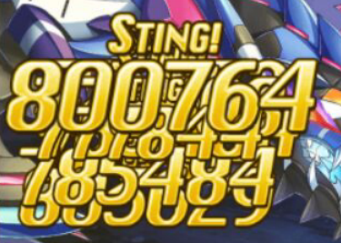

# 雷系

📜 旧神姫簡評（クリックで表示）

### 提尔 <!-- {docsify-ignore} -->

需要觉醒，一拳超雷可选组件之一。自身倍率极高，硬件够好突破200W上限炸个600W都不是问题。有15必中A破，雷系有雷皇/黄龙的15幻兽类破甲，可以再配合个破甲姬凑15+15+20的满破甲。

### 托尔 <!-- {docsify-ignore} -->

需要觉醒，30秒麻痹工具人，公会战Boss杀手。

### 雷公 <!-- {docsify-ignore} -->

需要觉醒。雷苟拉斯成员之一，雷系很好用的cut姬，水高难副本对策姬。拥有最夸张的cut效果量以及覆盖率（b后减2cd，挨打概率减cd），同时有全队热狂buff加速，热狂还能触发自身的挨打减cd被动，恐怖如斯。缺点，吃藕，除此之外没有缺点。

### 梵天，小学生 <!-- {docsify-ignore} -->

需要觉醒。旺盛自嗨打手，有你游最夸张的旺盛buff（2倍），然而除了嗨没有别的用处，基本仓管。

### 米迦勒，雷米 <!-- {docsify-ignore} -->

万圣限定，雷速B组件之一。最近一次上修直接咸鱼翻身，获得了非常强的全队加速能力以及不错的炮击伤害（60w\*3）。

### 曹操 <!-- {docsify-ignore} -->

联动限定，没抽到，不做评价。

### 朱庇特 <!-- {docsify-ignore} -->

需要觉醒，你游觉醒咸鱼翻身成功案例，雷burst队核心。你游目前最nb的属攻buff（5/7覆盖50%的效果量），自身速度也很快，拥有你游目前最强b后追伤（每次b都能增强下一次追伤，最多追100%）一发b炸个500w轻轻松松。雷系不缺少打手，但拥有有强力buff的打手只此一家。目前还是雷菠萝核心，还能月卡自选，确实强力。

### 马尔杜克，马杜 <!-- {docsify-ignore} -->
需要觉醒，雷苟拉斯成员之一，雷平A可选组件之一。招牌技城塞buff（防壁+20%追袭上限20w）攻守一体。

### 雅典娜 <!-- {docsify-ignore} -->

挡枪姬。中规中矩，然而雷只有这么一只稳定挡枪，没得选。

### 玛蒙 <!-- {docsify-ignore} -->

需要觉醒。20C破+炮击+400哥，但是需要暖机，建议和S达达英灵一起使用，不然9层掉宝可以凹一年。CG剧情发糖，很顶。

### 雷龙王 <!-- {docsify-ignore} -->

浴衣限定。偏生存向神姬，有不错的奶力和雷队稀缺的驱散，缺点是cut和雷公重复，两个一起上很亏。

### 巴尔，黑皮，雷巴，雷8 <!-- {docsify-ignore} -->

雷系第一个30属破，然而持续时间只有90秒，虽说自身有个刷新球，实战破甲覆盖率还是感人，最大的作用是顶掉队友的180秒20属破（铁内鬼了）。上修预定，可以观望一下。

### 美神，雷美，肥婆 <!-- {docsify-ignore} -->

新年限定。曾经出过bug导致远井赔了很多石头的女人，旺盛+防壁奶姬，技能组很好用，美神的本体和两个换皮速度都不错，可以作为副车头。

### 朱斯提提亚，正义 <!-- {docsify-ignore} -->

不屈+注目姬。然而依靠注目来挡枪根本不靠谱，实战只要被演就翻车。曾经的迷宫最终层杀手之一（然而迷宫已经一年多没出了，辣鸡远井）。

### 护士 <!-- {docsify-ignore} -->

雷苟拉斯成员之一，你游最靠谱的奶妈，需要B速支持。三个技能都是奶，单体奶群体奶都精通，b后刷新所有技能，也就是说速度越快奶力越强。缺点是除了奶什么都不会，对红自动不友好。

### 尤弥尔，鱼叉 <!-- {docsify-ignore} -->

注目姬，但是注目效果量感人，你游数一数二的即座A（每2T动一次），特色是每回合烧气来维持鱼叉状态，不够气还能从队友那里抢（水黑神直呼内行），红自动内鬼，鉴于隔壁相同机制的暗黑神觉醒小翻身，同样可以期待鱼叉觉醒翻身。

### 女娲 <!-- {docsify-ignore} -->

20B破+急所暴走姬，buff效果很强但是结束时全队掉15%血，雷系主旺盛所以女娲也就成了仓管。

### 黑皮（雷系盛产黑皮），爹游脸，赛亚人 <!-- {docsify-ignore} -->

仓管上修成了400哥，一拳超雷组件之一，每场战斗可以爆种3次，倍率很高（伤害比提尔还要高），还有一手压迫（Boss不会涨豆）使用体验不错。

### 萨麦尔，雷酋长，雷酋 <!-- {docsify-ignore} -->

曾经的水天杀手，招牌技一手必中的30A破（然而只有120秒持续时间感人）。由于必中破甲是b后特效，开局扔破甲大概率miss。

### 阿丽安萝德，雷7姐，雷7 <!-- {docsify-ignore} -->

婚纱限定。杂技姬，buff效果量非常不错（50属攻13打气）然而雷队buff机已经变成了朱庇特，CG好顶赞。

### 毗湿奴，轮子，雷轮子 <!-- {docsify-ignore} -->

自嗨杂技姬，一套技能组花里胡哨，然而被打到了就寄。CG+2。

### 安沙尔，魔法阵 <!-- {docsify-ignore} -->

水天杀手（同时也是大高达杀手），雷系珍贵的驱散手（另一个是雷龙王），20必中属破（然而经常被雷巴的破甲顶掉），操作简单且强力的神姬。

### 索尔，雷索 <!-- {docsify-ignore} -->

新年限定，~~雷速B核心~~，雷速B大概也死了，加速效果非常强被称作雷版米迦勒（雷米
？）。充气奶姬，每2t充25气，和雷米/建御雷配合补充5气可以让雷队拥有每2T
FB一次的能力，自身奶量也非常可观，让输出队也能维持旺盛，曾经榨干了不少雷雷人的钱包（风索直呼内行）。缺点是操作量多，每T都要按一次三技能。

### 撸，雷撸，撸本伟 <!-- {docsify-ignore} -->

雷炮击队核心，强力炮击+自动炮+强力易伤buff。最新一次上修咸鱼翻身堪称开了挂，技能组也是简单粗暴，连击附带30W自动炮，二技能100W\*5的自动炮，三技能5/6夸张覆盖的20%易伤。缺点是操作复杂，对红自动不算友好（强姬的通病）。

### 伊什塔尔，雷凛 <!-- {docsify-ignore} -->

~~雷炮击队核心~~，但是被更牛逼的挤了位置，曾经被我认为是2020最菜神姬，然而今年的1T桩和技伤桩证明了只要远井愿意，什么仓管都能翻身。雷凛属于爆发型炮击姬，通常和雷撸配合使用。缺点也十分致命，不能连击，永远的吊车尾。本体武器是雷队最好用的技伤武。

### 托特，魔法书，时空杖 <!-- {docsify-ignore} -->

雷平A核心，然而需要长时间暖机，招牌技全队即座A一轮，打桩强者，打车基本不带她玩。本体武器是雷队最好用的平A武（时空杖）。

### 伊丽丝，彩虹剑，雷彩虹 <!-- {docsify-ignore} -->

圣诞限定，你游最后一个没井的池子，又是榨干了不少雷雷人的钱包。10\*3的属破，暖机完是高倍率自嗨打手，速度很快可以胜任车头，和光彩虹剑机制几乎一样，但是少了很多操作量（自动挡就是好文明）。

### 雷拉斐尔，雷拉 <!-- {docsify-ignore} -->

情人节限定。非常好用的60W自动炮+盾姬，高难本（尤其是大高达）对策姬。招牌技全队防御10倍up（等效90%cut，伪无敌）可以让雷队脸接大高达30/10特动。

### 露娜 <!-- {docsify-ignore} -->

雷平A核心。和火死神一样的稀有20平A耐性down（等效66%增伤），技能组很全面，暖机后可以提供全队必3连+神姬高质量追袭。属于不暖机也能用，暖机后吴迪的姬。本体武器是很好用的大旺盛小平A（露娜弓）。

### 奈芙蒂斯，雷萝 <!-- {docsify-ignore} -->

雷burst核心，雷菠萝核爆可选组件之一。稀有的15burst耐性down（等效43%增伤），每3T一次的400哥，自身速度很快可以当做车头或者副车头。缺点和雷索一样，每T都要点一次三技能（打车的时候也可以放弃400哥不点三技）。

### 奈夫顿，动物园，雷眼镜 <!-- {docsify-ignore} -->

雷队首个40必中累积破甲+奶妈，雷菠萝核爆可选组件之一。同时提供了3/6的优质易伤buff，雷平A队组件。缺点是操作量非常非常非常多，打车基本没法用。

### 戴安娜，雷月，雷月弟 <!-- {docsify-ignore} -->

泳装限定，雷burst核心。技能组简单粗暴，旺盛+坚牢（血百分比越高防御越高）+奶，每次用技能全队+10气，b特效身后三人b伤+50W固定值，和朱庇特的追伤配合可以达到50W\*2的效果，恐怖如斯。

### 雷克总 <!-- {docsify-ignore} -->

140水机宝boss对策。招牌技吃豆（直接清空豆槽，但是只对幻/水boss有效），然而水机宝已经被雷天人爆杀，这个时间点出雷克已经太迟了。纯控制/生存向神姬，对输出几乎没有提升。

### 拉 <!-- {docsify-ignore} -->

雷炮击核心。除了打炮什么都不会的姬，但是她炮击伤害实在太高了。自带刷新球可以在单回合打出700w的基础炮击伤害，配合雷凛的1T爆发buff+新出的雷天宝幻兽可以达到单轮2000w炮击，恐怖如斯。和雷撸，雷凛绑定使用堪称雷炮击铁三角。

### 雷积木，新年限定 <!-- {docsify-ignore} -->

雷系buff姬。技能操作量巨大，buff需要暖机，累积攻刃buff10%，累积特殊攻击buff5%，10个随机buff有一半是废的，雷积木的设计基本告别了打车爬塔和公会战（和雷眼镜一样），只能在打桩队出场。而且由于buff效果不强，攒积木还要消耗大量的气（本身没速度，再点一技能直接就掉队了），很可能在不久之后被踹出打桩队。值得一提的是，雷积木一通操作的buff效果可能还不如暗积木点两下来得多，限定不如原皮系列。但是目前仍然是雷最好用的buff姬，没得选。

### 雷马尔斯 <!-- {docsify-ignore} -->

雷系炮击核心之一，B速越快伤害越高非常契合爱迪生队。必中30属破可靠好用，
5层雷刃自带7\~8W的炮击plus（可以buff给全队），还有个短CD攻刃buff+炮击二合一技能。虽然是3红配置（三个技能都是攻击型），但是三个技能都有全队增益效果。总结就是强，好用。唯一的缺点是30属破和美羊羊的20属破冲突，雷羊炮击队还需要黄龙/火皇sub凑额外的15破甲。

### 雷黑神 <!-- {docsify-ignore} -->

雷平A核心。自身是100%覆盖必三连+平A性能提升+平A吸血，这个效果能以2/6的覆盖率共享给全队。横向对比DWU（1/8全队必三），水朱庇特（1/12全队必三，B减CD），风爽（2/8全队必三，需要消耗token），雷黑神的2/6无条件全队必三连显得非常超模。技能组也是简单粗暴，哪里亮了点哪里就行。CG也是黑神系列祖传的一个顶俩，好评。

### TG-99，高达娘 <!-- {docsify-ignore} -->

雷炮击大爹。平A模式必连+15W追袭，炮击模式每段13W基础的自动炮取代平A。属于是看上去花里胡哨，但是只能平A炮击二选一，而且浪费了一技能和两条被动来填模式切换的坑。对于这种一通操作猛如虎，实际上只有两个技能的姬，我的评价是

《真香》

多段炮+技伤plus产生的化学反应。虽然基础标伤只有13W，在加了一堆特效后可以达到每回合80W\*10的恐怖伤害。正确用法是开局切换炮击模式，然后挂机。缺点是B的回合不触发自动炮。

推荐配合的plus
雷马鲁斯的雷刃（开局五层，每层2Wplus），雷拉的B后特效（5Wplus）,自己的B后特效（15Wplus）。

本体武器是你游目前最强技伤，没有之一（3个攻击词条的特大技伤，恐怖如斯）

### 厄瑞玻斯，雷马桶头 <!-- {docsify-ignore} -->

雷速B挡枪姬。一技能6T
CD的20充，二技能4次/6T覆盖的挡枪+迎击（迎击只对boss普通攻击有效，不能反击特动效果），三技能全队平A打气+2且连击提升。B特效提供一次不屈，FB提供3T
50攻刃+75防御+150全队吸血，自身挨打+8%特殊攻击（蛙哥数据）。强度与B速挂钩的盾姬，然而目前雷队的B速并不快，无法快速刷新不屈，而且自身的生存能力并不突出，实战时容易被打出不屈然后下一轮光速去世。

### 雷库克洛普斯，雷库克，浴衣限定 <!-- {docsify-ignore} -->

带有盾奶加速能力的雷炮击组件。一技能1cd
10w炮击。二技能3/6覆盖的全队鼓舞buff(回合结束+10气)，自身8
token以上会变为回合结束+20气。三技能全队3/6覆盖500缓回+1次净化。B特效追加施放一次一技能，并给自身1000缓回buff持续2T。被动为使用技能时给自身1个token（持续10T上限10个），且每个token能增加自身10%防御和嘲讽能力。自身受到水属性伤害时回合结束会触发15w\*token数量的多段炮击（也就是上限15w\*10）。

定位为多段炮击的多面手神姬，首先盾奶能力是完全无法应对水140（会被秒杀），所以pass。加速能力很不错，第一次二技能就有10气\*3，第二次以后就是20气\*3，对于爱迪生队非常友好。炮击能力在完全暖机的情况下每回合高达15w\*10（横向对比TG-99为12w\*10），也算是非常理想的多段炮了。

再说说缺点

token要叠，而且是从零开始的叠token。在爱迪生队中从第6T开始才能叠满。

输出能力过于依赖挨打才给的自动炮，遇到只会单点的木桩甚至要凹boss动作，纯纯坐牢。

比TG-99少了15w的自身炮击plus buff，所以整体输出要低一截。

可以看做是少了30破甲但多了充气的阉割版TG-99，在目前爱迪生+马尔斯+拉+撸+TG-99的组合中可以替换TGG-99或者撸，根据实际情况进行选择。

### 吉祥天女，吉祥姬 <!-- {docsify-ignore} -->

平A打手，炮击核心。技能组简单粗暴

一技能
3T/3CD，9段炮击（每段标伤大概在15W左右），回合结束时再触发9段炮。

二技能
3T/3CD，必三连buff，且发动时立刻进行两轮平A。

[一二技能互为共享技能，只能同时使用其中一个]{.underline}。且不受减CD效果的影响。

三技能
3T/6CD的自身属刃+防壁+会心buff

评价
一技能[3T总计36段炮击]{.underline}，平均每T
12段，你游目前最强的多段炮击手。二三技能也赋予吉祥姬充当平A打手的能力。本体武器是大会心+小B+小技伤，非常适合雷爱迪生带队的炮击盘子。

### 雷死神 <!-- {docsify-ignore} -->

雷平A可选组件。本身技能组是融合了火死神与暗死神，但是很遗憾都没有取其精华。一技能3/7 覆盖20w旺袭，二技能旺盛版连击buff，三技能标准30双降破甲。被动技能约等于常驻缓回+连击buff+平A乘区buff（平A队默认全程覆盖）。

评价：技能组很素，大概是2021年水平。Buff量中规中矩，在平A队作为破甲位被雷眼镜爆杀，在别的队伍也不一定能出场（雷队的破甲都很猛）。

### 特鲁斯，史莱姆娘 <!-- {docsify-ignore} -->

雷菠萝核爆组件。被动自身以外的队友使用黄技能时自身获得1层token（上限10层），根据token数量获得攻防，连击，打气效率，白虎乘区buff，且根据层数获得b追伤。一技能必中20破甲，3层token以上时变为30破甲。二技能1/7覆盖自身不屈+全体挡枪（能挡aoe）。三技能自身和英灵立刻+100气，CD8。

评价：用于代替曾经白毛+朱庇特+眼镜组合中的雷眼镜，少了恐伤buff和10破甲换取了雷菠萝二连发核爆的能力，单发伤害降低但是总输出提升。缺点，动画太多，且目前基本只能用于菠萝队（吃不到纯色队buff所以某些场合菠萝是被打压的）。

### 阿斯特蕾亚，天秤 <!-- {docsify-ignore} -->

雷B组件。一技能5/5覆盖的单体鼓舞（回合结束+10气）+天秤（200W Bplus）buff。二技能4/6覆盖全队B结算伤害提升buff。三技能4/6覆盖雷属攻+一次异常吸收盾（参考工口丝盾，吸收成功充20气）。被动，自身平A不会涨气但是持有天秤的角色burst时自身立刻100气，且B性能大幅提升（400哥）。

评价：比较微妙（难用）的雷B姬。自身不需要考虑速度，只需要跟着大腿fb就行。200W单体Bplus不是很够看，B结算伤害提升也有些尴尬，属刃也和朱庇特的buff冲突。本体武器是你游第一把4技能武器，且性能完爆了雷马尔斯剑，属于是雷盘目前最好用的暴击系武器。

### 黑卡蒂 <!-- {docsify-ignore} -->

雷B核心。一技能7CD的自身100充气+3T 30%雷属刃buff，战斗中首次释放作用于全队。二技能炮击+驱散，强化状态下驱散两次。三技能全队3/6覆盖b性能+30旺盛buff，强化状态下附加20攻刃+会心buff。B特效给予自身3T（不包含B那回合）强化状态，强化状态下自身是400哥且攻击+急所+连击率up。

评价：离谱至极。对比同为100充的光芙蕾雅/暗尤斯提亚，黑卡蒂还拥有你游最牛的攻刃+旺盛+属刃+会心buff，本身还是个400哥。落地即巅峰，下次超得的首选预定。

---

<!-- KAMIHIME:DETAIL:thunder:START -->
## 雷系・技能详细

> 📌 「神姬云测评（翻訳版）」（更新日: 2026-07-16）

### ［雷光の新婦］姫島朱乃

> 🇨🇳 朱乃  整体机制绑定3技能一次性技能的神姬，所以强度在线的时间只有3t，3t内每回合2次基座，但是本身既没有追也不是400所以其实摔炮伤害，一旦3技能buff消失长期战就变成3t一基座，2技能的旺盛旺壮表明了其实他是跟真化天枰（ユースティティア［神想真化］）竞争的，但本身并不算天枰的上位，再加上天枰还算是免费获取的，只能在短期战发挥一点用途，符合最高稀有度联动的正常强度
>                                                                    ——By  陆逊（礼包是对的）
>
> 🇯🇵 朱乃は、技能3という使い切り効果に全体の強さを紐付けた設計の神姫で、性能が生きるのは3ターンだけ。その3ターンの間は毎ターン2回の即座Burstを発動できるが、自身には追撃も400型倍率もないため、実際のBurst火力自体はそれほど高くない。技能3のバフが切れると、長期戦では3ターンに1回のBurst発動ペースに戻ってしまう。技能2の旺盛・旺壮は、実質的に真化天秤（ユースティティア［神想真化］）と競合するポジションであることを示しているが、天秤の上位互換とまでは言えず、しかも天秤は無料で入手できるキャラであるため、短期戦でわずかに用途を発揮できる程度。最高レア度のコラボキャラとしては標準的な強さと言える。

📊 技能详细を見る

**B特效**

🇨🇳 自身技能CD-1，我方全体HP回复

🇯🇵 自身の技能CD-1。味方全体のHP回復。

**■技能1**（CD: 9）

🇨🇳 发动一次不消耗BC的Burst； 
※【约定之力】状态下，同一回合最多可使用2次

🇯🇵 BCを消費せずBurstを1回発動する。※【約定の力】状態の時、同一ターンにつき最大2回まで使用可。

**■技能2**（持続: 3 / CD: 12）

🇨🇳 雷属性角色B伤害+30%上限+20%、旺壮（最大50%）、旺盛（最大30%）； 
【约定之力】状态下，追加特攻+10%

🇯🇵 雷属性キャラのBurstダメージ+30%（上限+20%）、旺壮（最大50%）、旺盛（最大30%）を付与。【約定の力】状態の時、特殊攻撃+10%を追加付与。

**■技能3**（持続: 3 / CD: 1）

🇨🇳 ※战斗中仅能使用1回 
自身获得持续3回合的【约束之力】

🇯🇵 ※戦闘中1回のみ使用可。自身に3ターン継続の【約定の力】を付与する。

**被动1**

🇨🇳 根据本回合中全体队友的B次数，回合结束时对敌方全体造成雷属性伤害（最多10次） 
※若持有【约定之力】，则发动3次该伤害

🇯🇵 そのターン中の味方全体のBurst回数に応じて、ターン終了時に敵全体へ雷属性ダメージを与える（最大10回）。※【約定の力】を保持している場合、このダメージを3回発動する。

**被动2**

🇨🇳 回合结束时，自身技能CD-1； 
※若持有【约定之力】，则回合结束时刷新1、2技能，并追加Bplus+30W（可累积/永久）

🇯🇵 ターン終了時、自身の技能CD-1。※【約定の力】を保持している場合、ターン終了時に技能1・技能2をリフレッシュし、Bplus+30万を追加付与（重複可・永続）。

### アリス

> 🇨🇳 惊喜池限定，雷反逆A。雷队的上一个反逆扳机 ［幻灯の夜華］バルドル ，虽然有全队即座A，但是出的太早了没有刷新也没有二动，跟不上时代。虽然爱丽丝也是六代姬模板，刷新即座、减CD，多动，buff，token消耗转伤害，但雷还是不太能走反逆A，傻蛋和铃鹿都会有普攻吸血，而且雷也没有同期火屁股那样的覆盖面广的减伤和生存buff。未来可期吧。
>
> 🇯🇵 サプライズガチャ限定、雷属性の反逆型通常攻撃（A）キャラ。雷属性編成の前任の反逆トリガーだった［幻灯の夜華］バルドルは全体即座通常攻撃を持っていたものの、登場が早すぎたためリフレッシュも2回攻撃も持たず、時代に追いついていなかった。アリスも6期神姫のテンプレート通り、即座リフレッシュ・CD短縮・多動・バフ・トークン消費のダメージ変換を備えているが、それでも雷属性は反逆A編成にあまり向いていない。傻蛋（バカ）や鈴鹿はいずれも通常攻撃吸血を持ち、さらに雷属性には同期の火属性キャラ「火尻」のような広範囲をカバーする被ダメージ軽減・生存バフも存在しない。将来に期待というところ。

📊 技能详细を見る

**B特效**

🇨🇳 自身技能CD-1

🇯🇵 自身の技能CD-1。

**■技能1**（CD: 4）

🇨🇳 发动一次不加BC的普攻； 
※消耗54【扑克牌】后，同一回合可使用2次。

🇯🇵 BCを消費せず通常攻撃を1回発動する。※【トランプ】54枚を消費した後、同一ターンにつき2回まで使用可。

**■技能2**（持続: 2 / CD: 1）

🇨🇳 敌方全体攻防-5%（专必积40%），我方全体三连几率+10%（可累积）； 
※同一回合获得5张【牌】时，刷新此技能。

🇯🇵 敵全体に攻防ダウン-5%（専必積、上限40%）、味方全体に三連撃確率+10%（重複可）を付与。※同一ターンに【トランプ】5枚を獲得した場合、この技能をリフレッシュする。

**■技能3**（持続: 1 / CD: 10）

🇨🇳 雷属性角色忍耐、反逆、反攻，cut+30%，异常状态无效1回； 
※获得【牌】时此技能CD-1。

🇯🇵 雷属性キャラに忍耐、反逆、反攻、cut+30%、異常状態無効1回を付与。※【トランプ】を獲得した時、この技能のCD-1。

**■技能4**（持続: 1 / CD: 8）

🇨🇳 自身攻击伤害up，必三，若自身HP大于25%则压血至25%； 
※战斗中首次发动时，效果给予全队雷属性角色。

🇯🇵 自身の攻撃ダメージアップ、三連撃確定、自身のHPが25%を超えている場合は25%まで低下させる。※戦闘中の初回発動時は、効果を雷属性キャラ全体に付与する。

**被动1**

🇨🇳 自身HP低于25%时，普攻二动，BC获得量-50%； 
消耗54张【牌】后，自身必三，普攻plus+10W。

🇯🇵 自身のHPが25%未満の時、通常攻撃が2回攻撃になり、BC獲得量-50%。【トランプ】54枚を消費した後は、自身に三連撃確定、通常攻撃Plus+10万を付与。

**被动2**

🇨🇳 雷属性角色三连时【牌】+1； 
回合结束时，消耗所有【牌】，为雷属性角色赋予强化效果及HP回复（HP回复效果量20%，上限1000~3000，每张牌上限+100，最大20回）； 
消耗5张以上【牌】时，刷新1技能 
1张：攻击+30%；   5张：防御+30%，刷新1技能； 
10张：普攻吸血，效果量5%上限200； 
15张：反靱             20张：特攻+20%。

🇯🇵 雷属性キャラが三連撃した時、【トランプ】+1。ターン終了時、【トランプ】をすべて消費し、雷属性キャラに強化効果とHP回復を付与する（HP回復効果量20%、上限1000〜3000、1枚につき上限+100、最大20回分）。【トランプ】5枚以上を消費した場合、技能1をリフレッシュする。 
1枚：攻撃+30% 
5枚：防御+30%、技能1をリフレッシュ 
10枚：通常攻撃吸血（効果量5%、上限200） 
15枚：反靭 
20枚：特殊攻撃+20%

### ［HELIX］アモン

> 🇨🇳 周年限定，雷炮。选择了雷炮就要忍受频繁点技能和漫长的动画。雷炮、主力输出，可刷新红，没什么好说的。附带一点奶和解异常。实际输出经群友测试，比［波戯の愛霹］シャイターン差一点。要想加强雷炮输出可以把棒棒糖踹了换阿蒙，提升20%以上输出，但是需要更好盘子和幻兽支持了。虽然还不到夯，但也有顶级实力。
>
> 🇯🇵 周年限定、雷属性の砲撃キャラ。雷砲撃編成を選ぶなら、頻繁な技能タップと長い演出アニメーションに耐える必要がある。雷砲撃・主力アタッカーで、赤技能をリフレッシュできる点以外は特に語ることもない。ついでに少量の回復と異常状態解除も付いてくる。実際の出力はコミュニティメンバーの検証によれば［波戯の愛霹］シャイターンにわずかに劣る。雷砲撃の出力をさらに強化したいなら、既存の砲撃要員「棒棒糖（ロリポップ）」を外してアモンに入れ替えれば20%以上の出力アップが見込めるが、その分より良い装備盤面と幻獣のサポートが必要になる。ぶっ壊れ級には届かないものの、トップクラスの実力は十分にある。

📊 技能详细を見る

**B特效**

🇨🇳 技能CD-1，根据【连理魔力】数，雷属性角色雷属攻up 
1~10个，雷属攻+15%，11~20个，雷属攻+30%， 
21个以上，雷属攻+45%

🇯🇵 技能CD-1。【連理魔力】の数に応じて雷属性キャラの雷属性攻撃力アップ。 
1〜10個：雷属性攻撃力+15% 
11〜20個：+30% 
21個以上：+45%

**■技能1**（持続: 8·2 / CD: 2）

🇨🇳 敌方全体雷属性炮击，攻击down（必专积最大40%）； 
奇数回使用时，追加敌方伤害-30%。

🇯🇵 敵全体に雷属性の砲撃、攻撃ダウン（必中・専属・重複可、最大40%）を付与。奇数ターンに使用した場合、敵の与ダメージ-30%を追加付与。

**■技能2**（CD: 5）

🇨🇳 敌方全体7.5倍雷属性炮击，根据发动次数性能up（效果见右上）； 
获得【连理魔力】时，刷新此技能。

🇯🇵 敵全体に7.5倍の雷属性砲撃。発動回数に応じて性能アップ（詳細は元表右上参照）。【連理魔力】を獲得した時、この技能をリフレッシュする。

**■技能3**（持続: 8·2 / CD: 2）

🇨🇳 敌方全体防御down（必专积最大40%）； 
奇数回发动时，追加我方全体过量治疗。

🇯🇵 敵全体に防御ダウン（必中・専属・重複可、最大40%）を付与。奇数ターンに発動した場合、味方全体に過剰回復を追加付与。

**■技能4**（持続: 1 / CD: 10）

🇨🇳 【连理魔力】30层时方可发动，战斗中仅能使用1回。 
雷属性角色特攻+？，HP全回复，异常全解，发动5次2技能。

🇯🇵 【連理魔力】30層の時のみ発動可能、戦闘中1回のみ使用可。雷属性キャラの特殊攻撃+？、HP全回復、状態異常を全解除、技能2を5回発動する。

**被动1**

🇨🇳 根据【连理魔力】层数，雷属性角色异常状态赋予率up，异常状态耐性up，炮击性能up； 
回合结束时，根据雷属性角色使用红技能次数，发动2技能。

🇯🇵 【連理魔力】の層数に応じて、雷属性キャラの異常状態付与率アップ、異常状態耐性アップ、砲撃性能アップ。ターン終了時、雷属性キャラが赤技能を使用した回数に応じて技能2を発動する。

**被动2**

🇨🇳 回合中，雷属性角色每使用8次技能，【连理魔力】+1，我方全体HP回复，同一回合最多10次； 
5的倍数回触发时，追加我方全体解异常1

🇯🇵 ターン中、雷属性キャラが技能を8回使用するごとに【連理魔力】+1、味方全体のHP回復（同一ターンにつき最大10回まで発動）。5の倍数ターンに発動した場合、味方全体に異常状態解除1つを追加付与。

**被动3**

🇨🇳 【连理魔力】30层时，包含后备在内的所有雷属性角色炮击plus+？，防御力2倍； 
使用技能时追加发动一次2技能

🇯🇵 【連理魔力】30層の時、控えメンバーを含む雷属性キャラ全員の砲撃Plus+？、防御力2倍。技能使用時に技能2をもう1回追加発動する。

### 桂言葉

> 🇨🇳 日在校园联动二期，正常的暖机普攻C水平，差不多6回合的暖机时间，减CD的即座普攻和暖机二动。不过比较意外的是被动2给的减CD是减全技能CD，3技能的回复，在高层伏魔殿来说还是比较有用的。但同样带有回复的普攻C，还有鈴鹿御前。总结就是强度还行，抽到能用，但也不是什么核心，缺了也能玩。
>
> 🇯🇵 『スクールデイズ』コラボ第2弾限定、標準的な暖機型通常攻撃（C）キャラで、暖機時間はおよそ6ターン。CD短縮効果付きの即座通常攻撃と、暖機完了後の2回攻撃を持つ。やや意外なのは被動2によるCD短縮が全技能CD短縮になっている点で、技能3のHP回復も高層の伏魔殿では十分役に立つ。ただ、同じくHP回復を持つ暖機型通常攻撃（C）キャラには鈴鹿御前もいる。総評としては強さはまずまずで、引けたら使えるが、コア級というほどでもなく、いなくても十分プレイできる。

📊 技能详细を見る

**B特效**

🇨🇳 刷新1技能

🇯🇵 技能1をリフレッシュ。

**■技能1**（持続: 1 / CD: 3）

🇨🇳 先自身普攻plus+15W，再进行一次加BC的普攻； 
※【精神崩坏】20层后追加自身特殊攻击+30%。

🇯🇵 まず自身の通常攻撃Plus+15万を付与し、続けてBCを加算する通常攻撃を1回発動する。※【精神崩壊】20層後は自身の特殊攻撃+30%を追加付与。

**■技能2**（持続: 180S / CD: 7）

🇨🇳 敌方单体防御down（特大必中）； 
※【精神崩坏】20层后追加敌方单体攻击down（特大必中）。

🇯🇵 敵単体に防御ダウン（特大・必中）を付与。※【精神崩壊】20層後は敵単体に攻撃ダウン（特大・必中）を追加付与。

**■技能3**（持続: 1 / CD: 5）

🇨🇳 自身与英灵HP回复； 
※【精神崩坏】20层后追加追加生命吸收（每次普攻全体上限？恢复）。

🇯🇵 自身と英霊のHP回復。※【精神崩壊】20層後は生命吸収（通常攻撃ごとに全体へ上限？回復）を追加付与。

**被动1**

🇨🇳 使用技能时、回合结束时、受到伤害时，【精神崩坏】+1，上限20；【精神崩坏】20层后，自身必三，普攻二动。

🇯🇵 技能使用時、ターン終了時、被ダメージ時に【精神崩壊】+1（上限20）。【精神崩壊】20層後は、自身に三連撃確定、通常攻撃2回攻撃を付与。

**被动2**

🇨🇳 雷属性角色普攻12次，自身全技能CD-1

🇯🇵 雷属性キャラが通常攻撃を12回行うと、自身の全技能CD-1。

### オク［心想昇華］

> 🇨🇳 第二期升华姬，卡池规则与其他反姬一样，池子里也有极低概率歪出之前的反姬和升华姬。
> 牢全让你给坐了。前6回合暖机结束之前除了40BC外毫无作用，但暖机结束后的输出也是对得起你前期坐的牢。也是非常的吃队友，阵容不齐就会大大拖慢暖机速度。而且B系列的反姬升华姬通用的问题，前期【心想】不够用后期【心想】用不完。雷B相对能用的队友不少，还有2个是花时间就能做出来的真化姬，但雷的这几个都是输出，缺少一个像水女娲那种既能提供B还能加攻击buff的强力辅助。总结就是手操，不适合红自动，推荐英灵项羽，打伏魔殿或者水200车。
>
> 🇯🇵 第2弾の昇華姫で、ガチャの規則は他の反姫と同様、極めて低確率で以前の反姫や昇華姫が出ることもある。牢屋にはしっかり入ってもらう羽目になる。暖機が完了する前6ターンはBC+40以外にまったく役に立たないが、暖機完了後の出力はそれまで座った牢の分に見合うだけの強さがある。味方への依存度も非常に高く、編成が揃っていないと暖機速度が大きく落ちる。さらに反姫系昇華姫共通の問題として、前半は【心想】が足りず、後半は【心想】が使い切れないという傾向がある。雷属性Burst役として使える味方はそれなりに多く、時間をかければ作れる真化姫も2体いるが、雷属性のこれらのキャラはいずれもアタッカー寄りで、水属性の女媧のようにBurstとアタックバフを同時に供給できる強力なサポート役が不足している。総評としては手動操作向きで、赤オートには不向き。英霊は項羽がおすすめで、伏魔殿や水属性200車編成向き。

📊 技能详细を見る

**B特效**

🇨🇳 追伤，【心想】+1； 
【守护者之力】展开期间，效果量2倍

🇯🇵 追撃、【心想】+1。【守護者の力】展開中は効果量2倍。

**■技能1**（CD: 0）

🇨🇳 ※消耗5【心想】，同一回合可使用2次，【守护者之力】展开期间，增加1次。 
发动一次不消耗BC的Burst。

🇯🇵 ※【心想】5消費、同一ターンにつき2回まで使用可。【守護者の力】展開中はさらに1回増加。BCを消費せずBurstを1回発動する。

**■技能2**（持続: 6 / CD: 0）

🇨🇳 ※不消耗【心想】，根据【心想】获得数量，同一回合最多使用4次； 
我方全体随机强化效果（可累积，不可解除）： 
防壁+500、水属耐+5%、概率触发1.05倍急所、雷属攻+5%。 
【守护者之力】展开期间，所有效果全部发动，最大HP+150

🇯🇵 ※【心想】を消費せず、【心想】の獲得数に応じて同一ターンにつき最大4回まで使用可。味方全体にランダムで以下の強化効果を1つ付与（重複可・解除不可）：防壁+500、水属性耐性+5%、確率で1.05倍急所発動、雷属性攻撃力+5%。【守護者の力】展開中は全ての効果が同時に発動し、さらに最大HP+150。

**■技能3**（持続: 3 / CD: 0）

🇨🇳 ※消耗3【心想】，同一回合最多可使用1次； 
奇数回发动时，敌方全体B破（专用必中20%）； 
偶数回发动时，敌方消2豆

🇯🇵 ※【心想】3消費、同一ターンにつき最大1回まで使用可。奇数ターンに発動した場合、敵全体に防御破壊（B破、専用・必中、20%）を付与。偶数ターンに発動した場合、敵のCT（行動ゲージ）を2消費させる。

**■技能4**（持続: 2 / CD: 0）

🇨🇳 ※消耗8【心想】； 
自身【守护者因子】+1，雷属性角色BC+40； 
累积获得6【因子】后自动展开【守护者之力】（永续） 
【守护者之力】展开后再使用此技能，除了+40BC外不再获得【因子】，追加雷属性角色固定减伤5000

🇯🇵 ※【心想】8消費。自身の【守護者因子】+1、雷属性キャラのBC+40。累計で【因子】6を獲得すると自動的に【守護者の力】を展開する（永続）。【守護者の力】展開後にこの技能を再度使用した場合、BC+40以外は【因子】を獲得せず、雷属性キャラに固定ダメージ軽減5000を追加付与する。

**被动1**

🇨🇳 战斗开始时【心想】+5；每3回合结束【心想】+3； 
雷属性角色B时，【心想】+1，【守护者之力】展开期间再追加一次追伤

🇯🇵 戦闘開始時に【心想】+5。3ターンごとの終了時に【心想】+3。雷属性キャラがBurstを発動した時、【心想】+1、【守護者の力】展開中はさらに追撃を1回追加発動する。

**被动2**

🇨🇳 根据获得【心想】数量，为雷属性角色赋予强化效果； 
【守护者之力】展开期间，效果量2倍，并额外提升自身特殊攻击和B性能 
1以上  ：攻击+25%           30以上：防御+25% 
50以上：B伤害+30%，上限+20% 
80以上：Bplus+50W

🇯🇵 獲得した【心想】の数に応じて雷属性キャラに強化効果を付与する。【守護者の力】展開中は効果量2倍になり、さらに自身の特殊攻撃とBurst性能が追加で上昇する。 
1以上：攻撃+25% 
30以上：防御+25% 
50以上：Burstダメージ+30%、上限+20% 
80以上：Bplus+50万

**被动3**

🇨🇳 队伍中全为雷属性角色时，全队BC获得量up，B性能up，后备有效

🇯🇵 パーティ全員が雷属性キャラの場合、全体のBC獲得量アップ、Burst性能アップ。控えメンバーにも効果あり。

### ［神鳴の恋香］シャマシュ

> 🇨🇳 情人节限定，感觉有点像暗海盗，通过储存token多次发动全体加速，10【巧克力】即可提供一次全队FB。自身不是400哥，虽然有着可用3次的即座B，但打不出多少伤害，基本还是用来给全队+BC的和获取【巧克力】的。FB时获得5【巧克力】，等同于全队50BC，还可以储存至需要时再使用。优秀的速B组件。生存方面，除了限定一次的满状态无敌外，血量健康时每回合1瓶小药也非常优秀。非常适合拿破仑拿来红auto，单靠2技能就能提供英气buff和BC保证FB不断。
>
> 🇯🇵 バレンタイン限定。暗黒海賊（ダークパイレーツ）に少し似た感覚で、トークンを溜めて何度も全体加速を発動できる。【チョコレート】10個で全体FB（フルバースト）1回分を供給できる。自身は400型ではなく、最大3回まで使える即座Burstを持つものの大したダメージは出せず、基本的には全体へのBC供給と【チョコレート】獲得のために使うキャラ。FB発動時に【チョコレート】5個を獲得でき、これは全体BC50相当に匹敵し、さらに必要な時まで貯めておける優秀な速Burst部品。生存面では、戦闘中1回限りの満タン時無敵効果に加え、HPが健康な状態なら毎ターン小さな薬1本を得られる点も非常に優秀。ナポレオンの赤オートに非常に適しており、技能2だけで英気バフとBC供給を両立し、FBを絶やさず維持できる。

📊 技能详细を見る

**B特效**

🇨🇳 自身全技能CD-1

🇯🇵 自身の全技能CD-1。

**■技能1**（CD: 35）

🇨🇳 发动一次不消耗BC的Burst，可消费40BC重复发动，最多重复发动2次（即最大消耗80BC，发动3次）

🇯🇵 BCを消費せずBurstを1回発動する。BC40を消費して再度発動可能、最大2回まで繰り返し可能（最大でBC80消費、合計3回発動）。

**■技能2**（持続: 6 / CD: 0）

🇨🇳 ※消耗1【巧克力】方可发动； 
我方全体随机强化效果（可叠加），BC+10 
攻击+5%，防御+5%，Bplus+8W，概率触发1.05倍急所

🇯🇵 ※【チョコレート】1消費で発動可能。味方全体にランダムで以下の強化効果を1つ付与（重ね掛け可）、BC+10。 
攻撃+5%、防御+5%、Bplus+8万、確率で1.05倍急所発動

**■技能3**（持続: 4 / CD: 10）

🇨🇳 我方全体“过量治疗”（上限1W），HP回复，解异常2； 
※累积获得25个以上【巧克力】后，追加水属耐+30%

🇯🇵 味方全体に過剰回復（上限1万）、HP回復、異常状態解除2つを付与。※累計で【チョコレート】25個以上を獲得した後は、水属性耐性+30%を追加付与。

**■技能4**（持続: 1 / CD: 1）

🇨🇳 ※累积获得25个以上【巧克力】后方可使用，战斗中仅能使用1回； 
雷属性角色HP全回复，异常全解，完全减免所有受到的伤害（该吃的debuff还是会吃）

🇯🇵 ※累計で【チョコレート】25個以上を獲得した後のみ使用可能、戦闘中1回のみ使用可。雷属性キャラのHP全回復、状態異常を全解除、受けるすべてのダメージを完全無効化する（デバフ自体は通常通り受ける）。

**被动1**

🇨🇳 雷属性角色B时，自身【巧克力】+1，1技能CD-1

🇯🇵 雷属性キャラがBurstを発動した時、自身の【チョコレート】+1、技能1のCD-1。

**被动2**

🇨🇳 回合结束时，若自身HP大于80%，生成1瓶小药

🇯🇵 ターン終了時、自身のHPが80%を超えている場合、小さな薬を1本生成する。

### ［怠惰なくノ一］ダグザ

> 🇨🇳 联动的本家限定，雷A，也是需要暖机而且被动1明确表明了锁死6T暖完。比较亮眼的就是1技能，6回合暖完之后，CD2的即座普攻，而且点一次就能打3*3*2=18下（全部三连），【纳米机器】buff也是常驻的。但除了1技能外其他技能就有点普通了，而且平A角色也没有给自己或全队提供连击率的buff，有点像去年姬的水平。
>
> 🇯🇵 コラボ本家限定、雷属性の通常攻撃（A）キャラ。暖機が必要で、被動1により6ターンで暖機完了と明確に固定されている。目立つのは技能1で、6ターンの暖機完了後はCD2の即座通常攻撃になり、しかも1回発動するだけで3×3×2=18ヒット（すべて三連撃込み）を叩き出せる。【ナノマシン】バフも常時発動状態。しかし技能1以外の技能はやや普通で、通常攻撃（A）キャラでありながら自身や全体に連撃率を供給するバフも持たない。昨年登場したキャラ程度の水準といった印象。

📊 技能详细を見る

**B特效**

🇨🇳 自身全技能CD-1

🇯🇵 自身の全技能CD-1。

**■技能1**（持続: 3 / CD: 6）

🇨🇳 【纳米机器】展开； 
根据【忍剑】数量发动X次即座普攻（加BC）， 
【忍剑】0~1时，1次； 
【忍剑】2时，2次； 
【忍剑】3时，3次

🇯🇵 【ナノマシン】を展開する。【忍剣】の数に応じてX回の即座通常攻撃（BC加算あり）を発動する。 
【忍剣】0〜1：1回 
【忍剣】2：2回 
【忍剣】3：3回

**■技能2**（持続: 2 / CD: 5）

🇨🇳 雷属性角色旺盛、反逆； 
【纳米机器】展开中，追加极旺袭、极反袭

🇯🇵 雷属性キャラに旺盛、反逆を付与。【ナノマシン】展開中は極旺襲、極反襲を追加付与。

**■技能3**（持続: 2 / CD: 5）

🇨🇳 我方全体固定减伤2000，异常状态无效1回， 
【忍剑】3以上时追加坚牢、忍耐

🇯🇵 味方全体に固定ダメージ軽減2000、異常状態無効1回を付与。【忍剣】3以上の時は堅牢、忍耐を追加付与。

**被动1**

🇨🇳 自身连击的回合，回合结束时技能CD-1； 
※【忍剑】3以上时CD-1强化为CD-2； 
敌方全体强化解除1； 
※偶数回触发时，【忍剑】+1

🇯🇵 自身が連撃したターンの終了時、技能CD-1。※【忍剣】3以上の時はCD-1がCD-2に強化される。敵全体に強化解除1を付与。※偶数ターンに発動した場合、【忍剣】+1。

**被动2**

🇨🇳 【纳米机器】展开时，自身普攻二动，BC获得量down； 
雷属性角色概率触发1.3倍急所，会心+25%

🇯🇵 【ナノマシン】展開中は、自身の通常攻撃が2回攻撃になり、BC獲得量ダウン。雷属性キャラに確率で1.3倍急所発動、会心+25%を付与。

### ［閃獣の絢服］チェンシー

> 🇨🇳 雷B，单回合3次的即座B，艳后的优质炮弹，放队尾给贝多芬B队也能用，B后刷新2技能叠叠乐伤害也不低。别看1技能CD有10，实际上5回合轻松凑够25次B，搭配被动1直接转好，而且还能开4技能再次刷新。应该可以坐很久雷B主C的位置。
>
> 🇯🇵 雷属性Burst役。1ターンに3回まで発動できる即座Burstを持ち、クレオパトラにとって優良な砲弾となる存在。パーティ最後尾に置けばベートーヴェンBurst編成でも使え、Burst後に技能2をリフレッシュして積み重ねるダメージもそれなりに高い。技能1のCDは10と一見長いが、実際には5ターンあれば楽にBurst25回を達成でき、被動1と組み合わせればすぐに好循環に入り、さらに技能4を開いて再リフレッシュすることもできる。長期間、雷属性Burst役の主力アタッカーの座に居座れそうだ。

📊 技能详细を見る

**B特效**

🇨🇳 刷新2技能

🇯🇵 技能2をリフレッシュ。

**■技能1**（CD: 10）

🇨🇳 发动一次不消耗BC的Burst，自身以外的队友BC+20（算上B后都有的+10就是30BC； 
消耗50BC可再次发动2回（0-50-50）

🇯🇵 BCを消費せずBurstを1回発動する。自身以外の味方のBC+20（Burst後に誰でも得られる+10も合わせると実質30BC相当）。BC50を消費して最大2回まで再発動可能（0-50-50）。

**■技能2**（持続: 5·3 / CD: 3）

🇨🇳 自身Bplus+20W，概率触发1.05倍急所（可累积），BC+20 
3的倍数回发动时，追加特殊攻击+30%

🇯🇵 自身のBplus+20万、確率で1.05倍急所発動（重複可）、BC+20を付与。3の倍数ターンに発動した場合、特殊攻撃+30%を追加付与。

**■技能3**（持続: 3 / CD: 0）

🇨🇳 ※消耗10BC方可发动，同一回合最多可使用5回 
敌方单体防御down（必专积最大40%）， 
自身cut+3%（可累积），

🇯🇵 ※BC10を消費して発動可能、同一ターンにつき最大5回まで使用可。敵単体に防御ダウン（必中・専属・重複可、最大40%）を付与。自身にcut+3%（重複可）を付与。

**■技能4**（CD: 0）

🇨🇳 ※消耗5【欧拉链接】方可发动 
刷新1、2技能，敌方全体强化解除2，幻兽召唤攻击CD-2

🇯🇵 ※【オイラーリンク】5消費で発動可能。技能1・技能2をリフレッシュし、敵全体に強化解除2を付与、幻獣召喚攻撃CD-2。

**被动1**

🇨🇳 战斗开始时，自身BC+100； 
雷属性角色B5次，1技能CD-1，【欧拉链接】+1

🇯🇵 戦闘開始時、自身のBC+100。雷属性キャラがBurstを5回発動すると、技能1のCD-1、【オイラーリンク】+1。

**被动2**

🇨🇳 雷属性角色发动Burst时，自身BC+15; 
4技能发动一次以后，自身2、3技能的强化效果（2技能的第一行、3技能的cut）给到全体（永续、不可解除）

🇯🇵 雷属性キャラがBurstを発動した時、自身のBC+15。技能4を1回発動した後は、自身の技能2・技能3の強化効果（技能2の1行目の効果、技能3のcut）が味方全体に適用されるようになる（永続・解除不可）。

### ［叛天轟魔］サタン

> 🇨🇳 半周年限定，雷属性平A，暖机完成后一回合4动加3次即座A，超越铃鹿的30次普攻达到了36次，伟大无需多言。暖机只靠自己三连，队友的三连也只影响2技能开门。比较遗憾的是自己除了4技能的2回合必三之外没有其他的增加连击率手段，需要队友提供三连buff。雷属性平A角色质量都很不错，但奈何自己的全队即座A绑定了反逆，且平A没有合适的武器摆盘子，只等一个优秀的武器模板就可扶摇直上九万里。
>
> 🇯🇵 半周年限定、雷属性の通常攻撃主体（平A）キャラ。暖機完了後は1ターンに4回攻撃＋即座通常攻撃3回を発動し、鈴鹿の通常攻撃30回を超える36回に達する、その凄まじさは言葉を尽くすまでもない。暖機は自身の三連撃のみに依存し、味方の三連撃は技能2の解禁条件にしか影響しない。惜しいのは、技能4の2ターン限定の三連撃確定以外に自身で連撃率を上げる手段を持たず、味方から三連撃バフの供給を受ける必要がある点。雷属性の通常攻撃主体キャラは全体的に質が高いが、自身の全体即座通常攻撃が反逆と紐付いていることや、通常攻撃編成に適した武器の盤面が不足していることが悩ましく、優れた武器テンプレートが1つ登場すれば一気に飛躍できるだろう。

📊 技能详细を見る

**B特效**

🇨🇳 自身全技能CD-1

🇯🇵 自身の全技能CD-1。

**■技能1**（持続: 3 / CD: 3）

🇨🇳 自身普攻plus+10W； 
发动一次不加BC的普攻， 
※【雷狱之门】状态下该技能每回合刷新，同一回合可使用2次

🇯🇵 自身の通常攻撃Plus+10万を付与。BCを加算しない通常攻撃を1回発動する。※【雷獄の門】状態の時、この技能は毎ターンリフレッシュされ、同一ターンにつき2回まで使用可。

**■技能2**（持続: 2 / CD: 15）

🇨🇳 【雷狱之门】展开，刷新1技能； 
※雷属性角色普攻30次 ，技能CD-1

🇯🇵 【雷獄の門】を展開し、技能1をリフレッシュする。※雷属性キャラが通常攻撃を30回行うと、技能CD-1。

**■技能3**（持続: 3 / CD: 6）

🇨🇳 敌方全体A破； 
※【雷威光】获得7个以后，追加我方全体反靱

🇯🇵 敵全体に通常攻撃防御破壊（A破）を付与。※【雷威光】を7個獲得した後は、味方全体に反靭を追加付与。

**■技能4**（持続: 2 / CD: 5）

🇨🇳 自身必三连，普攻性能up； 
※【雷威光】获得7个以后，上述效果扩展到全队雷属性角色，且追加普攻吸血

🇯🇵 自身に三連撃確定、通常攻撃性能アップを付与。※【雷威光】を7個獲得した後は、上記の効果が雷属性キャラ全体に拡大し、さらに通常攻撃吸血を追加付与。

**被动1**

🇨🇳 自身常驻普攻2动 
自身5次三连，【雷威光】+1， 
雷威光4个以后3动，7个以后4动，最多7个

🇯🇵 自身は常時通常攻撃2回攻撃。自身が三連撃を5回行うと【雷威光】+1。【雷威光】4個以降は3回攻撃、7個以降は4回攻撃になる（最大7個）。

**被动2**

🇨🇳 【雷狱之门】状态下，自身攻击+30%，属攻+30%，概率触发1.4倍急所，特殊攻击+30%，会心+20%

🇯🇵 【雷獄の門】状態の時、自身に攻撃+30%、属性攻撃力+30%、確率で1.4倍急所発動、特殊攻撃+30%、会心+20%を付与。

### ［夏の祭典］ジークフリート

> 🇨🇳 联动，雷平A，偏向长期战的角色，需要登场满5回合才能触发追加效果。自身有着常驻的30%cut以及敌方30%减伤。被动1给的buff比较慷慨，但需要自身保持80%的血量，而1技能还附带了回血和解异常。功能性是有的，凭借被动1的buff，输出应该也不差。
>
> 🇯🇵 コラボ限定、雷属性の通常攻撃（平A）型で長期戦向きのキャラ。登場から5ターンを経過しないと追加効果が発動しない。自身は常時30%のcutを持ち、敵には与ダメージ-30%を付与できる。被動1のバフはかなり気前がよいが、発動には自身のHPを80%以上に保つ必要がある。技能1にはHP回復と異常解除も付随する。機能性は十分で、被動1のバフのおかげで火力もそれなりに悪くないはずだ。

📊 技能详细を見る

**B特效**

🇨🇳 自身全技能CD-1

🇯🇵 自身の全技能CD-1。

**■技能1**（CD: 4）

🇨🇳 不加BC普攻，HP百分比最低的我方HP回复（上限1500），解异常1

🇯🇵 BCを消費せず通常攻撃を1回発動。HP残量（%）が最も低い味方のHPを回復（上限1500）、異常解除1。

**■技能2**（持続: 2 / CD: 6）

🇨🇳 敌方全体水属攻down（专必特），伤害-30%（专必）； 
登场5回合后，追加魔力封印

🇯🇵 敵全体に水属性攻撃力ダウン（専属・必中・特大）、与ダメージ-30%（専属・必中）を付与。※登場から5ターン経過後は、魔力封印を追加付与。

**■技能3**（持続: 2 / CD: 6）

🇨🇳 我方全体旺盛、旺壮； 
登场5回合后，追加会心

🇯🇵 味方全体に旺盛、旺壮を付与。※登場から5ターン経過後は、会心を追加付与。

**被动1**

🇨🇳 自身注目，常驻cut30%； 
HP80%以上的场合，普攻plus+30W，特殊攻击+30%； 
雷属性角色普攻25次，刷新1技能

🇯🇵 自身に注目（狙われやすくなる効果）、常時cut+30%を付与。HPが80%以上の場合、通常攻撃Plus+30万、特殊攻撃+30%。雷属性キャラが通常攻撃を25回行うと、技能1をリフレッシュ。

**被动2**

🇨🇳 受到攻击的回合，回合结束时，雷属性角色三连+8%（永续不可解除），敌方全体强化解除1； 
偶数回发动时，生成1瓶小药

🇯🇵 攻撃を受けたターンの終了時、雷属性キャラに三連撃率+8%（永続・解除不可）を付与し、敵全体に強化解除1を発動。※偶数ターンに発動した場合、小さな薬を1本生成。

### ［波戯の愛霹］シャイターン

> 🇨🇳 泳装限定，雷的感应和刷新炮，2技能99的CD注定只能靠刷新来走。而1技能CD50的【限制解除】，也全靠2技能的-1CD。雷炮击角色不少，还有夏娃这种可以一起左脚踩右脚的，实战中2技能的发动次数叠的也很快，1技能【限制解除】大概6t可以第二次使用，然后可以缩短到2t左右。因为是感应红技能发动，虽然前期单次伤害可能不比夏娃高，但后期凭借更快的叠层输出反超了夏娃，新一代的炮击主C。但问题就是演出动画太长、技能太多，出伤墨迹。
>
> 🇯🇵 水着限定。雷属性の感応・リフレッシュ型の砲撃キャラ。技能2はCD99と非常に長く、リフレッシュに頼るしかない仕様になっている。技能1のCD50の【制限解除】も、技能2の-1CD効果に完全に依存する。雷属性の砲撃キャラは既に少なくなく、イヴのように互いに支え合って自己ループを回せるキャラも存在する。実戦では技能2の発動回数がどんどん積み重なりやすく、技能1の【制限解除】はおおよそ6ターンで2回目が使用可能になり、その後は2ターン程度まで短縮できる。赤技能への感応で発動するため、序盤の単発火力はイヴより低いかもしれないが、後半は積層の速さで火力面でイヴを上回る、新世代の砲撃メインアタッカーだ。ただ問題は演出アニメーションが長く技能数も多いため、火力が出るまでがまどろっこしい点だ。

📊 技能详细を見る

**B特效**

🇨🇳 雷属性角色水幻耐性up，发动1次2技能

🇯🇵 雷属性キャラの水・幻属性耐性アップ。技能2を1回発動。

**■技能1**（持続: 1 / CD: 50）

🇨🇳 自身【限制解除】，刷新2、3技能。 
每次发动后下次发动效果持续时间+1，最多延长至5回合

🇯🇵 自身に【制限解除】を付与、技能2・技能3をリフレッシュ。※発動するたびに次回発動時の効果継続時間+1、最大5ターンまで延長。

**■技能2**（CD: 99）

🇨🇳 敌方全体雷炮击。根据发动次数性能up， 
1技能CD-1，3技能CD-2

🇯🇵 敵全体に雷属性の砲撃。発動回数に応じて性能アップ。技能1のCD-1、技能3のCD-2。

**■技能3**（持続: 3 / CD: 6）

🇨🇳 我方全体X倍急所（可累积）

🇯🇵 味方全体にX倍急所（重複可）を付与。

**被动1**

🇨🇳 【限制解除】时，2技能1回合可使用3次。 
我方全体使用红技能时，发动1次2技能，同一回合最多感应15次。

🇯🇵 【制限解除】中は、技能2を1ターンに3回まで使用可能。味方全体が赤技能を使用した時、技能2を1回発動（感応）。同一ターンにつき最大15回まで感応。

**被动2**

🇨🇳 雷属性角色5红，刷新2技能，雷属性角色BC+10。 
同一回合最多发动8回。

🇯🇵 雷属性キャラが赤技能を5回使用すると、技能2をリフレッシュし、雷属性キャラのBC+10。同一ターンにつき最大8回まで発動。

### ［学海の蕾花］アナヒット

> 🇨🇳 四季限定・夏1，雷炮队的辅助。可能是组长见雷反姬太弱了，出个辅助拐一下。操作太多了除了手操贝多芬外基本不会用，需要队伍频繁使用技能给1技能减cd，再用1技能给队友吃糖，队友吃糖后才给自己4技能需要的【感激】，还可以根据自身buff额外获得【感激】，差不多2~3回合就能开一炮。4技能的炮击，在技能介绍里明确写了“大ダメージ”，大量伤害，具体多少有待测试。雷炮的技能已经很多了，将来再实装个十技姬，一按一个不吱声。
> 拿破仑追加了新的ex后，开发出了配合拿破仑红auto的用法，短cd的1技能和3技能都可以为拿黄提供【英气】buff且持续时间相对较长，即使红auto也有不俗表现。
>
> 🇯🇵 四季限定・夏I期。雷属性砲撃編成のサポートキャラ。運営が雷属性の反姫（反逆型キャラ）が弱すぎると見て、サポートを出して補ったのだろう。操作量が非常に多く、手動操作でベートーヴェンを使う編成でない限り基本的に採用されない。パーティが頻繁に技能を使って技能1のCDを削り、その技能1で味方に飴を配り、味方が飴を食べることで初めて自身の技能4に必要な【感激】が得られる、という仕組み。自身のバフ状況によって追加で【感激】を得ることもでき、おおよそ2〜3ターンで1発の砲撃を放てる。技能4の砲撃は、技能説明文に明確に「大ダメージ」と記載されており大量のダメージを与えるが、具体的な数値は要検証。雷属性の砲撃キャラはすでに技能数が多く、この先さらに十技（10回技能持ち）姫が実装されたら、ボタン操作の多さに何も言えなくなるだろう。
> ナポレオンに新しいEXが追加された後、ナポレオンの赤auto（オート戦闘）と組み合わせる使い方が編み出された。短CDの技能1・技能3はいずれもナポレオンの黄技能に【英気】バフを供給でき、持続時間も比較的長いため、赤autoでも悪くない働きを見せる。

📊 技能详细を見る

**B特效**

🇨🇳 自身全技能CD-1

🇯🇵 自身の全技能CD-1。

**■技能1**（CD: 1）

🇨🇳 自身以外的雷属性角色【糖果】+1； 
我方使用技能时，消耗1【糖果】，根据使用技能颜色获得buff： 
红技能：AOE炮击； 
黄技能：我方全体BC+3； 
蓝技能：敌方降防5%（必专可累积）； 
绿技能：我方全体HP回复，上限500

🇯🇵 自身以外の雷属性キャラに【飴】+1を付与。味方が技能を使用した時、【飴】を1個消費し、使用した技能の色に応じて以下の効果を発動： 
赤技能：AOE砲撃 
黄技能：味方全体のBC+3 
青技能：敵の防御ダウン5%（必中・専属、重複可） 
緑技能：味方全体のHP回復（上限500）

**■技能2**（持続: 4 / CD: 2）

🇨🇳 敌方全体4回雷属性炮击，雷属耐down（必专可累积，上限40%）

🇯🇵 敵全体に雷属性の砲撃を4回発動。雷属性耐性ダウン（必中・専属、重複可、上限40%）を付与。

**■技能3**（持続: 4 / CD: 2）

🇨🇳 我方全体上限500HP回复，攻防+10%； 
3的倍数回使用时，追加解异常2

🇯🇵 味方全体のHPを回復（上限500）、攻防+10%を付与。※3の倍数ターンに使用した場合、異常解除2を追加付与。

**■技能4**（持続: 10 / CD: 0）

🇨🇳 【感激】40以上方可使用，消耗全部【感激】发动； 
根据自身强化效果，对敌方AOE炮击，我方雷属性角色炮击性能up（可累积）

🇯🇵 【感激】40以上の場合のみ使用可能。【感激】を全て消費して発動。自身の強化効果に応じて敵全体にAOE砲撃、味方雷属性キャラの砲撃性能アップ（重複可）を付与。

**被动1**

🇨🇳 当前回合中，雷属性角色使用10次技能，自身全技能CD-1，BC+15；同一回合最多触发3次

🇯🇵 このターン中、雷属性キャラが技能を10回使用すると、自身の全技能CD-1、BC+15。同一ターンにつき最大3回まで発動。

**被动2**

🇨🇳 我方消耗【糖果】时，自身【感激】+1； 
回合结束时根据自身强化效果获得【感激】和炮击plus（可累积）

🇯🇵 味方が【飴】を消費した時、自身の【感激】+1。ターン終了時、自身の強化効果に応じて【感激】と砲撃Plus（重複可）を獲得。

### アルテミス［反心想］

> 🇨🇳 第三期的反姬。雷炮组件，虽然红技能很多，但是自己的炮击倍率和追爆倍率太低了，只能当个夏娃发射器。【反想】消耗很少，每回合2、3按满的话基本两到三回合就能开一次4技能。除了能提供大量红黄技能外，3技能的buff叠起来也能保证生存。标准的伏魔殿选手，伤害不高但技能数量多，打一局花一个多小时点几百下技能。放在红自动都嫌动画时间长操作多。也就一个红刷新能看。
> 也许是太弱了，后续补强出了暴走弓这个角色，感应红技能触发叠层炮击，反月神搭配暴走弓、夏娃组成了炮击铁三角。在拿破仑追加ex后，连操作繁琐的问题都解决了，直接开始一个红自动，红技能给队友触发感应炮和刷新或减CD、黄技能给拿破仑提供【英气】buff，一套完整且自洽的循环，但前提是你得都抽。
>
> 🇯🇵 第3期の反姫（反逆型キャラ）。雷属性砲撃編成のパーツで、赤技能は多いものの、自身の砲撃倍率や追撃爆発倍率が低すぎるため、イヴの発射装置として使うことしかできない。【反想】の消費量は少なく、毎ターン技能2・3を満杯まで押していれば、基本的に2〜3ターンで1回技能4を発動できる。大量の赤・黄技能を供給できるほか、技能3のバフを積み重ねることで生存も保証できる。典型的な伏魔殿仕様のキャラで、ダメージは高くないが技能数が多く、1戦に1時間以上かけて数百回技能を押すことになる。赤auto（オート戦闘）に置いても演出時間が長く操作が多いと嫌われがちで、見どころは赤技能のリフレッシュ1つだけ。
> あまりに弱かったのか、後に補強として暴走弓というキャラが実装され、赤技能への感応で積層砲撃を発動できるようになり、アルテミス自身（反月神）と暴走弓、イヴで砲撃編成の鉄の三角形が組めるようになった。ナポレオンにEXが追加された後は、操作が煩雑という問題まで解決され、赤autoを1つ回すだけで、赤技能が味方の感応砲撃発動やリフレッシュ・CD短縮を誘発し、黄技能がナポレオンに【英気】バフを供給するという、完全で自己完結した循環が組めるようになった。ただし前提として全部揃えて引く必要がある。

📊 技能详细を見る

**B特效**

🇨🇳 【反想】+3，追伤

🇯🇵 【反想】+3、追加ダメージ。

**■技能1**（CD: 0）

🇨🇳 不消耗【反想】 
敌方全体2回AOE炮击； 
※根据消耗【反想】的数量，同一回合最多可使用5次，实时更新

🇯🇵 【反想】を消費しない。敵全体にAOE砲撃を2回発動。※消費した【反想】の数に応じて、同一ターンにつき最大5回まで使用可能（リアルタイムで更新）。

**■技能2**（CD: 0）

🇨🇳 消耗1【反想】 
单体炮击，根据伤害我方全体HP回复，BC+15，同一回合可使用2次。

🇯🇵 【反想】1消費。単体に砲撃。与えたダメージに応じて味方全体のHPを回復、BC+15。同一ターンにつき2回まで使用可能。

**■技能3**（持続: 5 / CD: 0）

🇨🇳 消耗1【反想】 
我方全体全伤害上限up，水属耐up；同一回合可使用3次； 
战斗中第一次使用时，全体雷属性角色红技能刷新

🇯🇵 【反想】1消費。味方全体の全ダメージ上限アップ、水属性耐性アップを付与。同一ターンにつき3回まで使用可能。※戦闘中の初回使用時、雷属性キャラ全体の赤技能をリフレッシュ。

**■技能4**（持続: 3·1 / CD: 0）

🇨🇳 消耗10【反想】 
AOE炮击，根据【反想】的消耗数量给予敌人或我方全体以下效果： 
10个以上：全消豆； 
11~20个：水属攻down； 
21~30个：造成伤害down； 
31~40个：我方全体追爆（使用红技能时追伤）； 
41~50个：恐伤； 
51个以上：我方全体cut+60%，异常全解，HP回复。

🇯🇵 【反想】10消費。AOE砲撃。消費した【反想】の数に応じて、敵または味方全体に以下の効果を付与： 
10個以上：【豆】を全消去（原文表記が簡略なため詳細未確認） 
11〜20個：水属性攻撃力ダウン 
21〜30個：与ダメージダウン 
31〜40個：味方全体に追爆（赤技能使用時に追加ダメージ）を付与 
41〜50個：恐傷（被弾契機で発動する追加効果）を付与 
51個以上：味方全体にcut+60%、異常全解除、HP回復を付与

**被动1**

🇨🇳 开场给5【反想】； 
4的倍数回合结束时给5【反想】； 
雷属性角色使用10次技能时，【反想】+2

🇯🇵 戦闘開始時に【反想】+5を付与。4の倍数ターンの終了時に【反想】+5を付与。雷属性キャラが技能を10回使用すると、【反想】+2。

**被动2**

🇨🇳 根据消耗【反想】数量给予雷属性角色全队强化，消耗80【反想】后我方全体极追爆

🇯🇵 消費した【反想】の数に応じて雷属性キャラ全体に強化を付与。【反想】を80消費した後は、味方全体に極追爆（強化版の追爆）を付与。

**被动3**

🇨🇳 队伍中全为雷属性角色时，全队炮性能up，炮plus+？，后备有效

🇯🇵 パーティが全員雷属性キャラの場合、全体の砲撃性能アップ、砲撃Plus+？を付与。控えメンバーにも効果あり。

### ［雷盟の刃］鈴鹿御前

> 🇨🇳 9周年限定3期角色，雷属性的平A组件，主力输出，打完出来拉表一看伤害超了队友一大截，铃鹿得了mvp！。单靠自己最大单回合普攻30下，恐怖如斯。虽然说暖机要靠队友平A，但雷属性可以组一队有即座A的角色，实际差不多8回合就有6【三明剑】，暖机速度也很快。雷属性目前姬的性能都很不错，可惜没有强的卡池武器。
>
> 🇯🇵 9周年限定第3期のキャラ。雷属性の通常攻撃（平A）型パーツで、主力アタッカー。戦闘が終わってダメージ集計を見ると、味方を大きく引き離してMVPを獲るのは鈴鹿御前だ。自身1体だけで1ターン最大30回の通常攻撃を叩き出すという、恐ろしいほどの数値を誇る。暖機は味方の通常攻撃に頼る必要があるとはいえ、雷属性なら即座に通常攻撃を発動できるキャラでパーティを組めるため、実戦ではおおよそ8ターンで【三明剣】が6個に達し、暖機速度もかなり速い。雷属性キャラは現在どれも性能が優れているが、惜しむべきは強力なガチャ限定武器がないことだ。

📊 技能详细を見る

**B特效**

🇨🇳 自身全技能CD-2

🇯🇵 自身の全技能CD-2。

**■技能1**（CD: 3）

🇨🇳 发动一次不加BC的普攻，根据【三明剑】数量，同一回合可使用多次。【三明剑】3个可用2回，6个可用3回，9个以上可用4回。

🇯🇵 BCを消費せず通常攻撃を1回発動。【三明剣】の数に応じて同一ターンに複数回使用可能。【三明剣】3個で2回、6個で3回、9個以上で4回まで使用可能。

**■技能2**（持続: 3 / CD: 5）

🇨🇳 自身普攻吸血（回复量为伤害的30%，上限300），异常状态无效1回。 
【三明剑】6个以上时效果全体化。

🇯🇵 自身の通常攻撃に吸血（ダメージの30%をHP回復、上限300）、異常状態無効1回を付与。※【三明剣】6個以上の場合、効果が味方全体化。

**■技能3**（持続: 2 / CD: 6）

🇨🇳 自身普攻2动，BC获得量-50%

🇯🇵 自身の通常攻撃が2回攻撃になる。BC獲得量-50%。

**■技能4**（持続: 2 / CD: 6）

🇨🇳 【三明剑】6个以上方可发动。 
刷新1技能和3技能，1技能每回合都会刷新

🇯🇵 【三明剣】6個以上の場合のみ発動可能。技能1・技能3をリフレッシュ。※技能1は毎ターン自動でリフレッシュされる。

**被动1**

🇨🇳 自身以外的雷属性角色，普攻18次后自身【三明剑】+1，【三明剑】6以后，追加4技能CD-1

🇯🇵 自身以外の雷属性キャラが通常攻撃を18回行うと、自身の【三明剣】+1。【三明剣】が6個以降は、技能4のCD-1を追加。

**被动2**

🇨🇳 根据【三明剑】数量赋予自身强化效果， 
0个有利属性耐性20%，3个三连up，6个特殊攻击up20%，9个必三连。

🇯🇵 【三明剣】の数に応じて自身に強化効果を付与。 
0個：有利属性耐性+20% 
3個：三連撃率アップ 
6個：特殊攻撃+20% 
9個：三連撃確定

### ［虹の名優］アガリアレプト

> 🇨🇳 UNITIA联动限定。带点防御和回复功能的平A角色，如果有全队必三连buff的话，被动1每回合都能刷新，但暖机到10【谍知】也要10回合，为A有利伏魔殿设计的角色。
>
> 🇯🇵 UNITIAコラボ限定。防御と回復機能を併せ持つ通常攻撃（平A）型キャラ。パーティ全体に三連撃確定バフがあれば被動1は毎ターンリフレッシュできるが、【諜知】が10まで暖機するにも10ターンかかるため、通常攻撃に有利な伏魔殿仕様を想定して設計されたキャラだ。

📊 技能详细を見る

**B特效**

🇨🇳 全技能CD-1

🇯🇵 全技能CD-1。

**■技能1**（CD: 3）

🇨🇳 立即发动1次不加BC的普攻，【谍知】+1

🇯🇵 即座にBCを消費せず通常攻撃を1回発動。【諜知】+1。

**■技能2**（持続: 6 / CD: 3）

🇨🇳 雷属性角色有利属耐（可累积），cut5%（可累积） 
【谍知】10以上时，追加防壁

🇯🇵 雷属性キャラに有利属性耐性（重複可）、cut+5%（重複可）を付与。※【諜知】10以上の場合、防壁を追加付与。

**■技能3**（持続: 2 / CD: 5）

🇨🇳 敌方全体强化解除1，我方全体反靱

🇯🇵 敵全体に強化解除1、味方全体に反靭を付与。

**被动1**

🇨🇳 发动1技能时，根据【谍知】层数回复我方全体HP 
【谍知】10以上时，追加解异常1

🇯🇵 技能1発動時、【諜知】の層数に応じて味方全体のHPを回復。※【諜知】10以上の場合、異常解除1を追加付与。

**被动2**

🇨🇳 雷属性角色普攻18次的回合，回合结束时刷新1技能

🇯🇵 雷属性キャラが通常攻撃を18回行ったターンの終了時、技能1をリフレッシュ。

### ［惑溺のふわもふ］モイラ

> 🇨🇳 四季限定·冬 2期角色，偏向长期战红auto的奶妈角色。另外雷已经连续3个角色都有回合结束+BC了。【生命力】1回合只能获得1个，至少要第5回合才算得上能用。盾奶角色的评价基本都不会太高，但老婆都穿睡衣了就是来暖床的，强度就别指望了。
> 四季限定角色up池结束后会进普池几个月，后面3月份周年还有转盘和未所持可以捞
>
> 🇯🇵 四季限定・冬II期のキャラ。長期戦の赤auto（オート戦闘）向きのヒーラー系キャラ。ちなみに雷属性は3体連続でターン終了時にBCを得る効果を持つキャラが続いている。【生命力】は1ターンに1個しか得られず、最低でも5ターン目にならないと本格的に使えるようにならない。盾役兼ヒーラーのキャラは基本的に評価が高くならないものだが、パジャマ姿の彼女はベッドを暖めに来ただけなので、強さは期待しない方がいい。
> 四季限定キャラのアップ排出期間が終わると数か月後に通常ガチャに追加される。その後、3月の周年記念でルーレットや未所持保証といった救済手段もある。

📊 技能详细を見る

**B特效**

🇨🇳 自身无敌

🇯🇵 自身に無敵を付与。

**■技能1**（持続: 2 / CD: 4）

🇨🇳 我方全体HP回复，上限1200 
偶数回发动时普攻吸血上限300，B吸血上限600

🇯🇵 味方全体のHPを回復（上限1200）。※偶数ターンに発動した場合、通常攻撃吸血（上限300）、Burst吸血（上限600）を追加付与。

**■技能2**（持続: 2 / CD: 4）

🇨🇳 我方全体雷属攻up，旺盛 
偶数回发动时追加会心

🇯🇵 味方全体に雷属性攻撃力アップ、旺盛を付与。※偶数ターンに発動した場合、会心を追加付与。

**■技能3**（持続: 18·3 / CD: 6）

🇨🇳 我方全体防御up20%，被回复上限20%，可累积；反靱

🇯🇵 味方全体に防御+20%、被回復上限+20%（重複可）、反靭を付与。

**■技能4**（持続: 3）

🇨🇳 【生命力】5个以上才可使用，战斗中可使用2次 
我方全体HP全回复，异常全解； 
刷新自己其余技能

🇯🇵 【生命力】5以上の場合のみ使用可能。戦闘中2回まで使用可能。味方全体のHPを全回復、異常を全解除。自身の他の技能をリフレッシュ。

**被动1**

🇨🇳 回合结束时，若受到回复或没有受到伤害，【生命力】+1；【生命力】5个以上时，自己技能CD-1

🇯🇵 ターン終了時、回復を受けているか被ダメージがなかった場合、【生命力】+1。【生命力】5以上の場合、自身の技能CD-1。

**被动2**

🇨🇳 使用技能时，根据【生命力】数量回复我方全体HP，BC+？，三连up 
【生命力】0~1：三连+3%，HP回复上限100，BC+10 
【生命力】2~5：三连+3%*2，HP回复上限200，BC+10 
【生命力】6~9：三连+3%*2，HP回复上限500，BC+10 
【生命力】10+：三连+3%*3，HP回复上限1000，BC+20

🇯🇵 技能使用時、【生命力】の数に応じて味方全体のHPを回復、BC+？、三連撃率アップ。 
【生命力】0〜1：三連撃+3%、HP回復上限100、BC+10 
【生命力】2〜5：三連撃+3%×2、HP回復上限200、BC+10 
【生命力】6〜9：三連撃+3%×2、HP回復上限500、BC+10 
【生命力】10以上：三連撃+3%×3、HP回復上限1000、BC+20

### ［真白の造形家］フル

> 🇨🇳 四季限定·冬角色，偏向于日常打车的炮击姬。官方介绍中没有特别说明，如果【雷壁】没有累积限制或消耗条件，效果时间（9T）内最大可累积20个。作为一个炮击角，除了炮击之外还能提供降防加buff回血造药，虽然要依靠B来刷新技能，【雷壁】叠起来之前可能会有真空期用起来难受，但如果【雷壁】真没有消耗条件，叠起来也是不会缺气的。不太能进主流的贝多芬队伍，只推荐爱迪生，也只能打炮有利的伏魔殿和木桩，平A和B感觉都玩不出什么花活。
>
> 🇯🇵 四季限定・冬のキャラ。日常のファーム（雑魚周回）向きの砲撃姫。公式説明には特に記載がないが、【雷壁】に累積上限や消費条件がないなら、効果時間（9ターン）内で最大20個まで積めることになる。砲撃キャラとして、砲撃以外にも防御ダウン、バフ付与、HP回復、薬の生成まで提供できる。Burstでのリフレッシュに依存する必要があり、【雷壁】が積み上がるまでの間は真空期間ができて使いづらいかもしれないが、【雷壁】に本当に消費条件がないのであれば、積んでしまえば以降は気（BC等のリソース）が途切れることもない。主流のベートーヴェン編成にはあまり入れず、エジソン編成にのみ推奨される。砲撃が得意な伏魔殿や火力測定用のダミー戦でしか使いどころがなく、通常攻撃やBurstでは特に見せ場がない印象だ。

📊 技能详细を見る

**B特效**

🇨🇳 我方全体【雷壁】+1（可累积），刷新自己红技能

🇯🇵 味方全体に【雷壁】+1（重複可）を付与。自身の赤技能をリフレッシュ。

**■技能1**（持続: 9·2 / CD: 3）

🇨🇳 AOE炮，我方全体【雷壁】+1（可累积，持续9T），每回合上限？Hot（持续2T）

🇯🇵 AOE砲撃。味方全体に【雷壁】+1（重複可、9ターン継続）、ターンごとに上限？の持続回復（2ターン継続）を付与。

**■技能2**（持続: 180S / CD: 9）

🇨🇳 AOE炮，防御-30%（特大必中）※ 奇数回发动时追加异常无效盾1回

🇯🇵 AOE砲撃。防御-30%（特大・必中）を付与。※奇数ターンに発動した場合、異常無効盾1回を追加付与。

**■技能3**（持続: 1·9 / CD: 4）

🇨🇳 自己全攻击性能up（伤害30%上限30%，1T），特殊攻击+15%1T，BC+30，自身无敌，【雷壁】+1（持续9T） 
 ※ 3的倍数回使用时效果全体化。

🇯🇵 自身の全攻撃性能アップ（ダメージ+30%、上限+30%、1ターン）、特殊攻撃+15%（1ターン）、BC+30、自身に無敵、【雷壁】+1（9ターン継続）を付与。※3の倍数ターンに使用した場合、効果が味方全体化。

**被动1**

🇨🇳 回合结束时根据自己的【雷壁】数量给雷属性角色hp回复和+BC（1【雷壁】上限600，每多一个雷壁+200，每个【雷壁】BC+5）

🇯🇵 ターン終了時、自身の【雷壁】の数に応じて雷属性キャラのHPを回復し、BCを付与（【雷壁】1個で上限600、以降1個ごとに+200。【雷壁】1個につきBC+5）。

**被动2**

🇨🇳 战斗开始时、每4回合回合结束时生成1瓶小药，BC+10，后备有效

🇯🇵 戦闘開始時、および4ターンごとのターン終了時に、小さな薬を1本生成、BC+10。控えメンバーにも効果あり。

### ［青春の恋憧］フルーレティ

> 🇨🇳 DXD联动的一般限定角色，后续可能会进推池。感觉像是一个需要暖机的辅助型角色，把自己被动的buff共享给队友，但最快暖机完成也需要7T，而且每T都要点幻兽，操作繁琐但buff数值给的很全数值也不低。技能CD667偏长，但有回合结束+BC、B减CD和暖机给的2技能减CD，核心的3技能真空期应该不会很长，丢给列奥尼达斯（レオニダス）吧。
> 根据目前伏魔殿榜单来看，在B有利的伏魔殿发挥出色，10个【幻兽魔力】就有的加速效果，贝多芬队伍中可多次使用的红技能也更方便做谱，对雷的速B来说作用很大。
>
> 🇯🇵 DXDコラボの一般限定キャラで、今後恒常ガチャ入りする可能性もある。暖機が必要な補助型キャラという印象で、自分の被動バフを味方に共有できるが、最速でも暖機完了に7ターンかかり、しかも毎ターン幻兽をタップする必要があり操作は煩雑。ただしバフの種類は非常に豊富で数値も低くない。技能CDは6・6・7とやや長めだが、ターン終了時のBC獲得、B特効によるCD短縮、暖機完了で得られる技能2のCD短縮があるため、核となる技能3の真空期間はそれほど長くならないはず。レオニダスに持たせるのが良いだろう。
> 現在の伏魔殿ランキングを見ると、Burstが有利な伏魔殿で優れた活躍を見せており、【幻兽魔力】10個で得られる加速効果や、ベートーヴェン編成で複数回使用できる赤技能も譜面作成に便利で、雷属性の速Burstにとって大きな役割を果たしている。

📊 技能详细を見る

**B特效**

🇨🇳 自身全技能CD-1

🇯🇵 自身の全技能CD-1。

**■技能1**（CD: 6）

🇨🇳 3hitAOE炮击，根据【幻兽魔力】获得数，同一回合可多次使用（0个1回，1~8个2回，9~16个3回，17~24个4回，25个以上5回）

🇯🇵 3HitのAOE砲撃。【幻兽魔力】の獲得数に応じて同一ターンに複数回使用可能（0個で1回、1〜8個で2回、9〜16個で3回、17〜24個で4回、25個以上で5回）。

**■技能2**（持続: 180秒 / CD: 6）

🇨🇳 敌方全体攻防down30（特大必中），【幻兽魔力】20个以上追加自身全技能CD-1

🇯🇵 敵全体に攻防ダウン30%（特大・必中）を付与。※【幻兽魔力】20個以上の場合、自身の全技能CD-1を追加付与。

**■技能3**（持続: 2 / CD: 7）

🇨🇳 自身以外的雷属性角色共享被动2

🇯🇵 自身以外の雷属性キャラに被動2を共有する。

**■技能4**（持続: 1 / CD: 10）

🇨🇳 雷属性角色无敌，HP回复，【幻兽魔力】10个以上方可使用

🇯🇵 雷属性キャラに無敵、HP回復を付与。※【幻兽魔力】10個以上の場合のみ使用可能。

**被动1**

🇨🇳 回合结束时获得3个【幻兽魔力】，召唤幻兽攻击回合结束时额外获得1个【幻兽魔力】，【幻兽魔力】10个以上时，回合结束时我方全体BC+20

🇯🇵 ターン終了時に【幻兽魔力】3個を獲得。幻兽召喚攻撃を行ったターンの終了時には、さらに【幻兽魔力】1個を追加獲得。※【幻兽魔力】10個以上の場合、ターン終了時に味方全体のBC+20。

**被动2**

🇨🇳 根据【幻兽魔力】提升自己属性，0个提升水属性耐性，4个提升异常状态耐性，8个攻防+50%，12个50%概率1.3倍急所，16个普攻plus20W，20个技伤plus10W，24个Bplus100W，28个攻击伤害up（同鬼），

🇯🇵 【幻兽魔力】の数に応じて自身の性能をアップ。0個で水属性耐性アップ、4個で異常状態耐性アップ、8個で攻防+50%、12個で50%の確率で1.3倍急所、16個で通常攻撃Plus+20万、20個でスキルダメージPlus+10万、24個でBplus+100万、28個で攻撃ダメージアップ（鬼神と同型）。

### [おもてなし小兎]ベリト

![[おもてなし小兎]ベリト](images/thunder/19.png)

> 🇨🇳 万圣节限定，有一种流水线角色的感觉。即座普攻、降防吃豆烂大街的技能，3技能的注目嘲讽看脸，共享的被动需要暖机不说，还只加攻防不加倍率，评价为纯卖角色的。
>
> 🇯🇵 ハロウィン限定。量産型キャラという印象が強い。即座通常攻撃や防御ダウン・吃豆（デバフ発動）といったありふれた技能構成で、技能3の注目・嘲讽（挑発）は運任せ。共有可能な被動も暖機が必要な上、攻防アップのみで倍率バフを持たないため、見た目重視の「ビジュアル販売用」キャラという評価になる。

📊 技能详细を見る

**B特效**

🇨🇳 自身固定减伤2500

🇯🇵 自身に固定ダメージ軽減2500を付与。

**■技能1**（CD: 3）

🇨🇳 自身发动一次不加BC的普攻，获得1个【糖果】

🇯🇵 自身がBCを消費しない通常攻撃を1回発動。【糖果】を1個獲得する。

**■技能2**（持続: 4 / CD: 6）

🇨🇳 AOE炮击，雷耐性降低30%（专用、必中） 
【糖果】10个以上时，有利属性（水/幻）敌人全吃豆

🇯🇵 AOE砲撃。雷属性耐性-30%（専属・必中）を付与。※【糖果】10個以上の場合、有利属性（水/幻）の敵全体が「豆を踏む」状態になる。

**■技能3**（持続: 2 / CD: 7）

🇨🇳 自己注目、不屈1回，被动2效果给我方全体

🇯🇵 自身に注目（ヘイト上昇）、不屈1回を付与。被動2の効果を味方全体に共有する。

**被动1**

🇨🇳 雷属性角色普攻20次刷新1技能，【糖果】10个以上时，需要的普攻次数变为15次。

🇯🇵 雷属性キャラの通常攻撃が20回に達すると技能1をリフレッシュ。※【糖果】10個以上の場合、必要な通常攻撃回数が15回になる。

**被动2**

🇨🇳 根据【糖果】数量增加自身攻击防御（1个增加5%。上限20）；【糖果】3个以上伤害cut20%，5个以上必三连且普攻伤害提高，10个以上特殊攻击+25%

🇯🇵 【糖果】の数に応じて自身の攻防をアップ（1個につき+5%、上限20個）。【糖果】3個以上でcut+20%、5個以上で三連撃確定＋通常攻撃ダメージ上昇、10個以上で特殊攻撃+25%。

### ［蒼雷の庇護者］ステュクス

> 🇨🇳 8.5周年2期限定角色，继雷奈芙（［円舞の姫君］ネフティス）之后的第2个B破角色，不过雷的速B角色少得可怜。理论上B得快的话2技能cut是常驻的，技能组整体上看偏向防御，虽然自身有B破，但自身输出方面可能不如雷奈芙，不太适合爆破队。在伏魔殿中应该会有所发挥，
> 自身技能组2黄1红1蓝，在贝多芬队伍中可以通过黄谱弥补攻击buff不足的问题，但雷队贝多芬队伍中常用的几个角色都是吃气大户（［ひと夏の余暇］テイア、 ［獣心通士］ネフェルトゥム），仅靠联动角色 本郷虹夢 难免捉襟见肘。欸？刚好新出了一个雷真化，有壮有B追能做黄谱会打气。
> HS很涩
>
> 🇯🇵 8.5周年第2弾限定キャラ。雷奈芙（［円舞の姫君］ネフティス）に続く2人目の防御破壊（B破）役だが、そもそも雷属性には速Burst役が非常に少ない。理論上Burstを速く出せれば技能2のcutは常時発動状態になり、技能構成全体としては防御寄り。自身にB破を持つものの、火力面では雷奈芙に及ばない可能性が高く、爆破編成にはあまり向かない。伏魔殿では相応の活躍が見込める。
> 自身の技能配色は黄2・赤1・蓝1で、ベートーヴェン編成では黄譜によって攻撃バフ不足を補えるが、雷属性のベートーヴェン編成でよく使われる何人かのキャラ（［ひと夏の余暇］テイア、［獣心通士］ネフェルトゥム）はBCを大量に消費するタイプであり、コラボキャラの本郷虹夢だけでは心もとない。……と思っていたら、ちょうど旺壮とBurst追撃を持ち黄譜を作れて気合も入れられる雷属性の真化キャラが新登場した。
> HSはかなりエロい。

📊 技能详细を見る

**B特效**

🇨🇳 刷新1技能，生成1个雷圣水

🇯🇵 技能1をリフレッシュ。雷聖水を1個生成。

**■技能1**（CD: 5）

🇨🇳 AOE炮击，我方全体BC+20，5的倍数次数使用时BC+200；苍雷水域展开时，同一回合可使用2次

🇯🇵 AOE砲撃。味方全体のBC+20。※5の倍数回使用した場合、BC+200。※蒼雷水域展開中は同一ターンに2回使用可能。

**■技能2**（持続: 2 / CD: 5）

🇨🇳 我方全体反射效果（伤害cut30%），防壁+1500，生成1个雷圣水； 
苍雷水域展开时，固定减伤1000，异常状态吸收1回

🇯🇵 味方全体に反射効果（被ダメージcut30%）、防壁+1500を付与。雷聖水を1個生成。※蒼雷水域展開中は固定ダメージ軽減1000、異常状態吸収1回を追加付与。

**■技能3**（持続: 4 / CD: 6）

🇨🇳 单体B破 
苍雷水域展开时，有利属性（水/幻）敌人全吃豆，根据吃豆数量增加BC

🇯🇵 敵単体に防御破壊（B破）を付与。※蒼雷水域展開中は有利属性（水/幻）の敵全体が「豆を踏む」状態になり、その数に応じてBCが増加する。

**■技能4**（持続: 3 / CD: 0）

🇨🇳 刷新其他技能，生成2瓶小药，展开3T苍雷水域 
消耗8个雷圣水才可使用

🇯🇵 他の技能をリフレッシュ。小さな薬を2本生成。3ターンの蒼雷水域を展開する。※雷聖水8個を消費した場合のみ使用可能。

**被动1**

🇨🇳 回合结束时，根据我方全体发动的BURST数量减自身2技能CD，（1~2个BURST减1cd，3~4BURST减2cd，5BURST减3CD） 
回合结束时，我方全体防御+10%，苍雷水域展开时防御+20%，上限？HP回复。防御最大+100%

🇯🇵 ターン終了時、味方全体が発動したBurst回数に応じて自身の技能2のCDを短縮する（Burst1〜2回でCD-1、3〜4回でCD-2、5回でCD-3）。ターン終了時、味方全体の防御+10%を付与。蒼雷水域展開中は防御+20%、上限？のHP回復を付与。防御は最大+100%まで。

**被动2**

🇨🇳 每4回合，回合结束时雷属性角色BC+15，后备成员时也会发动

🇯🇵 4ターンごとのターン終了時に、雷属性キャラのBC+15。控えメンバーでも発動する。

### ［幻灯の夜華］バルドル

> 🇨🇳 雷队期待已久的全队即座普攻，非常意外地还兼顾了反逆扳机、倍率buff和续航机能。虽然毫无疑问是体系的核心，但由于目前雷普攻队和之前光普攻队一样存在主力成员人手强恢复的特性导致反逆体系很难运转，她作为雷反逆的先驱主打一个未来可期。然而，由于其自身的高性能并能兼职盾役，目前丢旺盛队里用也并非不可，只是二动启动会比较慢。此外还持有必中30%破甲，虽然雷队破甲一抓一大堆，但其中雷弱占了很大一部分，难得来个高性能正经破甲在组队方面的优势还是不小的。
>
> 🇯🇵 雷属性編成が待望していた全体即座通常攻撃を持ち、しかも意外にも反逆トリガー、倍率バフ、継戦機能まで兼ね備えている。編成の核であることは間違いないが、現在の雷通常攻撃編成は以前の光通常攻撃編成と同様、主力メンバーの多くが強力な回復を持つ特性上、反逆体系が機能しづらく、雷反逆の先駆けとして今後の発展に期待といったところ。とはいえ自身の性能自体が高く、盾役も兼任できるため、旺盛編成に投入しても悪くはなく、ただ二動（追加行動）の始動がやや遅くなる点だけが気になる。さらに必中30%破甲も持ち、雷属性編成には破甲役自体は多いものの、その多くが雷弱属性向けであるため、高性能で正統な破甲役が来てくれたことは編成面で小さくないメリットとなる。

📊 技能详细を見る

**B特效**

🇨🇳 自身全技能CD-1

🇯🇵 自身の全技能CD-1。

**■技能1**（CD: 3）

🇨🇳 发动一次不增加B的普攻 
第一次使用时，变为全体雷属性角色即座普攻

🇯🇵 BCを増加させない通常攻撃を1回発動。※初回使用時は、雷属性キャラ全体の即座通常攻撃に変わる。

**■技能2**（持続: 180秒 / CD: 6）

🇨🇳 3倍上限50wAOE炮击，必中30%破甲

🇯🇵 3倍（上限50万）のAOE砲撃。必中で30%破甲を付与。

**■技能3**（持続: 3 / CD: 6）

🇨🇳 我方全体反射效果（伤害cut30%），固定减伤1600

🇯🇵 味方全体に反射効果（被ダメージcut30%）、固定ダメージ軽減1600を付与。

**■技能4**（持続: 3 / CD: 5）

🇨🇳 我方全体最大?%忍耐，最大1.4倍反逆，1500防壁 
全体HP25%以上的角色的HP变成25%

🇯🇵 味方全体に最大？%忍耐、最大1.4倍反逆、防壁1500を付与。※HPが25%以上のキャラ全体のHPを25%まで低下させる。

**被动1**

🇨🇳 自身HP25%以下，或5回合之后HP90%以上时，普攻二动 
BC获取量-50%

🇯🇵 自身のHPが25%以下、または5ターン経過後にHPが90%以上の場合、通常攻撃が二動（追加行動）になる。BC獲得量-50%。

**被动2**

🇨🇳 回合结束时，根据所有雷属性角色普攻次数给予全体防御UP 
1~8次：+30% 
8~15次：+60% 
16~19次：+90% 
20~25次：120% 
26次或以上：150%

🇯🇵 ターン終了時、雷属性キャラ全員の通常攻撃回数に応じて、味方全体に防御アップを付与する。 
1〜8回：+30% 
8〜15回：+60% 
16〜19回：+90% 
20〜25回：+120% 
26回以上：+150%

### 本郷虹夢

> 🇨🇳 AMBITIOUS MISSION联动角色，雷贝多芬体系的重要成员。拥有类似［賀びの雷霆］プルート那样的随机永续buff，但需要指定且单次效果量较低，属于点技能都要点死人甚至还要看脸的反人类设计。黄技能感应被动能跨T累计性能很优秀，而且由于虹梦自己就是个黄技能提供者，在有合适队友的配合下发动频率不错。持有贝多芬体系中非常珍贵的绿技能，但是这个绿的战略性太强拿来配谱有点浪费。
>
> 🇯🇵 AMBITIOUS MISSIONコラボキャラで、雷ベートーヴェン体系の重要な一員。［賀びの雷霆］プルートに似たランダム永続バフを持つが、対象を指定する必要があり1回あたりの効果量も低く、技能をタップするだけで疲弊するほど手間がかかり、しかも運任せという、なかなか人に厳しい設計になっている。黄技能感応の被動はターンを跨いで性能が積み上がる優れた仕組みで、虹夢自身も黄技能供給役であるため、相性の良い味方と組めば発動頻度も悪くない。ベートーヴェン体系では非常に貴重な緑技能を持つが、この緑技能は戦略性が高すぎるため、単に譜面作成に使うのはいささかもったいない。

📊 技能详细を見る

**B特效**

🇨🇳 自身全技能CD-1

🇯🇵 自身の全技能CD-1。

**■技能1**（CD: 0）

🇨🇳 我方指定单体随机给予以下可累积、不能消除、永续的buff之一： 
攻刃+3% 
雷属攻+3% 
防御+3% 
异常耐性+3% 
异常成功率+3% 
三连+3% 
被恢复上限+3% 
普攻plus2.5w 
技伤plus1.5w 
Bplus4w 
每回合最多可以使用3次

🇯🇵 味方の指定単体に、以下のいずれか1つを重複可・解除不可・永続でランダムに付与する： 
攻刃+3% 
雷属性攻撃力+3% 
防御+3% 
異常耐性+3% 
異常成功率+3% 
三連撃+3% 
被回復上限+3% 
通常攻撃Plus+2.5万 
スキルダメージPlus+1.5万 
Bplus+4万 
※1ターンにつき最大3回まで使用可能。

**■技能2**（持続: 3 / CD: 6）

🇨🇳 全体雷属性角色雷属攻+40%，有利属性cut30%，技伤倍率+50%，技伤上限+30%

🇯🇵 雷属性キャラ全体に雷属性攻撃力+40%、有利属性からの被ダメージcut+30%、スキルダメージ倍率+50%、スキルダメージ上限+30%を付与。

**■技能3**（持続: 2 / CD: 7）

🇨🇳 我方指定单体HP完全恢复，3000防壁 
如果指定的雷属性角色持有20个以上buff，则追加全技能CD-1（目前有bug，CD-1无条件触发）

🇯🇵 味方の指定単体のHPを全回復、防壁3000を付与。※指定した雷属性キャラが20個以上のバフを保持している場合、自身の全技能CD-1を追加付与（現在バグがあり、CD-1は条件を問わず発動している）。

**被动1**

🇨🇳 如果我方场上存在持有20个以上buff的角色时，发动3倍上限50wAOE炮击

🇯🇵 味方に20個以上のバフを保持しているキャラがいる場合、3倍（上限50万）のAOE砲撃を発動する。

**被动2**

🇨🇳 我方全体雷属性角色累计使用5次黄色技能时，我方全体BC+15

🇯🇵 味方の雷属性キャラ全体が黄技能を累計5回使用すると、味方全体のBC+15。

### ［神代の始祖］イヴ

> 🇨🇳 雷队期待已久的感应炮。5感应限雷角且仅是全CD-1，加上高伤技能在回合结束才会发动一次，在感应性能上整体略逊于现存的几个感应强者，但由于自身炮击伤害相当高，因此作为主炮仍然非常优秀。拥有全体加速技能，对于一直以来只能靠刷技能加速的雷炮队来说是雪中送炭，因此也毫无疑问配得上炮击体系核心的称号。雷炮队久违地迎来了巨大补强，在运转上和火力上都有相当程度的提高。
>
> 🇯🇵 雷属性編成が待望していた感応砲役。感応条件が5回で、しかも雷属性キャラの行動のみが対象となる限定感応キャラであり、効果も全技能CD-1のみ、さらに高火力の技能はターン終了時に1回しか発動しないため、感応性能自体は既存の感応強者たちに一歩劣るものの、砲撃ダメージそのものが非常に高いため、主砲として見れば依然として非常に優秀。全体加速技能も持ち、これまで技能のリフレッシュに頼るしかなかった雷砲撃編成にとっては干天の慈雨と言える存在で、砲撃体系の中核キャラの称号にふさわしい。雷砲撃編成は久しぶりに大きな補強を得て、運用面・火力面ともに大きく強化された。

📊 技能详细を見る

**B特效**

🇨🇳 发动1次1技能

🇯🇵 技能1を1回発動する。

**■技能1**（CD: 1）

🇨🇳 1倍上限7wAOE炮击，根据使用次数增加hit数（最大10hit）

🇯🇵 1倍（上限7万）のAOE砲撃。使用回数に応じてHit数が増加する（最大10Hit）。

**■技能2**（持続: 2 / CD: 5）

🇨🇳 每hit3倍上限20w七属AOE炮击 
我方全体可累积全上限+8% 
每回合可以再发动2次，每次消耗20BC

🇯🇵 1Hitごとに3倍（上限20万）の全属性AOE砲撃。味方全体に重複可能な全上限+8%を付与。※1ターンにつき追加で2回まで発動可能（1回につきBC20消費）。

**■技能3**（持続: 2 / CD: 3）

🇨🇳 我方全体BC+20，固定减伤1000 
奇数次使用时，追加Bplus50w 
偶数回合发动时，追加上限300修复效果（使用技能恢复HP）

🇯🇵 味方全体のBC+20、固定ダメージ軽減1000を付与。※奇数回使用時はBplus+50万を追加付与。※偶数ターンに発動した場合、上限300の修復効果（技能使用時にHP回復）を追加付与。

**被动1**

🇨🇳 本回合雷属性角色使用5次红技能时，自身全技能CD-1

🇯🇵 このターン中に雷属性キャラが赤技能を5回使用すると、自身の全技能CD-1。

**被动2**

🇨🇳 回合结束时根据雷属性使用红技能次数发动AOE炮击 
1~2：0.5倍上限10w 
3~5：2倍上限25w 
6~8：3倍上限50w 
9~11：3.5倍上限75w 
12~14：5倍上限100w 
15：7倍上限150w

🇯🇵 ターン終了時、雷属性キャラの赤技能使用回数に応じてAOE砲撃を発動する。 
1〜2回：0.5倍（上限10万） 
3〜5回：2倍（上限25万） 
6〜8回：3倍（上限50万） 
9〜11回：3.5倍（上限75万） 
12〜14回：5倍（上限100万） 
15回：7倍（上限150万）

### ［学舎の青き春］ポセイドン

> 🇨🇳 雷A的续航生存组件，正如下面那个吸血鬼一样，盾奶的评价都不会多高。1技能的连击率和plus都需要时间来叠，3技能的全体无敌也需要暖机后才能使用，不能用来防现在版本的开门杀，除了被动1的连击回复外基本都有上位替代，以当时的条件来说能用，但放到现在这个三体人乱飞的版本，就连回复也有更好的选择，如果没有其他更好的选择，也是只能给列奥尼达斯（レオニダス）打长期战。
>
> 🇯🇵 雷通常攻撃（A）編成の継戦・生存パーツ。下記の吸血鬼（マネス）と同様、盾奶（防御・回復役）系のキャラは評価が高くなりにくい。技能1の連撃率とPlusはどちらも時間をかけて積み上げる必要があり、技能3の全体無敵も暖機後でなければ使えないため、現行バージョンの「開幕即死攻撃」対策には使えない。被動1の連撃時HP回復以外はほぼ全て上位互換が存在し、実装当時の基準では使えたものの、三体人（強力な特殊ボス）が飛び交う現在のバージョンでは、回復効果すら他にもっと良い選択肢がある。他に良い選択肢がなければ、レオニダスを使った長期戦要員として起用するしかない。

📊 技能详细を見る

**B特效**

🇨🇳 【海的伙伴】+1

🇯🇵 【海の仲間】+1。

**■技能1**（持続: 10 / CD: 2）

🇨🇳 敌方单体3次雷炮击（1.5倍上限10W），我方全体三连机率+？（可累积），普攻plus+1.5W（可累积）

🇯🇵 敵単体に1.5倍（上限10万）の雷属性砲撃を3回発動。味方全体に三連撃確率+？（重複可）、通常攻撃Plus+1.5万（重複可）を付与。

**■技能2**（持続: 2 / CD: 5）

🇨🇳 我方全体异常状态耐性up； 
敌方全体伤害-50%（必中）； 
【海的伙伴】4以上追加强化解除2

🇯🇵 味方全体に異常状態耐性アップを付与。敵全体に与ダメージ-50%（必中）を付与。※【海の仲間】4以上の場合、強化解除2を追加付与。

**■技能3**（持続: 1 / CD: 8）

🇨🇳 ※【海的伙伴】4以上方可发动 
我方全体无敌

🇯🇵 味方全体に無敵を付与。※【海の仲間】4以上の場合のみ発動可能。

**被动1**

🇨🇳 根据我方全体三连的次数，回合结束时回复我方全体HP（回复力10%上限100~800）； 
【海的伙伴】10以上，回复量+400

🇯🇵 味方全体の三連撃回数に応じて、ターン終了時に味方全体のHPを回復する（回復力10%、上限100〜800）。※【海の仲間】10以上の場合、回復量+400。

**被动2**

🇨🇳 回合结束时、自身发动三连时，【海的伙伴】+1； 
【海的伙伴】10以后，三连时追加发动1技能

🇯🇵 ターン終了時、または自身が三連撃した時に【海の仲間】+1。※【海の仲間】10以上の場合、三連撃時に技能1を追加発動する。

### [血鬼王の従者]マネス

![[血鬼王の従者]マネス](images/thunder/25.jpg)

> 🇨🇳 雷队的续航生存组件，虽然这年头盾奶的评价都不会高到哪里去，但是玛涅斯的续航性能其实还是可圈可点的。自动发动的2技能恢复能力极强，幽体化能给予一大堆乱七八糟的防御效果，特别是100防基本等同于无视cut贯通的伤害减半，再加上固定减伤，实际上非常硬。主要缺点是技能CD较长，整个体系运转依赖B特效。只要能解决运转方面的问题，暖机完成之后全队幽体化常驻硬成一坨，因此配合新的S3英灵，比如列奥尼达斯（レオニダス）在长期战中能发挥很高的价值。
>
> 🇯🇵 雷属性編成の継戦・生存パーツ。今どき盾奶（防御・回復役）系キャラの評価は総じて高くはないが、マネスの継戦性能は実際なかなか評価に値する。自動発動する技能2の回復力は非常に高く、幽体化は雑多な防御効果をまとめて付与でき、特に防御+100%はcut貫通を無視した実質ダメージ半減に近く、固定ダメージ軽減も加わって実際にはかなり硬い。主な欠点は技能CDが長く、体系全体の運用がB特効に依存していること。運用面の問題を解決できれば、暖機完了後は全隊が幽体化状態を常時維持できるほど硬くなるため、レオニダスのような新しいS3英霊と組み合わせれば長期戦で高い価値を発揮できる。

📊 技能详细を見る

**B特效**

🇨🇳 1技能CD-1 
自身幽体化时，我方全体幽体化，包含发动回合在内持续2T

🇯🇵 技能1のCD-1。自身が幽体化した時、味方全体を幽体化させる（発動したターンを含めて2ターン継続）。

**■技能1**（持続: 3 / CD: 7）

🇨🇳 自身和指定队友幽体化

🇯🇵 自身と指定した味方を幽体化させる。

**■技能2**（持続: 6 / CD: 6）

🇨🇳 全体5次1.5倍炮击，上限15w 
可累积攻击-10%，最大40% 
我方全体上限800HP恢复

🇯🇵 全体に1.5倍（上限15万）の砲撃を5回発動。敵に攻撃ダウン-10%（重複可、最大40%）を付与。味方全体に上限800のHP回復を付与。

**■技能3**（持続: 2 / CD: 7）

🇨🇳 单体6倍炮击，上限60w，赋予魔力封印状态

🇯🇵 敵単体に6倍（上限60万）の砲撃。魔力封印状態を付与。

**被动1**

🇨🇳 自身阵亡/幽体化时/没有受到伤害的回合结束时，发动一次2技能

🇯🇵 自身が戦闘不能になった時、幽体化した時、または被ダメージがなかったターンの終了時に、技能2を1回発動する。

**被动2**

🇨🇳 幽体化的我方回避率、异常耐性UP，防御+100%，固定减伤-1500，隐匿效果（受击率下降）

🇯🇵 幽体化している味方に回避率アップ、異常耐性アップ、防御+100%、固定ダメージ軽減1500、隠匿効果（被弾率ダウン）を付与。

### [聖夜の輝服]アポロン

![[聖夜の輝服]アポロン](images/thunder/26.jpg)

> 🇨🇳 雷队大药提供者。满豆反制奶和风属性的特动反制比差距有点大，但是加入了一些攻击buff，比较符合雷的特色。尤其是无条件旺壮对于倍率很高的雷来说有很强的战略价值。所有技能都有暖机强化机制，整体不太灵活，但是基本的防御和恢复性能够用，拿来攻坚问题不大，但是拿来当buff机就不太舒服。整体来说是偏向攻坚用的buff奶，但是只凭旺壮就会有登场机会。
>
> 🇯🇵 雷属性チーム向けの大薬供給者。CTが満タンになった際に発動する反応型ヒーラーとしては、風属性の同種の反応型ヒーラーとの差がやや大きいが、いくつかの攻撃バフが加わっており、雷属性の特色に比較的合っている。特に無条件で発動する旺壮は、倍率が非常に高い雷属性にとって強い戦略的価値を持つ。全ての技能に暖機強化機構があり、全体的にあまり柔軟性がないが、基本的な防御と回復性能は十分あり、攻堅（高難度攻略）に使う分には問題ないが、バフ役として使うにはやや使いづらい。総合的には攻堅寄りのバフヒーラーだが、旺壮だけでも起用の機会がある。

📊 技能详细を見る

**B特效**

🇨🇳 我方全体回复，上限1000

🇯🇵 味方全体のHP回復（上限1000）。

**■技能1**（持続: 2 / CD: 6）

🇨🇳 我方全体恢复，上限2100 
登场6回合后追加再生，上限600

🇯🇵 味方全体のHP回復（上限2100）。登場後6ターン経過すると再生（上限600）を追加付与。

**■技能2**（持続: 1 / CD: 4）

🇨🇳 我方全体水属性cut25%，伤害cut30% 
登场4回合后追加最大50%坚牢

🇯🇵 味方全体に水属性cut25%、被ダメージcut30%を付与。登場後4ターン経過すると最大50%堅牢を追加付与。

**■技能3**（持続: 3 / CD: 7）

🇨🇳 我方全体旺壮效果 
登场7回合后追加普攻倍率+30%，B倍率+50%，技伤倍率+50%，全上限+15%

🇯🇵 味方全体に旺壮効果を付与。登場後7ターン経過すると通常攻撃倍率+30%、Burst倍率+50%、スキルダメージ倍率+50%、全ての上限+15%を追加付与。

**被动1**

🇨🇳 敌方满CT大招的回合结束时我方全体回复，上限1000，解除1个异常

🇯🇵 敵のCTが満タンになり大技を発動したターンの終了時、味方全体のHP回復（上限1000）、異常状態を1つ解除。

**被动2**

🇨🇳 开局给1大药

🇯🇵 戦闘開始時に大薬を1つ付与。

### ［タイプΔ］アストレア

> 🇨🇳 雷队长期战向速B组件，暖机巨慢，光B特效就需要B25次才能叠满，由于单次效果量较低基本无法用于短期战中。可发动2次的3技能在分气类即座技能里算是很优秀的级别，配合自身全黄技能配色且可以多次使用的特性非常适合在贝多芬的B体系中作为黄技能提供者。刚出来的时候感觉没啥用，目前看起来用来打顶上和伏魔殿还挺有东西的……
>
> 🇯🇵 雷属性チームの長期戦向け速Burst編成用パーツ。暖機が非常に遅く、B特効だけでもBurstを25回発動して積み切る必要があり、1回あたりの効果量が低いため短期決戦にはほぼ使えない。2回発動可能な技能3は、BCを分配するタイプの即座発動技能の中ではかなり優秀なレベルで、自身が全て黄技能の配色を持ち、かつ複数回使用可能という特性と合わせて、ベートーヴェンのBurst体系における黄技能供給役に非常に適している。登場当初は使い道がないと感じられたが、現在では「頂上」や「伏魔殿」で使うとなかなか侮れないと分かってきた……

📊 技能详细を見る

**B特效**

🇨🇳 自身特殊攻击+4%，累积、永续、不可消除，上限+100%

🇯🇵 自身の特殊攻撃+4%（重複可、永続、解除不可、上限+100%）。

**■技能1**（CD: 1）

🇨🇳 自身HP恢复，自身随机赋予以下6种效果其中之一： 
雷属攻+5%，攻刃+5%，防御+5%，异常耐性UP，二连UP，三连UP 
累积、永续、不可消除

🇯🇵 自身のHP回復。自身にランダムで以下6種の効果のうち1つを付与： 
雷属性攻撃力+5%、攻刃+5%、防御+5%、異常耐性アップ、二連撃アップ、三連撃アップ 
（重複可、永続、解除不可）

**■技能2**（CD: 5）

🇨🇳 自身B倍率+25%，B上限+10%，Bplus10w 
累积、永续、不可消除

🇯🇵 自身のBurst倍率+25%、Burst上限+10%、Bplus+10万。（重複可、永続、解除不可）

**■技能3**（CD: 6）

🇨🇳 自身BC+100，超过部分平分给队友

🇯🇵 自身のBC+100。上限を超えた分は味方に均等に分配される。

**被动1**

🇨🇳 回合结束时，自身每个buff效果给予自身BC+3，最多50

🇯🇵 ターン終了時、自身が持つバフ効果1つにつきBC+3（最大50）。

**被动2**

🇨🇳 自身持有20个以上的buff时，全技能发动2次

🇯🇵 自身がバフを20個以上保持している時、全技能が2回発動する。

### ［快刀乱麻］カリス

> 🇨🇳 继露娜之后，雷队的第二位A破提供者，但是性能上完全碾压前者。整体技能组的发挥极度依赖于连击，可以说15连是刚需，因此基本绑定与其他有即座普攻或者必三连能力的角色使用，所幸雷队此类角色数量不少，因此基本上不会有太多限制。1技能持续期间不仅能每回合刷新即座，还能延长A破持续时间，这让A破覆盖非常高，虽然做不到火队千夏那样的永续，但由于其自身普攻输出能力也不错实际上综合性能仍然凌驾于千夏之上，可以说是雷普攻队目前最重要的核心角色。
>
> 🇯🇵 ルナに続く、雷属性チーム2人目の通常攻撃耐性破壊（A破）供給役だが、性能は前者を完全に凌駕する。技能セット全体の発揮は連撃に極度に依存しており、15連撃はほぼ必須と言える。そのため基本的に即座通常攻撃や三連撃確定能力を持つ他のキャラとセットで運用することになるが、幸い雷属性チームにはこの種のキャラが多く、大きな制約にはならない。技能1の持続中は毎ターン即座発動をリフレッシュできるだけでなく、A破の持続時間も延長できるため、A破のカバー率は非常に高い。火属性チームの千夏のような永続には及ばないものの、自身の通常攻撃出力もそれなりに高く、総合性能では実質的に千夏を上回っている。雷属性の通常攻撃編成において現時点で最も重要な中核キャラと言える。

📊 技能详细を見る

**B特效**

🇨🇳 我方全体三连机率+15%，连同发动回合在内持续5T

🇯🇵 味方全体の三連撃確率+15%（発動したターンを含めて5ターン継続）。

**■技能1**（持続: 3 / CD: 6）

🇨🇳 我方全体1.2倍旺盛，三连机率UP，异常盾（1次，永续）

🇯🇵 味方全体に1.2倍旺盛、三連撃確率アップ、異常状態シールド（1回、永続）を付与。

**■技能2**（CD: 5）

🇨🇳 立即发动一次普攻，根据普攻连击次数我方全体恢复 
单击：300 
二连：500 
三连：500

🇯🇵 即座に通常攻撃を1回発動。通常攻撃の連撃数に応じて味方全体のHP回復。 
単撃：300 
二連撃：500 
三連撃：500

**■技能3**（持続: 3 / CD: 6）

🇨🇳 敌单体普攻耐性-20%，必中，专用

🇯🇵 敵単体に通常攻撃耐性-20%を付与（必中・専用）。

**被动1**

🇨🇳 1技能持续期间，每回合我方全体累计普攻15次时，刷新2技能，并使普攻耐性减少效果延长1T（不限于自己3技能给予的效果）

🇯🇵 技能1の持続中、1ターンに味方全体の通常攻撃回数が累計15回に達すると技能2をリフレッシュし、通常攻撃耐性ダウン効果の持続時間を1ターン延長する（自身の技能3による効果に限らない）。

**被动2**

🇨🇳 我方全体三连机率UP

🇯🇵 味方全体の三連撃確率アップ。

### ［ひと夏の余暇］テイア

> 🇨🇳 纯防御和续航型的角色，登场时由于雷队速B体系孱弱，运转方面的问题很大，导致一直不受好评。在新的S英灵登场后，短CD且回合内可复数次使用的特性让她大放异彩。无论是配合列奥尼达斯还是贝多芬都可以做到宝石无限，也就意味着可以做到高效果量cut常驻且每回合持续进行全队恢复，几乎刀枪不入，能够轻松处理掉几乎所有的高难boss。目前已经是雷队重要的攻坚成员，非常励志的逆袭角色。
>
> 🇯🇵 純粋な防御・継戦型のキャラ。登場当時は雷属性チームの速Burst体系が弱く、運用面での問題が大きかったため、長らく評価が振るわなかった。新しいS英霊の登場後、短いCDかつ1ターン内に複数回使用できる特性が光るようになった。レオニダスと組んでもベートーヴェンと組んでも【宝石】無限を実現でき、つまり高効果量のcutを常時維持しつつ毎ターン全体回復を続けられるということを意味し、ほぼ無敵と言えるほどで、大半の高難度ボスを楽々処理できる。現在では雷属性チームの重要な攻堅メンバーとなっており、非常に励みになる逆転劇的なキャラである。

📊 技能详细を見る

**B特效**

🇨🇳 获得3个【宝石】

🇯🇵 【宝石】を3個獲得。

**■技能1**

🇨🇳 获得1个【宝石】 
每回合可以额外再使用2次，每次需要消耗20BC

🇯🇵 【宝石】を1個獲得。1ターンにつき追加で最大2回まで使用可能（1回につきBC20消費）。

**■技能2**（持続: 2 / CD: 1）

🇨🇳 消耗1个【宝石】，我方指定单体水·幻属性耐性+25%，雷属攻+30% 
拥有5个【宝石】时，消耗5个【宝石】，效果全体化，并且追加特殊攻击+5%，伤害cut30%

🇯🇵 【宝石】を1個消費し、味方指定単体に水・幻属性耐性+25%、雷属性攻撃力+30%を付与。【宝石】を5個保持している場合は5個消費して効果を全体化し、さらに特殊攻撃+5%、被ダメージcut30%を追加付与。

**■技能3**（持続: 2 / CD: 1）

🇨🇳 消耗1个【宝石】，我方指定单体上限1200恢复，防壁1000 
拥有5个【宝石】时，消耗5个【宝石】，效果全体化，并且追加解除2个debuff，上限500hot

🇯🇵 【宝石】を1個消費し、味方指定単体にHP回復（上限1200）、防壁1000を付与。【宝石】を5個保持している場合は5個消費して効果を全体化し、さらにデバフ2つを解除、上限500の継続回復（HoT）を追加付与。

**被动1**

🇨🇳 战斗开始时或未受到伤害的回合结束时，获得1个【宝石】 
每消耗10个【宝石】，获得1个小药

🇯🇵 戦闘開始時、またはダメージを受けなかったターンの終了時に【宝石】を1個獲得。【宝石】を10個消費するごとに小薬を1個獲得。

**被动2**

🇨🇳 使用指定目标的技能时，指定目标攻刃+10%，防御+5%，可累积，持续2T

🇯🇵 対象指定技能を使用した時、対象に攻刃+10%、防御+5%を付与（重複可、2ターン継続）。

### ［月下の誓い］ディアボロス

> 🇨🇳 虽然1技能给的buff非常多并且效果量也很高，但是由于自身炮击伤害很有限且还要每回合扣全队BC，本质上还是个普攻队的专用打手。在每回合都丢一次幻兽的情况下，本质上是高倍率每回合二动且必三连，同时能提供全队回血，作为打手非常优秀。但是由于每回合都要求队友持有15以上BC，不仅全队不能放B，其他角色基本也不允许出现单击。这就让她对队伍其他角色也有较高的要求，和卡利斯（［快刀乱麻］カリス）等角色拥有较好的配合。
>
> 🇯🇵 技能1で付与されるバフは非常に多く、効果量も高いが、自身の砲撃ダメージが限定的で、しかも毎ターン全体のBCを消費する必要があるため、本質的には通常攻撃編成専用のアタッカーである。毎ターン幻兽（幻獣召喚）を1回使う前提であれば、実質的に高倍率で毎ターン2回行動＆三連撃確定を実現しつつ、全体回復も供給できるため、アタッカーとして非常に優秀。ただし毎ターン味方がBC15以上を保持していることを要求するため、全体でBurstを放てないだけでなく、他のキャラも基本的に単撃を出すことが許されなくなる。これにより他の編成メンバーへの要求も高くなり、カリス（［快刀乱麻］カリス）などのキャラと相性が良い。

📊 技能详细を見る

**B特效**

🇨🇳 无

🇯🇵 なし。

**■技能1**（持続: 10 / CD: 10）

🇨🇳 自身伤害cut50%，攻刃+100%，防御+100%，普攻倍率+30%，普攻上限+30%，技伤倍率+100%，技伤上限+30%，B倍率+300%，B上限+50%，异常耐性UP，必三连，1.35倍旺盛，自身转换吸收效果（普攻时每Hit全队上限200恢复），HP全恢复，注目效果 
每回合结束时，我方全体BC-15，任意一人BC不足15时，效果解除

🇯🇵 自身に被ダメージcut50%、攻刃+100%、防御+100%、通常攻撃倍率+30%、通常攻撃上限+30%、スキルダメージ倍率+100%、スキルダメージ上限+30%、Burst倍率+300%、Burst上限+50%、異常耐性アップ、三連撃確定、1.35倍旺盛、自身の攻撃を吸収効果に変換（通常攻撃時、1Hitごとに味方全体に上限200のHP回復）、HP全回復、注目効果（狙われやすくなる効果）を付与。 
ターン終了時ごとに味方全体のBCが15減少し、誰か1人でもBCが15未満になった場合、この効果は解除される。

**■技能2**（CD: 5）

🇨🇳 2倍上限20wAOE炮击，立即发动一次不增加BC的普攻

🇯🇵 2倍・上限20万のAOE砲撃。BCを増加させずに即座に通常攻撃を1回発動。

**■技能3**（CD: 6）

🇨🇳 单体6倍上限60w炮击，解除2个buff，并根据解除的数量增加我方全体BC 
0个：BC+10 
1个：BC+15 
2个：BC+30

🇯🇵 単体に6倍・上限60万の砲撃。敵のバフを2つ解除し、解除した数に応じて味方全体のBCを増加させる。 
0個：BC+10 
1個：BC+15 
2個：BC+30

**被动1**

🇨🇳 发动幻兽回合结束时，刷新2技能

🇯🇵 幻兽（幻獣召喚）を発動したターンの終了時、技能2をリフレッシュ。

**被动2**

🇨🇳 解释1技能的占位被动

🇯🇵 技能1の内容を説明するためだけに設けられた、実質的な効果のない被動。

### ヘカテー

> 🇨🇳 除了自身拥有不错的倍率之外，更拥有全队即座、强力倍率buff等B队所需要的重要辅助能力，当之无愧的新一代雷B队核心。3技能作为倍率buff极为优秀，这让她不仅能用于B队，也偶尔会出现在旺盛普攻队甚至菠萝队中担任buff役。虽然自身性能非常优秀，但需要先B一次触发附加状态才是完全体，这导致雷B队无论怎么组都需要1回合的暖机，和暗队的弗雷毛病类似，在纯色爆破盛行的年代反而显得没那么离谱了。
>
> 🇯🇵 自身の倍率が優秀なだけでなく、全体即座Burstや強力な倍率バフといったBurst編成に必要な重要な補助能力も備えており、間違いなく新世代の雷属性Burstチームの中核と言える存在。技能3は倍率バフとして極めて優秀で、Burst編成だけでなく、旺盛型の通常攻撃編成や、さらにはパイナップル編成（菠萝队、俗称）でもバフ役として稀に採用される。自身の性能は非常に優秀だが、まず1回Burstを発動して追加状態を発動させて初めて完全体になるため、雷属性Burstチームはどう組んでも1ターンの暖機が必要になる。これは闇属性チームのフレイと似た問題だが、単色爆破編成が盛んな現在ではむしろそれほど不自然ではなくなっている。

📊 技能详细を見る

**B特效**

🇨🇳 发动【Moon Code】状态，连同发动回合在内持续4T

🇯🇵 【Moon Code】状態を発動（発動したターンを含めて4ターン継続）。

**■技能1**（持続: 3 / CD: 7）

🇨🇳 自身BC+100，雷属攻+30% 
战斗中第一次使用时，作用于全体雷属性角色

🇯🇵 自身のBC+100、雷属性攻撃力+30%を付与。戦闘中の初回使用時は、雷属性キャラ全体に効果が及ぶ。

**■技能2**（CD: 6）

🇨🇳 单体6倍上限60w炮击 
Moon Code状态中时，消除2个强化效果

🇯🇵 単体に6倍・上限60万の砲撃。【Moon Code】状態中は、敵の強化効果を2つ解除する。

**■技能3**（持続: 3 / CD: 6）

🇨🇳 我方全体B倍率+50%，B上限+15%，1.3倍旺盛 
Moon Code状态中时，追加攻刃+20%，25%会心

🇯🇵 味方全体にBurst倍率+50%、Burst上限+15%、1.3倍旺盛を付与。【Moon Code】状態中は、攻刃+20%、25%会心を追加付与。

**被动1**

🇨🇳 Moon Code状态中时，自身攻刃+50%，1.3倍急所，B性能大幅增加（B倍率10倍，上限200w，俗称400哥）

🇯🇵 【Moon Code】状態中は、自身の攻刃+50%、1.3倍急所、Burst性能が大幅に増加する（Burst倍率10倍、上限200万。通称「400哥」＝B倍率400級の高火力要員を指すコミュニティ内の呼称）。

**被动2**

🇨🇳 自身BC最大值为200

🇯🇵 自身のBC上限は200。

### ［賀びの雷霆］プルート

> 🇨🇳 看似纯buffer，但实际上自身每回合可稳定发动2红1黄，全技能CD较短，和CD-1搭配在一起可以额外再使用一次1技能和3技能，因此作为技能提供者在贝多芬和爱迪生体系中都有发挥。在濒临淘汰和再度回春之间反复横跳的神奇角色，只能说技能CD短就是可以为所欲为的。
>
> 🇯🇵 見た目は純粋なバフ役だが、実際には毎ターン安定して赤技能2回・黄技能1回を発動でき、全技能のCDも短いため、CD-1効果と組み合わせれば技能1と技能3をさらに1回追加で使用できる。そのため技能供給役としてベートーヴェン体系やエジソン体系のどちらでも活躍できる。用済み扱いされかけたり、再評価されて復活したりを繰り返す不思議なキャラで、とにかく技能のCDが短ければ何でもできるということを体現していると言うほかない。

📊 技能详细を見る

**B特效**

🇨🇳 发动一次不消耗【电积木】的2技能

🇯🇵 【電積み木】を消費せずに技能2を1回発動。

**■技能1**（CD: 0）

🇨🇳 单体2倍上限40w炮击，【电积木】+2 
每回合可消耗10BC再发动1次

🇯🇵 単体に2倍・上限40万の砲撃。【電積み木】+2。1ターンにBC10を消費してさらに1回発動可能。

**■技能2**（持続: 9 / CD: 3）

🇨🇳 我方全体攻刃+10%（可累积），消耗1【电积木】 
我方全体随机赋予以下buff中的2种（会随机到重复的种类）： 
攻刃+15% 
防御+15%， 
普攻倍率+20% 
技伤倍率+30%，技伤上限+10% 
水属性耐性+10% 
雷属攻+20%

🇯🇵 味方全体に攻刃+10%（重複可）を付与。【電積み木】を1消費。味方全体にランダムで以下のバフのうち2種を付与（重複して同じ種類が選ばれることもある）： 
攻刃+15% 
防御+15% 
通常攻撃倍率+20% 
スキルダメージ倍率+30%、スキルダメージ上限+10% 
水属性耐性+10% 
雷属性攻撃力+20%

**■技能3**（CD: 1）

🇨🇳 我方全体Bplus20w（可累积，无上限），消耗2【电积木】

🇯🇵 味方全体にBplus+20万を付与（重複可、上限なし）。【電積み木】を2消費。

**被动1**

🇨🇳 自身buff10个时，回合结束我方全体特殊攻击+5%（可累积），连同发动回合在内持续4T

🇯🇵 自身がバフを10個保持している時、ターン終了時に味方全体の特殊攻撃+5%（重複可）を付与（発動したターンを含めて4ターン継続）。

**被动2**

🇨🇳 战斗开始时持有3个【电积木】

🇯🇵 戦闘開始時に【電積み木】を3個保持する。

### ［獣心通士］ネフェルトゥム

> 🇨🇳 稀有的全蓝技辅助，同时也是你游目前蓝技能次数最多的角色。第一回合就可以累积至40%的破甲以及全体恐伤非常优秀，从登场之初就一直活跃的辅助角色。由于自身严重缺少输出能力，地位逐渐降低。但是，在贝多芬登场之后，蓝技能的重要性前所未有地提高，她作为目前全游戏最优秀的蓝技能提供者，在后续组队中显然将成为很重要的一环，实用价值再一次大幅提升。
>
> 🇯🇵 全技能が青技能という珍しい補助キャラであり、現時点で本ゲーム中最も青技能の使用回数が多いキャラでもある。初回のターンだけで破甲を40%まで積むことができ、全体に恐傷（被弾契機の追加ダメージ効果）を付与できる点も非常に優秀で、登場当初から常に活躍してきた補助キャラである。しかし自身の出力能力が著しく不足しているため、次第に評価が下がっていった。ところが、ベートーヴェンの登場後、青技能の重要性が過去にないほど高まり、彼女は現在ゲーム全体で最も優秀な青技能供給役として、今後の編成において重要な一角を占めることが明らかであり、実用価値が再び大きく向上した。

📊 技能详细を見る

**B特效**

🇨🇳 发动一次不消耗BC的1技能

🇯🇵 BCを消費せずに技能1を1回発動。

**■技能1**（持続: 6 / CD: 0）

🇨🇳 消耗10BC，敌全体防御-10%，必中，专用，效果量最大可累积至40% 
【动物伙伴】+1，最大可累积10 
随机赋予以下专用、永续的异常状态之一： 
二连DOWN 
三连DOWN 
异常耐性DOWN 
异常赋予成功率DOWN 
命中率DOWN

🇯🇵 BC10を消費し、敵全体に防御-10%（必中・専用、効果量は最大40%まで重複可）を付与。【動物パートナー】+1（最大10まで累積）。以下の専用・永続の異常状態のうちいずれか1つをランダムに付与： 
二連撃ダウン 
三連撃ダウン 
異常耐性ダウン 
異常付与成功率ダウン 
命中率ダウン

**■技能2**（持続: 3 / CD: 6）

🇨🇳 敌方全体恐伤状态 
自身BC+20 
持有4个【动物伙伴】时，消耗4个【动物伙伴】，我方全体上限1000恢复

🇯🇵 敵全体に恐傷状態を付与。自身のBC+20。【動物パートナー】を4個保持している場合は4個消費し、味方全体のHP回復（上限1000）を付与。

**■技能3**（CD: 6）

🇨🇳 敌方单体CT-1 
自身BC+20 
持有4个【动物伙伴】时，消耗4个【动物伙伴】，我方全体上限1000恢复

🇯🇵 敵単体のCT（行動ゲージ）-1。自身のBC+20。【動物パートナー】を4個保持している場合は4個消費し、味方全体のHP回復（上限1000）を付与。

**被动**

🇨🇳 解释1技能的占位被动

🇯🇵 技能1の説明を補うための、実質的な効果のない被動。

<!-- KAMIHIME:DETAIL:thunder:END -->

---

<!-- KAMIHIME:DETAIL:thunder-trueform:START -->
## 真化・覚醒フォーム・技能详细

> 📌 「神姬云测评（翻訳版）」（更新日: 2026-07-16）

### アテナ［神想真化］

> 🇨🇳 真化后自身从盾变成了矛，主C的水平。1技能的强化状态buff量给的非常高，无论是A还是B都是合格的打手，但1技能的CD过长，真空期太久，而且2技能必须在1技能的强化状态下才能用。3技能虽然说明要消耗最大HP的10%，但实际测试下来最多只会消耗1500血，算上被动1的回复，实际用下来就是3000血换自身和英灵30BC和45%的三连，饰品堆了回性还能回更多，这无疑是非常划算的。目前看下来很强了，可以灵活运用到各种主流队伍中。
>
> 🇯🇵 真化後は「盾」から「矛」へと役割が変わり、メインアタッカー級の性能になった。技能1の強化状態バフ量は非常に高く、通常攻撃（A）でもBurst（B）でも十分な打ち手になれるが、技能1のCDが長すぎて真空期間（無防備な期間）が長い。さらに技能2は技能1の強化状態下でなければ使用できない。技能3は最大HPの10%を消費すると説明されているが、実測では最大1500HPしか消費されず、被動1の回復分を加味すると、実質3000HPを消費して自身と英霊のBC+30・三連撃率+45%を得られる計算になり、装飾品で被回復量を盛ればさらに多く回復できるため、非常にコストパフォーマンスが良い。現時点ではかなり強力で、様々な主流編成に柔軟に組み込める。

**🔺 真化ボーナス**

🇨🇳 消耗真化素材给予强化合计：HP+1500 
攻击力+4000 
普攻伤害+10% 
普攻上限+20% 
cut+5%

🇯🇵 真化に必要な素材を消費して得られる強化合計：HP+1500 
攻撃力+4000 
通常攻撃ダメージ+10% 
通常攻撃上限+20% 
cut+5%

📊 技能详细を見る

**B特效**

🇨🇳 追伤5倍50W

🇯🇵 追撃、5倍（上限50万）。

**■技能1**（持続: 2 / CD: 12）

🇨🇳 【最强之矛】，自身普攻plus+20W，Bplus+100W，必三连，B性能大幅up。

🇯🇵 【最強の矛】状態を付与。自身の通常攻撃Plus+20万、Bplus+100万、三連撃確定、Burst性能大幅アップ。

**■技能2**（CD: 0）

🇨🇳 ※【最强之矛】时方可使用，同一回合可使用2次 
奇数回自身加BC的即座普攻， 
偶数回不消耗BC的即座Burst，

🇯🇵 ※【最強の矛】状態時のみ使用可能、同一ターンに2回使用可。奇数回目はBCが増加する即座通常攻撃、偶数回目はBCを消費しない即座Burstを発動する。

**■技能3**（持続: 4 / CD: 1）

🇨🇳 ※消耗最大HP的10%（上限1500），同一回合可使用3回， 
自身与英灵BC+10，三连机率+15%。

🇯🇵 ※最大HPの10%（上限1500）を消費、同一ターンに3回使用可。自身と英霊のBC+10、三連撃率+15%を付与。

**■技能4**（持続: 2 / CD: 1）

🇨🇳 雷属性角色特殊攻击+30%，BC+100。 
战斗中仅能使用1回。

🇯🇵 雷属性キャラの特殊攻撃+30%、BC+100。戦闘中1回のみ使用可。

**被动1**

🇨🇳 自身B或者三连时，回合结束后自身HP回复（上限1500），1技能CD-1，仅能发动1回。

🇯🇵 自身がBurstまたは三連撃を発動した場合、ターン終了後に自身のHP回復（上限1500）、技能1のCD-1。発動できるのは1回のみ。

**被动2**

🇨🇳 队伍全员为雷属性时，我方全体全攻击性能up，最终伤害+10%，后备有效。

🇯🇵 パーティ全員が雷属性の場合、味方全体の全攻撃性能アップ、最終ダメージ+10%。控えメンバーにも効果あり。

### ユースティティア［神想真化］

> 🇨🇳 5天秤毁天灭地，暖机完成后一跃成为最强B角，CD6持续4的旺壮旺盛，配合贝多芬黄谱减CD基本可以常驻，2技能的多次使用和全队加气也更容易做黄谱，缓解了雷贝多芬的打气困难。
>        缺点也是需要放B暖机，没有暖机完毕之前B追400哥都是空话，短期木桩和爆破队能发挥的作用有限，还是比较偏向于长期战，比如伏魔殿。
>
> 🇯🇵 天秤5枚時は圧倒的な性能となり、暖機完了後は最強クラスのBurst役に一変する。CD6・持続4ターンの旺壮・旺盛を持ち、ベートーヴェンの黄譜によるCD短縮と組み合わせればほぼ常時維持でき、技能2の複数回使用と全体BC供給によって黄譜も組みやすくなり、雷属性ベートーヴェンのBC不足問題を緩和する。
> 欠点はBurstを使って暖機する必要があることで、暖機完了前はBurst追撃による400倍打ち手というのは絵に描いた餅にすぎない。短期戦の木人打ちや爆破編成では発揮できる役割が限られ、伏魔殿のような長期戦向きのキャラである。

**🔺 真化ボーナス**

🇨🇳 消耗真化素材给予强化合计：HP+1500 
攻击力+4000 
B上限+10% 
B倍率+20% 
旺盛+15%

🇯🇵 真化に必要な素材を消費して得られる強化合計：HP+1500 
攻撃力+4000 
B上限+10% 
B倍率+20% 
旺盛+15%

📊 技能详细を見る

**B特效**

🇨🇳 天秤能量（以下简称天秤）+1，5天秤的场合B追

🇯🇵 天秤エネルギー（以下「天秤」）+1。天秤5枚の場合、Burst追撃を発動。

**■技能1**（CD: 8）

🇨🇳 立即发动一次不消耗BC的Burst，5天秤的场合同一回合可使用3次。

🇯🇵 BCを消費せずBurstを即座に1回発動する。天秤5枚の場合、同一ターンに3回使用可。

**■技能2**（持続: 3 / CD: 0）

🇨🇳 自身BC+5，我方指定单体随机给予以下可累积的buff之一, 
攻刃up 
雷属攻up 
三连up 
普攻up 
技伤up 
Burst up 
每回合最多可使用3次，5天秤的场合技能效果全体化

🇯🇵 自身のBC+5。味方単体を指定し、以下の重複可能なバフのいずれか1つをランダムに付与する。 
攻刃アップ 
雷属性攻撃力アップ 
三連撃率アップ 
通常攻撃アップ 
スキルダメージアップ 
Burstアップ 
1ターンにつき最大3回まで使用可。天秤5枚の場合、効果が全体化する。

**■技能3**（持続: 2 / CD: 6）

🇨🇳 我方全体旺盛·旺壮，5天秤的场合持续时间+2

🇯🇵 味方全体に旺盛・旺壮を付与。天秤5枚の場合、持続時間+2ターン。

**■技能4**（持続: 1）

🇨🇳 雷属性角色特殊攻击up、B后追击，上限100W，只能使用一次

🇯🇵 雷属性キャラの特殊攻撃アップ、Burst後に追撃（上限100万）を付与。使用できるのは1回のみ。

**被动1**

🇨🇳 战斗开始/每使用2技能15次时，敌方全体雷抗down（专用必中），5天秤的场合追加炮击？

🇯🇵 戦闘開始時、および技能2を15回使用するごとに、敵全体の雷属性耐性ダウン（専用・必中）を付与。天秤5枚の場合、砲撃？を追加発動。

**被动2**

🇨🇳 队伍全员为雷属性时，全攻击性能up，最终伤害+10%，后备有效

🇯🇵 パーティ全員が雷属性の場合、全攻撃性能アップ、最終ダメージ+10%。控えメンバーにも効果あり。

### バアル［神想真化］

> 🇨🇳 炮击混普攻打手。虽然这类角色在过去往往都因为体系不搭导致强度堪忧，但在鬼畜的8次红技能面前什么都无所谓了，无论是在感应炮队还是普攻队中都有很广阔的发挥空间。自带高性能双降，在组队方面相当便利。与其他真化角色相比，在全队倍率辅助方面略显不足，但link技能的30%特殊攻击用于爆发也并不算太差。
>
> 🇯🇵 砲撃と通常攻撃を兼ねる打ち手。この種のキャラは従来、体系が噛み合わずに強度が疑問視されることが多かったが、凶悪な8回赤技能を前にすればそんなことはもはや関係ない。感応砲撃編成でも通常攻撃編成でも幅広く活躍できる。自前の高性能な双降（攻防同時ダウン）を持ち、編成構築の面でもかなり便利。他の真化キャラと比べると全体倍率補助の面ではやや見劣りするが、link技能の特殊攻撃+30%も爆発力として悪くない。

**🔺 真化ボーナス**

🇨🇳 消耗真化素材给予强化合计：HP+1500 
攻击力+4000 
技伤上限+10% 
普攻倍率+10% 
10%会心

🇯🇵 真化に必要な素材を消費して得られる強化合計：HP+1500 
攻撃力+4000 
スキルダメージ上限+10% 
通常攻撃倍率+10% 
会心10%

📊 技能详细を見る

**B特效**

🇨🇳 自身全技能CD-1

🇯🇵 自身の全技能CD-1。

**■技能1**（CD: 3）

🇨🇳 4倍上限60wAOE炮击，立即发动一次普攻

🇯🇵 4倍（上限60万）のAOE砲撃。通常攻撃を即座に1回発動する。

**■技能2**（持続: 180秒 / CD: 7）

🇨🇳 单体5次2倍上限15w炮击，雷耐性-30%，水属攻-30%，必中

🇯🇵 単体に5回、2倍（上限15万）の砲撃。雷属性耐性-30%、水属性攻撃力-30%（必中）を付与。

**■技能3**（持続: 2 / CD: 8）

🇨🇳 自身全技能刷新，自身防御力5倍，赋予注目效果，上限1200hot

🇯🇵 自身の全技能をリフレッシュ。自身の防御力5倍、注目効果を付与、上限1200のHOT（持続回復）を付与。

**■技能4**（持続: 1）

🇨🇳 全体雷属性角色特殊攻击+30%，自身全技能刷新 
只能使用一次

🇯🇵 雷属性キャラ全体の特殊攻撃+30%を付与し、自身の全技能をリフレッシュする。使用できるのは1回のみ。

**被动1**

🇨🇳 我方全体累计使用7次红技能，或发动burst5次，或普攻15次时，回合结束自身特殊攻击+5%，持续5T

🇯🇵 味方全体が累計で赤技能を7回使用、またはBurstを5回発動、または通常攻撃を15回行った時、ターン終了時に自身の特殊攻撃+5%を付与（5T継続）。

**被动2**

🇨🇳 队伍全员为雷属性时，全体技伤plus3w，普攻plus3w，Bplus25w，最终伤害+10%，后备有效

🇯🇵 パーティ全員が雷属性の場合、全体のスキルダメージPlus+3万、通常攻撃Plus+3万、Bplus+25万、最終ダメージ+10%。控えメンバーにも効果あり。

<!-- KAMIHIME:DETAIL:thunder-trueform:END -->
