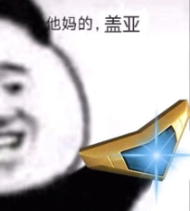

# 风系

📜 旧神姫簡評（クリックで表示）

### 盖亚 <!-- {docsify-ignore} -->

需要觉醒，缓回+挡枪+cut。风系挡枪姬，高难本常客。被雷boss或者大高达暴打的玩家可以考虑交3眼，觉醒完就是你暴打boss。

### 缇坦妮雅，痴女 <!-- {docsify-ignore} -->

需要觉醒，单体buff姬，风系拖拉机，和水妙音非常像。曾经的打桩姬，现在仍然可以拿来打塔。打车基本没有上场机会，觉醒优先度低。

### 库丘林，大狗 <!-- {docsify-ignore} -->

需要觉醒。倍率不错的自嗨打手，可惜风队强者如云，大狗觉醒也没啥机会进队了。

### 奥丁 <!-- {docsify-ignore} -->

需要觉醒，背水挡枪姬，然而风系挡枪的活全被盖亚包揽了。不推荐觉醒。

### 阿萨谢尔，阿萨 <!-- {docsify-ignore} -->

需要觉醒。未觉醒状态是自嗨姬，觉醒后是全队一起嗨的~~假卡~~，风队优质buff姬，但是目前也有点过气了，惨。曾经的风系天王，打车神器之一，强烈推荐觉醒。

### 哈斯塔 <!-- {docsify-ignore} -->

需要觉醒。风炮击可选组件+破甲姬，上修后变成了多段炮但是段数太少，哈斯塔的破甲是20A破+10属破组合型，能和她配合的破甲姬不多。觉醒优先度中等，缺破甲可以优先考虑。

### QB <!-- {docsify-ignore} -->

被必连击被动坑惨的神姬，你游最惨ssr白值面板。拥有20b破，但是除了破甲毫无用处，风队吉祥物。

### 赛特，华哥 <!-- {docsify-ignore} -->

平平无奇的风奶，常年仓管。

### 波塞冬，风菠菜 <!-- {docsify-ignore} -->

泳装限定。性能微妙，偏生存+加速，然而热狂buff与恶魔套首饰冲突。基本仓管，CG+2。

### 阿丽安萝德，7姐，风7 <!-- {docsify-ignore} -->

需要觉醒，风炮击核心，公会战核心。B特效30秒麻痹，工具人必备神姬。也可以选择强力炮击，非常灵活。炮击是15段输出，配合技伤plus可以打出爆炸伤害（一炮450w）。

### 埃忒尔，龙蛋，风蛋 <!-- {docsify-ignore} -->

未觉醒状态可用，~~觉醒提升有限~~，其实觉醒很强。风burst优质组件，20群充+急所，b后追伤（伪300哥）。龙蛋打气是一下15，速度很快可以当车头或者副车头，属于风b队万金油角色。自带的わくわく表情十分魔性。

### 奈芙蒂斯，风萝 <!-- {docsify-ignore} -->

圣诞限定。20属破+自嗨姬，上修了还是基本仓管，CG+2。

### 伊西斯 <!-- {docsify-ignore} -->

旺盛+挡枪姬，然而风挡枪的活全被盖亚包揽了，平时仓管。本体武器神盾炮是可堪一用的大旺盛。

### 艾尔，不沉舰 <!-- {docsify-ignore} -->

按照血量上限百分比回复的姬，堆高血量和回性就是打不死的小强。B后刷新奶，挨打回气→B→奶→挨打回气如此循环，曾经的迷宫最终层杀手，然而除了能挨打没别的用处了。

### 密涅瓦 <!-- {docsify-ignore} -->

烧血型buff姬，buff效果量不错而且可以让自己光速去世，塔和桩有出场机会。~~本体武器翠风灯是目前风系最好的技伤武，~~已经不是了，但是翠风灯能月卡超得也算优势吧。

### 乌列尔，风乌 <!-- {docsify-ignore} -->

浴衣限定。生存向风姬，可以提供大量防御buff+一口超级单体奶，吃豆cd很短但是命中率感人，CG很顶。

### 弗丽嘉，女仆，伞女仆 <!-- {docsify-ignore} -->

20属破奶妈，觉醒后奶力非常强，自带急所buff+异常盾在对抗雷140时表现非常不错。

### 索尔，风索 <!-- {docsify-ignore} -->

圣诞限定，风burst可选组件之一。功能全面的风奶，招牌技20气的群充+奶二合一。曾经榨干了不少风风人的钱包，万恶之源。

### 阿图姆，阿童木，atm <!-- {docsify-ignore} -->

刷新球+400哥，假卡，风系天王之一。队友越强她越强，只要你游还在出新姬，atm就有无限成长的空间。招牌技单体CD-3~~，各种风队套路的核心~~，打桩打塔必带姬，打车出场率也不低。缺点是对红自动非常不友好，以及某些打桩套路要反复凹被动（秃头）。最近有点过气，不是atm刷不动而是新风姬队友太菜了带不动。

### 伊什塔尔，风凛，超级兵 <!-- {docsify-ignore} -->

炮击+30A破，风队第一个30破甲姬，然而持续时间只有120秒，本身是炮击定位但是上限感人，被称作超级兵不是没有原因的。

### 马内斯，风女仆（第二个女仆），食尸鬼 <!-- {docsify-ignore} -->

泳装限定，高难对策姬。需要送两个队友才能完全启动，所以称作食尸鬼。启动后的buff非常强力，配合别的风盾奶姬甚至可以全程无伤干掉大高达。高难本手操专用，平时打车基本没法出场，或是放在替补位收拾残局。

### 关羽，二爷 <!-- {docsify-ignore} -->

日服联动限定（繁中服没有）。20C破+400哥车头，风burst队组件，~~风系天王之一，~~但是风B死了，寄！最近有过气的趋势（不需要破甲的场合，可被7姐代替）。目前尚未复刻。

### 瓦胡，风瓦胡，风箭龟（水瓦胡叫水箭龟） <!-- {docsify-ignore} -->

30B破，风平A组件之一，可惜风平A体系还未成型，未来可期。风系第二好用的破甲姬，然而持续时间只有150秒（还是不够长）。

### 塞勒涅，风假面，风怪盗 <!-- {docsify-ignore} -->

大高达对策姬，自身输出还算不错。大高达以外的车基本看不到她出场。

### 欧西里斯，风\*\*，风ass <!-- {docsify-ignore} -->

泳装限定。风burst组件，反逆风核心，拥有高效果量的反逆buff+30气群充，自身半血以下也是个400哥。缺点是风欧西里斯只管全队烧血，没有提供有效的生存手段，风反逆玩法属于是棺材板里仰卧起坐，一不小心就会翻车。

### 风妙音 <!-- {docsify-ignore} -->

风系输出大爹，自带30高命中率破甲，风炮击可选组件，风反逆优质组件。5/6覆盖的30属破命中率极高（基本可以看做是必中），残血状态每回合百万级别的自动炮，b后再追加百万级别的炮击（约等于300哥+100w自动炮），打车打桩打塔打公会战都有良好体验。

### 波雷亚斯，爽，风爽 <!-- {docsify-ignore} -->

新年限定，强力buff+强力炮击+400哥，短期战特化姬，风炮击可选组件之一，风核爆可选打手。爆发力十足但是不持久，好在本身定位明确，要么开局打一波然后送掉，要么放替补后期上场爆发一波。

### 风药师 <!-- {docsify-ignore} -->

你游第一个后备大药。本身作为风奶奶量非常不错，但是burst没有伤害，这就很难受了。高难本表现也不错，更多的情况是放在替补蹭一瓶大药。现在大药姬多了，药师的价值也大幅下降。

### 修普诺斯，妈，风妈 <!-- {docsify-ignore} -->

杂技姬，全队挂机一回合，下一回合爆炸输出，风核爆套路核心（尚未开发），已经有开发了，甚至可以给别的核爆队打工。本体是风系最强平A武器（妈剑）。

### 普鲁弗拉斯，风女仆（风系第三个女仆了） <!-- {docsify-ignore} -->

炮击+挡枪姬，然而风挡枪的活全被盖亚包揽了。但是这个姬可以挡aoe，在某些场合优于盖亚。

### 风美神 <!-- {docsify-ignore} -->

婚纱限定。风平A组件，拥有平A乘区buff，附带自动炮的万金油风净化奶。CG有牛，纯爱慎点。

### 赫尔墨斯，魔术师，风眼镜 <!-- {docsify-ignore} -->

炮击+buff姬。曾经的风炮击最后一块拼图，然而光速过气。自身的buff效果和炮击伤害都不错，但是及其不稳定，实用性很低。本体是风系的大会心武器（惊奇杖）。

### 伊塔库亚 <!-- {docsify-ignore} -->

浴衣限定，风炮击核心，~~风炮击最后一块拼图~~，然后也有点过气了。20B破+自动炮+招牌buff，技伤plus（可以使全队每一段炮击伤害提升15w），这个提升有多恐怖？曾经的风7是15w\*15次炮击伤害，现在直接翻倍30w\*15次。同理对atm和哈斯塔的多段炮击也是有着显著提升。

### 风阿蒙，万圣限定 <!-- {docsify-ignore} -->

风队长期战特化速b组件，长期战表现优秀，定位和龙蛋非常相似（充气，急所，b后追伤），比龙蛋多个异常盾，长途车的表现优于觉醒龙蛋。核心是被动的乌鸦buff，用一次幻兽叠一层（最多5层），叠满可以提供40%的属刃，且群体充气由20变为30，追伤也差不多有B200W追150W的水平。目前主要用于雷140对策。

### 风king，风金谷 <!-- {docsify-ignore} -->

背水型注目挡枪姬。靠注目挡枪，懂的都懂。和风妙音一样有个一键背水，但是忍耐的效果量不如妙音，覆盖率也不如妙音，炮击也不如妙音。在目前的风队里几乎没有出场机会（雷140单点附带15000真实伤害，带风king就是去送人头的）。本体是你游第一把提供特殊攻击乘区的武器，也是目前唯一一把，效果是对攻击/技巧型（红色和紫色）神姬提供30%的固定特殊攻击加成，可叠加。

### 埃力格，圣诞限定 <!-- {docsify-ignore} -->

风队buff兼炮击姬。最初是设计成魔宝石活动对策（远井是这么介绍的），实际上刷活动关确实好用。亮点是3/6的30属刃+二连三连（二连比阿萨高，三连比阿萨低）+队友使用红技能附带50w基础的追击炮。Buff量非常不错，可惜覆盖率低于阿萨。追击炮的覆盖率也很感人，风7姐和风妙音的自动炮无法触发追击炮，而且风队目前没有频繁使用红技能的角色（只有风箭龟），实际的炮击效果不算理想，是未来可期的角色（就看远井愿不愿意）。最近一期炮击桩有上场，其实还行。

### 小狐狸，神妖联动限定 <!-- {docsify-ignore} -->

风队最好用的打车奶妈（有水宝那味了）。一技能25%\*2的减伤。二技能15%\*2的攻防buff+20%\*2的旺盛+2000\*2的防壁，目前你游最高效果量的群体旺盛（之前是35%那一档）。技能组攻守兼备，简单粗暴，突出一个安逸。然而已经有觉醒弗丽嘉或者风美神的场合，小狐狸的抽取优先级并不算高（毕竟不是人权姬，没有一样能玩）。然后凭借30%攻刃40%的最高旺盛buff变成了菠萝队第一buff工具人。

### 风卡利，塔利班 <!-- {docsify-ignore} -->

风反逆打手。机制和暗系原皮相似，靠主动压血获得倍率，靠2技能获得生存能力，区别是原皮的三技能可以一键满气（可以当做充气工具人送掉），而换皮的三技能获得了非常不错的续航能力。再加上一技能反逆buff和被动半血以下增加特攻，风卡利可以作为合格的风反逆平A系打手。然而目前风反逆队仍然缺乏核心组件，整个反逆体系并不成熟（缺少类似暗龙蛋定位的角色），风卡利只能说是有实力，但未来可期，但是不可期。

### 卡里忒斯 <!-- {docsify-ignore} -->

风旺盛平A组件。一技能裂伤（等效20专属破甲，并降低目标的连击率），和暗巴的刺伤debuff（全伤害plus）对比，实在是意义不明。二技能4/7上限20W的旺袭。三技能和圣诞火QB同款的自身必三连+平A
plus。亮点是覆盖率不错的旺袭buff以及被动（触发三连的角色回合结束回复400），在一定程度上可以作为伞女仆的上位替代（奶量不如女仆但是多个旺袭buff）。B后特效是追加当前血量\*50倍的固定真实伤害，上限150W，超出部分衰减，也就是自身血量3W就能够到追伤上限。本体武器是风盘首个大急所。（好消息
风队有大急所了
坏消息
暗队4年前就有一样模板的了，而且现在还白送）

### 风撒旦，泳装限定 <!-- {docsify-ignore} -->

风平A核心。一技能35W极旺袭（满血时）+每击100吸血，二技能标准4/7覆盖的20%平A单体破甲，三技能每6t一次的即座，自身有10buff以上变为双即座（目前有bug，只需要7buff就能双即座，可能与首饰有关）。被动必三连，但是每一击回气只有1.7，这回气效率基本可以告别b特效了，不想B可以不B，但是输出是真的高。

评价
众所周知平A破甲是平A队的入场券，风撒旦的出现意味着风平A从"垫底"变成了"能玩"。值得一提的是风撒旦的输出非常离谱，是目前所有平A破甲姬里输出最高的，不过目前风平A的组件不齐，除了撒旦风队没有能拿得出手的姬，所以对于风平A队，我只能送上四个字《未来可期》。

### 贾巴沃克，毒龙 <!-- {docsify-ignore} -->

风炮击组件。被动
使用技能时从，，，，中随机抽取一个buff。B特效为抽取2次buff。各buff最多持续5T，重复抽到刷新持续时间。

红心

自身连击率up

黑桃
自身特殊攻击+20%

梅花
自身回性+10%，缓回300

方块
自身15cut

自身平A乘区+30%，平A上限+30%。技伤乘区+100%，技伤上限+50%。B乘区+100%，B上限+50%

一技能
全队1T特大技伤buff（50乘区50上限），持有或时全队奶1000。

二技能
6T CD的30W驱散炮，持有或时驱散变成两次。

三技能
3T
CD的10W\*7炮击，持有时伤害变成15W\*7

评价

风炮击版彩虹剑，技能组花里胡哨，然而CD过长以及标伤过低。自身的输出能力非常依赖抽到小丑buff，然而没有稳定的小丑buff入手方式，鉴定为寄。

### 权天使 <!-- {docsify-ignore} -->

风炮击核心输出。自身拥有独特的token机制
结晶。结晶上限为10个，一技能与B特效会生成3结晶。被动每回合结束时根据身上的buff数量生成结晶，1\~3buff生成1结晶，4\~7buff生成2结晶，8buff以上生成3结晶。且回合结束时自身拥有10buff以上会自动使用一技能（注
生成的结晶也算在buff层数里，有几个结晶就算几层，不愧是铁库罗斯的程序员）。

一技能
7T CD 40W炮击并生成3个结晶。

二技能
2T CD
消耗所有结晶造成（1+消耗数）\*15W的多段炮击伤害，核心输出技能。

三技能
3/6覆盖的自身炮击性能up（目测在20\~40%之间）并附带自身10W
炮击plus。若累计使用结晶超过10个则进一步强化（炮击性能强化，炮击plus变为15W）。

继风7姐之后，风炮击队第二位真正意义上的多段炮主力输出手，且自身机制足够优秀不需要依赖辅助（这点强于7姐，7姐基本绑定atm辅助），但是自身机制不吃刷新也是一大劣势。使用时需要注意快速凑齐自身10层buff来达到最快启动速度，也就是说基本绑定了爱迪生队。

优点
自带炮击buff与可观的多段炮+自动炮，输出稳定。

缺点
输出过于稳定，不受减CD（刷新球）的收益，依赖buff的堆叠（绑定爱迪生）。

以及换了画师，CG表现糟糕，差评（被圣诞SR那身薄纱）。

### 拜亚提斯，万圣限定 <!-- {docsify-ignore} -->

一技能30减攻减防+异常耐性down

二技能3/7覆盖恐伤，B后CD-2

三技能3/6覆盖追袭5W，防壁2500，属刃20

简评
目前风系最好用的破甲手，自带不错覆盖率的恐伤，还带有风队稀有的属刃buff。需要注意的是恐伤上限为2%\*15个debuff的易伤效果，新风姬自带8个debuff，剩下7个debuff比较难凑。

### 风驼奶，圣诞限定 <!-- {docsify-ignore} -->

风炮击核心，万金油破甲。一技能6CD75W单体炮击+给自身20%风属刃（持续3T）。二技能6CD35W群体炮击覆盖10%破甲（持续9T且能最多叠4层）。三技能6CD刷新自身所有红技能，本场战斗第一次使用对象全体化。被动自身10buff数量以上，回合结束自身红技能CD-1。使用技能时给自己一个token（持续5T，数量无上限），每个token给自身4w 炮击plus，且3token以上时回合结束附带50w自动炮。

评价：2022年最强限定之一（另一个我认为是暗海盗）。自身40%累积破甲爆杀其他风破甲姬，且每局一次的全队红技能刷新直接改变了风炮击的环境（不止风炮击，风平A也能带她，红技能厉害的队伍都能带）。实测风爱迪生以拥有开局1E5左右的爆发能力，目前风炮击还缺少一位直伤可观且红技能多的神姬（比如隔壁光阿顿），达不到顶流但也脱离了下水道水平。

### 风阿波罗，新年限定 <!-- {docsify-ignore} -->

高难本对策奶。一技能1500奶+一次净化。二技能3/8覆盖25cut+20属刃二合一buff。三技能2/7覆盖使boss输出降低50%的debuff。B特效1000奶。被动技能，boss特动的回合结束500奶+一次净化，回复效果发动的回合结束二技能CD-1。

评价：技能组简单粗暴，自身奶力全看boss脸色。不过目前高难本的boss特动特别多，这个被动奶可以频繁触发（比如雷140机兽），也算是之后150车可能的对策卡，未来可期。

### 库洛诺斯，黑白（火炮兰） <!-- {docsify-ignore} -->

风B核心。一技能5/10覆盖全队30风属攻+20防+1000受击减免buff，且fb后延长1T持续时间。二技能5/10覆盖的自身20w Bplus（可累积），且发动后的5T内自身每次b都会再叠加一层（5T 20w）Bplus。三技能3/6覆盖的全队鼓舞（回合结束+10气），自身激励（回合结束+20气）buff。B特效B后追伤75W。且每个队友B时会给自身充10气。

评价：一技能是罕见的特殊类属刃（能与别的风属攻buff叠加，比如拜亚提斯）。B追比例非常离谱（无条件追伤且数值可观），追伤可以很好地配合二技能的叠加Bplus打出离谱伤害。三技能也是可观群充，配合被动可以胜任风速B队车头（比如放2号位80气就能参与FB且B完自身还余30气）。本体武器是风队最好的B武，特大B+小攻小会心，黄金杖哭了。

### 风马杜 <!-- {docsify-ignore} -->

风盾+buff姬。技能组朴实无华。一技能4/6覆盖城砦buff（防壁+防御buff）。二技能12/6覆盖的风属刃buff（可累积）。三技能1/6覆盖自身无敌+嘲讽buff。B特效全队1500受击减免buff。被动自身未受伤的回合结束时发动二技能。

评价：亮点是二技能可叠加属刃，前提是自身不受伤。通过一三技能+B后特效联动来频繁触发二技能叠加属刃。本体武器也是4技能，中攻旺血回性，比隔壁雷天秤差多了。

### 加斯伯禄 <!-- {docsify-ignore} -->

定位模糊。一技能2/6覆盖对敌方恶魔debuff（等效我方受击时加50%防御），对我方天使buff（回合结束时缓回600）。二技能6CD 自身充气150，溢出的气均分给4个队友。三技能立刻发动一次不消耗气的burst，消耗40气可以额外再发动一次。B特效，自身拥有天使buff时为400哥。

评价：buff覆盖率低，三技能冷却太长。唯一亮点是开局两发的400哥，技能组有点杂技。很符合我对风队的想象。

---

<!-- KAMIHIME:DETAIL:wind:START -->
## 风系・技能详细

> 📌 「神姬云测评（翻訳版）」（更新日: 2026-07-16）

### ［風誘う恋機］ペールビア

📊 技能详细を見る

**B特效**

🇨🇳 无

🇯🇵 無し

**■技能1**（CD: 3）

🇨🇳 发动一次不加BC的即座普攻； 
※【欧拉链接】状态下，同一回合最多可使用2次，且回合结束时刷新此技能。

🇯🇵 BCが増加しない即座通常攻撃を1回発動。※【オイラーリンク】状態時は同一ターンにつき最大2回まで使用可能で、ターン終了時にこの技能をリフレッシュする。

**■技能2**（持続: 2 / CD: 3）

🇨🇳 奇数回使用时敌方全体防御down40%（专必特）； 
偶数回使用时我方全体最大500%坚牢、最大800%忍耐； 
※【欧拉链接】状态下，同一回合最多可使用2次，且回合结束时刷新此技能。

🇯🇵 奇数回使用時、敵全体に防御ダウン40%（専必特）を付与。偶数回使用時、味方全体に最大500%堅牢、最大800%忍耐を付与。※【オイラーリンク】状態時は同一ターンにつき最大2回まで使用可能で、ターン終了時にこの技能をリフレッシュする。

**■技能3**（持続: 3 / CD: 7）

🇨🇳 我方全体最大35%旺盛、最大50%反逆、cut+20%，普攻吸血（20%上限500）； 
※【欧拉链接】状态下，则追加我方全体最大50%旺壮。

🇯🇵 味方全体に最大35%旺盛、最大50%反逆、cut+20%、通常攻撃吸血（20%、上限500）を付与。※【オイラーリンク】状態時は、味方全体に最大50%旺壮を追加付与。

**■技能4**（持続: 3·1 / CD: 40）

🇨🇳 自身【欧拉链接】状态3T； 
※若已有该状态，则将被动1共享给我方风属性角色1T。 
风属性角色40次普攻，此技能CD-4。

🇯🇵 自身に【オイラーリンク】状態を3ターン付与。※すでにこの状態を持っている場合、被動1を1ターンの間味方風属性キャラに共有する。風属性キャラが通常攻撃を40回行うと、この技能のCD-4。

**被动1**

🇨🇳 自身追袭，普攻伤害+30%上限+20%； 
※【欧拉链接】状态下，追加最大100%反攻、普攻plus+20W，必三连。

🇯🇵 自身に追撃、通常攻撃ダメージ+30%・上限+20%を付与。※【オイラーリンク】状態時は、最大100%反攻、通常攻撃Plus+20万、三連撃確定を追加付与。

**被动2**

🇨🇳 战斗开始时，赋予自身【欧拉链接】状态； 
※【欧拉链接】状态时，自身普攻二动。

🇯🇵 戦闘開始時、自身に【オイラーリンク】状態を付与。※【オイラーリンク】状態時、自身の通常攻撃が2回攻撃になる。

### ［風華の祝砲］龍王

> 🇨🇳 婚纱限定，风炮组件。至此风炮也算是凑齐了一队诚信互刷的阵容（［夏の祭典］ツクヨミ、［新婚猫嫁］キャスパリーグ、[大人の悪戯]アルゴス），虽然基本上都是一年前的姬，但放在今天还是能打的，而且也有buff有回血有生存。强度在线，虽然没能拉表看谁在C，但龙王即使没有C也是可以给其他队友刷技能的。不过风炮的问题，可能是会缺BC吧，在[大人の悪戯]アルゴス）暖完之前基本没有全队加速手段，可能看大手子贝多芬怎么做谱，或者就是看爱迪生红自动能不能满了。
>
> 🇯🇵 ウェディング限定、風砲撃編成のパーツ。これで風砲撃も互いにリフレッシュを回し合える一隊（［夏の祭典］ツクヨミ、［新婚猫嫁］キャスパリーグ、[大人の悪戯]アルゴス）がひととおり揃った形になる。基本的にはどれも1年ほど前のキャラだが、今でも十分戦える性能で、バフもHP回復も生存力も備えている。強さは十分あり、DPS計測で誰がC（メインアタッカー）を務めるかまでは検証できていないが、龍王はC役でなくても他の味方の技能をリフレッシュできる。ただ風砲撃編成の問題点として、BC不足になりやすいことが挙げられ、［大人の悪戯］アルゴスの暖機が終わるまでは基本的に全体加速手段がなく、ベートーヴェンの譜面構成の腕次第か、あるいはエジソン赤オートでBCが満タンになるかどうかに左右されるところがある。

📊 技能详细を見る

**B特效**

🇨🇳 发动一次1技能

🇯🇵 技能1を1回発動する。

**■技能1**（CD: 1）

🇨🇳 敌方单体5次风属性炮击，我方全体HP回复； 
※根据发动次数性能up

🇯🇵 敵単体に風属性の砲撃を5回発動。味方全体のHP回復。※発動回数に応じて性能アップ。

**■技能2**（持続: 1 / CD: 2）

🇨🇳 敌方全体攻防down（专必特）； 
※奇数回发动时追加神伤（永续最大lv5）

🇯🇵 敵全体に攻防ダウン（専必特）を付与。※奇数回発動時は神傷（永続、最大Lv5）を追加付与。

**■技能3**（持続: 3 / CD: 6）

🇨🇳 敌方单体风属性炮击； 
若敌方为雷、幻属性，则全消豆，自身炮plus+？； 
刷新其他技能，下一次发动的1技能会连续发动2次，并追加我方全体解异常2。

🇯🇵 敵単体に風属性の砲撃。敵が雷属性または幻属性の場合はそのCT（行動ゲージ）を全消費させ、自身の砲Plus+？を付与。他の技能をリフレッシュし、次に発動する技能1は連続して2回発動するようになり、味方全体に異常解除2を追加付与する。

**被动1**

🇨🇳 回合中，每当风属性角色使用6次技能，刷新1技能 
※同一回合最多刷新5次，每结算一次神伤，刷新次数+1，最大10次。

🇯🇵 ターン中、風属性キャラが技能を6回使用するごとに技能1をリフレッシュする。※同一ターンにつき最大5回までリフレッシュ可能。神傷が1回発生するごとにリフレッシュ回数上限+1（最大10回）。

**被动2**

🇨🇳 使用技能时，我方全体随机强化效果，敌方全体随机异常状态（可累积）； 
神伤结算时，自身技能CD-1，我方全体异常状态无效1回，HP回复。

🇯🇵 技能使用時、味方全体にランダムで強化効果を、敵全体にランダムで異常状態（重複可）を付与する。神傷発生時、自身の技能CD-1、味方全体に異常状態無効1回、HP回復を付与する。

### ［HELIX］バアル

> 🇨🇳 周年限定巴力，你敢违抗拥有巴力的我吗？继风菠菜之后的又一风B主C， 自身常驻400和3次B刷新一回合刷3次的即座B，和风菠菜一起左脚踩右脚。输出方面暖完后和风菠菜差距不大，但风菠菜提供生存buff，风巴就提供了输出buff，B特效的属攻和旺壮，以及比较遗憾的自身和英灵急所。但还是离不开吃队友的问题，需要优质的即座B队友。风B蒸蒸日上。
>
> 🇯🇵 周年限定のバアル。バアルを手にした私に、貴様は逆らうつもりか？――既に風Burst主力アタッカーとして定着している「風菠菜」（愛称、おそらくポセイドンを指す）に続く、新たな風Burst主力アタッカー。自身は常時400型（Burst倍率大幅アップ）で、Burstを3回発動でリフレッシュされる、1ターンに3回使える即座Burstを持ち、風菠菜と足並みを揺るがぬように支え合う関係。出力面では暖機完了後は風菠菜と大差ないが、風菠菜が生存バフを提供するのに対し、バアルは出力バフを提供する――B特効の属性攻撃力アップと旺壮、そして少々物足りない自身・英霊への急所付与がそれに当たる。ただ依然として味方依存の問題からは逃れられず、優秀な即座Burst持ちの味方が必要になる。風Burstは着実に上向いている。

📊 技能详细を見る

**B特效**（持続: 2）

🇨🇳 我方全体风属攻up，旺壮

🇯🇵 味方全体に風属性攻撃力アップ、旺壮を付与。

**■技能1**（持続: 3 / CD: 6）

🇨🇳 发动一次不消耗BC的Burst； 
风属性角色BC+15（其他队友带即座B的10就是25）二连三连几率+15%（可累积），最大HP+200（可累积）

🇯🇵 BCを消費せずBurstを1回発動する。風属性キャラのBC+15（他の味方の即座Burstが持つ+10と合わせれば実質+25）、二連撃・三連撃確率+15%（重複可）、最大HP+200（重複可）を付与。

**■技能2**（持続: 3 / CD: 0）

🇨🇳 ※消耗10BC发动，每回合最多可使用3次。 
敌方全体风属性炮击，防御down（专必积40%），自身与英灵概率X倍急所。

🇯🇵 ※BC10を消費して発動、1ターンにつき最大3回まで使用可能。敵全体に風属性の砲撃。防御ダウン（専必積40%）を付与。自身と英霊に確率でX倍急所を付与。

**■技能3**（持続: 1 / CD: 5）

🇨🇳 我方全体援护（真化阿蒙同款）； 
自身HP回复，异常全解，cut50%，刷新其他技能。

🇯🇵 味方全体に援護（真化アモンと同様の効果）を付与。自身のHP回復、状態異常を全解除、cut+50%、他の技能をリフレッシュ。

**■技能4**（持続: 1 / CD: 10）

🇨🇳 【连理魔力】20层时方可发动，战斗中仅能使用1回。 
风属性角色特攻up，BC+200，自身攻击伤害up。

🇯🇵 【連理魔力】20層の時のみ発動可能、戦闘中1回のみ使用可能。風属性キャラの特殊攻撃アップ、BC+200、自身の攻撃ダメージアップ。

**被动1**

🇨🇳 自身常驻攻防三连B性能大幅up； 
在三连或B回合结束时，发动AOE炮击，风属性角色BCup，根据发动次数性能up。

🇯🇵 自身は常時攻防・三連撃・Burst性能が大幅アップした状態。三連撃発動時、またはBurst発動ターンの終了時に、AOE砲撃を発動し、風属性キャラのBCをアップさせる。発動回数に応じて性能アップ。

**被动2**

🇨🇳 回合中，风属性角色B3次，【连理魔力】+1，刷新1技能，同一回合最多刷新3次。

🇯🇵 ターン中、風属性キャラがBurstを3回発動すると、【連理魔力】+1、技能1をリフレッシュ。同一ターンにつき最大3回までリフレッシュ。

**被动3**

🇨🇳 【连理魔力】20层时，包含替补在内的风属性角色，Bplus+?，防御力2倍， 
自身B后追伤（不可解除）

🇯🇵 【連理魔力】20層の時、控えメンバーも含む風属性キャラのBplus+？、防御力2倍を付与。自身はBurst後に追撃ダメージ（解除不可）。

### 西園寺世界

> 🇨🇳 日在校园联动限定，风A。不常见的越打越弱类型，还不能和自爆军姬一样发挥完作用干脆利落的走了。但就短期战来说是真的强，1技能2动的即座普攻，以及仅仅需要10次普攻就能刷新，自身的6次还计算在内，还有必三连和10W的高额plus，20%特殊攻击。估算了一下，技能全用的话大概是7回合左右就会到20层【精神崩坏】，还不算被打也加的层数，不过就目前来说，6到7回合也足够你日常打车了。而且被动1要求的是受到伤害时才会加，cut和防御叠高一点，受到0伤害应该不会算的。但这个设计真的很适合短期的平A木桩。
>
> 🇯🇵 『School Days』コラボ限定、風属性の通常攻撃（A）型。珍しい「使うほど弱くなる」タイプで、自爆系の姫のようにきっちり役目を終えて退場する、とまではいかない。しかし短期戦においては本当に強く、技能1は2回攻撃の即座通常攻撃で、しかも通常攻撃10回だけでリフレッシュできる（自身の6回分もカウントされる）上、三連撃確定と10万という高額のPlus、20%特殊攻撃まで持つ。計算してみると、技能をすべて使い切る前提なら7ターン前後で【精神崩壊】20層に到達する見込みで、被弾でも層が積み増されることを考慮していないため、実際はさらに早い。とはいえ現状では6〜7ターンあれば日常の周回には十分間に合う。なお被動1は被ダメージ時にのみ層が増える仕組みで、cutや防御を積んで被ダメージを0にしてしまうと増えなくなる可能性がある。ただこの設計は短期戦の通常攻撃木人相手には非常に適している。

📊 技能详细を見る

**B特效**

🇨🇳 刷新1技能

🇯🇵 技能1をリフレッシュ。

**■技能1**（CD: 3）

🇨🇳 发动一次加BC的普攻； 
※若【精神崩坏】层数未到达上限，则会发动两次，但【精神崩坏】还是+1

🇯🇵 BCを加算する通常攻撃を1回発動。※【精神崩壊】の層数が上限に達していない場合は2回発動するが、【精神崩壊】の増加は+1のまま。

**■技能2**（持続: 2 / CD: 6）

🇨🇳 自身必定三连普攻，普攻plus+10W 
※战斗中首次使用时，以我方全体风属性角色作为对象

🇯🇵 自身の通常攻撃が確定で三連撃になる。通常攻撃Plus+10万。※戦闘中の初回使用時は、対象が味方全体の風属性キャラに変わる。

**■技能3**（持続: 3·1 / CD: 1）

🇨🇳 单体风属性炮击伤害，自身概率触发1.1倍急所(可累积)； 
※若【精神崩坏】层数未到达上限，则追加我方全体cut+40%。

🇯🇵 敵単体に風属性の砲撃ダメージ。自身に確率で1.1倍急所を付与（重複可）。※【精神崩壊】の層数が上限に達していない場合は、味方全体にcut+40%を追加付与。

**被动1**

🇨🇳 使用技能或者受到伤害时,【精神崩坏】层数+1,上限20；【精神崩坏】层数未到达上限时，自身特殊攻击+20%

🇯🇵 技能使用時、または被ダメージ時に【精神崩壊】の層数+1（上限20）。【精神崩壊】が上限に達していない間は、自身の特殊攻撃+20%。

**被动2**

🇨🇳 风属性角色进行10次普通攻击后，刷新1技能。 
※一回合最多发动三次

🇯🇵 風属性キャラが通常攻撃を10回行うと、技能1をリフレッシュする。※1ターンにつき最大3回まで発動。

### ［金襴の風翅］風天獄カタス

> 🇨🇳 正月限定，风A，和火撒旦一样实质上3动，带上被动2一边砍一边叠叠乐提供plus。虽然整体强度高度依赖三连，但自身就有必三以及给全队提供的三连机率，而且还有HP回复提供续航，说一句风A的核心也不为过。美中不足就是没有刷新即座A，但CD只有2回合也就不说什么了。
>
> 🇯🇵 正月限定、風属性の通常攻撃（A）型。火属性のサタンと同様、実質3回攻撃で、被動2と合わせて殴りながらバフを積み増してPlusを供給できる。全体的な強さは三連撃への依存度が高いものの、自身に三連撃確定と全体への三連撃確率供給を持ち、さらにHP回復による継戦力も備えているため、風A編成の核と言っても過言ではない。惜しい点は即座通常攻撃のリフレッシュを持たないことだが、CDがわずか2ターンなので特に問題にはならない。

📊 技能详细を見る

**B特效**

🇨🇳 自身技能CD-1

🇯🇵 自身の技能CD-1。

**■技能1**（持続: 12 / CD: 2）

🇨🇳 发动一次不加BC的普攻； 
※偶数回发动时我方全体三连+10%（可累积）

🇯🇵 BCが増加しない通常攻撃を1回発動。※偶数回発動時は味方全体に三連撃+10%を付与（重複可）。

**■技能2**（持続: 2 / CD: 4）

🇨🇳 AOE炮击，我方全体伤害上限（AB炮）+100%； 
※奇数回使用时，追加我方全体旺靱（最大+20%特攻）

🇯🇵 AOE砲撃。味方全体のダメージ上限（通常攻撃・Burst・砲撃）+100%を付与。※奇数回使用時は、味方全体に旺靭（最大+20%特殊攻撃）を追加付与。

**■技能3**（持続: 1 / CD: 8）

🇨🇳 自身概率触发？倍急所，攻击伤害up，必三连； 
风属性角色普攻15次，此技能CD-1

🇯🇵 自身に確率で？倍急所を付与。攻撃ダメージアップ、三連撃確定。風属性キャラが通常攻撃を15回行うと、この技能のCD-1。

**被动1**

🇨🇳 风属性角色三连时【风筝】+1，最大15； 
自身三连时，发动一次1技能，同一回合最多2回

🇯🇵 風属性キャラが三連撃した時、【凧】+1（最大15）。自身が三連撃した時、技能1を1回発動する（同一ターンにつき最大2回まで）。

**被动2**

🇨🇳 回合结束时，根据【风筝】数量，我方全体普攻plus+8000/个（上限12W），HP恢复上限400，每多一个加100，（上限1800）

🇯🇵 ターン終了時、【凧】の数に応じて味方全体に通常攻撃Plus+8000／個（上限12万）、HP回復（上限400、1個増えるごとに+100、最大上限1800）を付与。

### ポセイドン［心想昇華］

> 🇨🇳 第二期升华，风B，非常地好用，输出有400哥buff和B后追伤，防御还有B后回血和可累积的cut，但相应的也是需要队友提供额外的即座B来获取【心想】，好在风属性有即座B的优质队友不少，实际测试下来约6T就可以30鱼，7T可以80【心想】。4技能的的B性能大幅up只有1回合，如果已经有20鱼了，B后给3【心想】加上被动1再给1个，4【心想】给1技能用自给自足。英灵的选择也很多，除了贝多芬外也可以选择项羽多提供一个即座B，也可以选择爱迪生或者拿破仑摆烂，红auto的时候3技能还追加了消豆加BC，对面基本上放不出来满豆的。评价给到夯。
>
> 🇯🇵 第2弾の昇華、風属性Burst役。非常に使いやすく、出力面では400型バフとBurst後追撃を持ち、防御面ではBurst後のHP回復と重複可能なcutを備える。ただしその分、味方から追加の即座Burstを供給してもらい【心想】を獲得する必要があるが、幸い風属性には優秀な即座Burst持ちの味方が少なくなく、実測では約6ターンで【海の仲間】30、7ターンで【心想】80に到達する。技能4のBurst性能大幅アップは1ターンのみだが、すでに【海の仲間】20があれば、Burst後に【心想】3を得た上で被動1でさらに1獲得、合計4【心想】で技能1が使えるという自給自足のループが組める。英霊の選択肢も広く、ベートーヴェンの他に項羽を選んで即座Burstをもう1つ増やすことも、あるいはエジソンやナポレオンで手堅くまとめることも可能で、赤オート運用時は技能3が敵のCT（豆）を追加消費させてBCを得る効果も持つため、相手をほぼ満タンのBCにさせない。評価は非常に高い。

📊 技能详细を見る

**B特效**

🇨🇳 【海之伙伴】+1； 
根据【海之伙伴】数量，追伤，我方全体HP回复，【心想】+X；

🇯🇵 【海の仲間】+1。【海の仲間】の数に応じて追撃、味方全体のHP回復、【心想】+Xを付与。

**■技能1**（CD: 0）

🇨🇳 ※消耗4【心想】，同一回合可使用2次； 
发动一次不消耗BC的Burst。

🇯🇵 ※【心想】4消費、同一ターンにつき2回使用可。BCを消費せずBurstを1回発動する。

**■技能2**（持続: 5 / CD: 0）

🇨🇳 ※消耗2【心想】，同一回合可使用3次； 
我方全体雷属耐+5%，BC+15，防壁+1000（可累积）； 
偶数回发动时追加旺靱（最大+20%特攻）

🇯🇵 ※【心想】2消費、同一ターンにつき3回使用可。味方全体に雷属性耐性+5%、BC+15、防壁+1000（重複可）を付与。※偶数回発動時は旺靭（最大+20%特殊攻撃）を追加付与。

**■技能3**（持続: 2 / CD: 0）

🇨🇳 ※消耗3【心想】，同一回合可使用1次； 
敌方单体攻防-30%（专必特）； 
偶数回发动时追加敌方消豆1，消豆成功时我方BC+15

🇯🇵 ※【心想】3消費、同一ターンにつき1回使用可。敵単体に攻防-30%（専必特）を付与。※偶数回発動時は敵のCT（行動ゲージ）を1消費させる効果を追加し、成功時は味方のBC+15。

**■技能4**（持続: 1 / CD: 0）

🇨🇳 ※消耗11【心想】 
【海之伙伴】+5，风属性角色BC+50，自身B性能大幅up（倍率10倍上限200W） 
【海之伙伴】30以上时追加我方全体防御2倍

🇯🇵 ※【心想】11消費。【海の仲間】+5、風属性キャラのBC+50、自身のBurst性能を大幅アップ（倍率10倍、上限200万）。【海の仲間】30以上の時、味方全体の防御力2倍を追加付与。

**被动1**

🇨🇳 战斗开始时，【海之伙伴】+2，【心想】+2； 
风属性角色B时【心想】+1； 
3的倍数回回合结束时，【心想】+3 
【海之伙伴】上限30

🇯🇵 戦闘開始時、【海の仲間】+2、【心想】+2。風属性キャラがBurstを発動した時、【心想】+1。3の倍数ターンの終了時、【心想】+3。【海の仲間】の上限は30。

**被动2**

🇨🇳 根据【心想】获得数给予我方全体强化，【心想】获得80个以后，自身所有技能同一回合可使用次数+1。 
10以上：攻击+20%； 
30以上：B伤害+40%，上限+20%； 
60以上：Bplus+60W 
80以上：特殊攻击+20%

🇯🇵 【心想】の獲得数に応じて味方全体に強化を付与する。【心想】を80獲得した後は、自身の全技能の同一ターン使用可能回数+1。 
10以上：攻撃+20% 
30以上：Burstダメージ+40%、上限+20% 
60以上：Bplus+60万 
80以上：特殊攻撃+20%

**被动3**

🇨🇳 队伍全员为风属性时，我方全体cut+10%，第一回合效果量10倍；B伤害+20%上限+10%，后备有效

🇯🇵 パーティ全員が風属性の場合、味方全体のcut+10%（初回ターンのみ効果量10倍）、Burstダメージ+20%・上限+10%を付与。控えメンバーにも効果あり。

### ［旻天の銀翼］シャット

> 🇨🇳 风十技，对比其他十技来说相对较弱，除了需要暖机才能使用的4技能外全是防御向技能，而且被动2的使用技能+BC也限制了只有在前台才能触发。但作为贝多芬绑定的十技，该用还得用。
>
> 🇯🇵 風属性の十技（10回技能持ち）。他の十技キャラと比べると相対的に弱く、暖機が必要な技能4以外はすべて防御寄りの技能で、被動2の技能使用時BC獲得も前線に出ている場合のみ発動するという制限がある。しかしベートーヴェンに紐づく十技である以上、使うべき時は使わざるを得ない。

📊 技能详细を見る

**B特效**

🇨🇳 根据【欧拉链接】获得数追伤

🇯🇵 【オイラーリンク】の獲得数に応じて追撃。

**■技能1**（持続: 3 / CD: 0）

🇨🇳 ※消耗10BC方可发动 
敌方全体降防（专必积最大40%）， 
强化时追加敌方强化解除2。

🇯🇵 ※BC10を消費して発動。敵全体に防御ダウン（専必積、最大40%）を付与。強化時は敵の強化解除2を追加付与。

**■技能2**（持続: 3 / CD: 0）

🇨🇳 ※消耗10BC方可发动 
我方全体雷属耐up（可累积）， 
强化时追加坚牢、忍耐。

🇯🇵 ※BC10を消費して発動。味方全体に雷属性耐性アップ（重複可）を付与。強化時は堅牢、忍耐を追加付与。

**■技能3**（CD: 0）

🇨🇳 ※消耗10BC方可发动 
我方全体HP回复， 
强化时效果量10倍

🇯🇵 ※BC10を消費して発動。味方全体のHP回復。強化時は効果量10倍。

**■技能4**（持続: 10 / CD: 0）

🇨🇳 ※消耗10【欧拉链接】方可发动 
我方全体全攻击plus（普攻plus+10W，Bplus+30W，炮plus+5W， 
强化时追加风属性角色技能CD-1

🇯🇵 ※【オイラーリンク】10を消費して発動。味方全体に全攻撃Plus（通常攻撃Plus+10万、Bplus+30万、砲Plus+5万）を付与。強化時は風属性キャラの技能CD-1を追加付与。

**被动1**

🇨🇳 自身10的倍数回使用技能时，该技能获得强化； 
自身同一回合最多使用10次技能

🇯🇵 自身が技能を10の倍数回使用した時、その技能に強化が付与される。自身は同一ターンにつき最大10回まで技能を使用可能。

**被动2**

🇨🇳 风属性角色使用10次技能，我方全体BC+15，【欧拉链接】+1

🇯🇵 風属性キャラが技能を10回使用すると、味方全体のBC+15、【オイラーリンク】+1。

### ［起風の添翼］サリエル

> 🇨🇳 半周年限定第二期，虽然自身不是400哥，但自身有着2回合4次即座B，配合3技有着全队50BC的加速，后续即使【烈风】过了也有25的加速。真正强的还是4技能，生成1瓶小药，FB后立即刷新，5的倍数回发动时还追加全队无敌，还有被动的智能回血、属破和cut，在当下高压的环境下既有加速还有生存，除了没有解异常外还是可以的。但可惜，现在的鬼和高层的fmd各种特动都有强化解除了，你的无敌不是真正的无敌。
>
> 🇯🇵 ハーフ周年限定第2弾。自身は400型ではないが、2ターンで4回の即座Burstを持ち、技能3と合わせれば全体50BC分の加速になる。【烈風】が切れた後でも25の加速が残る。本当に強いのは技能4で、小さな薬を1本生成し、Full Burst後は即座にリフレッシュ、5の倍数回発動時には全体に無敵を追加付与する。さらに被動によるスマートなHP回復、属性耐性破壊、cutも持ち、現在の高難度環境では加速力と生存力を両方備えている。異常解除を持たない点を除けば十分優秀。ただ惜しいのは、現在の鬼系ボスや高難度伏魔殿の各種特殊行動（特動）には強化解除が付いているものが多く、無敵も本当の意味での無敵にはならないことである。

📊 技能详细を見る

**B特效**

🇨🇳 强化解除1，【烈风】中追伤3倍50W

🇯🇵 強化解除1。【烈風】中は追撃（3倍、上限50万）。

**■技能1**（CD: 0）

🇨🇳 【烈风】中方可发动 
不消耗BC的Burst，同一回合可使用2回

🇯🇵 【烈風】中のみ発動可能。BCを消費しないBurst、同一ターンにつき2回まで使用可。

**■技能2**（持続: 2 / CD: 10）

🇨🇳 【烈风】，我方全体B链UP， 
风属性角色5B，此技能CD-1

🇯🇵 自身に【烈風】を付与。味方全体のB連鎖（Burst chain）アップ。風属性キャラがBurstを5回発動すると、この技能のCD-1。

**■技能3**（持続: 3 / CD: 3）

🇨🇳 风属性角色BC+25，特殊攻击+5%； 
发动Burst时立即发动一次

🇯🇵 風属性キャラのBC+25、特殊攻撃+5%を付与。Burst発動時に即座にこの技能を1回発動する。

**■技能4**（持続: 1 / CD: 8）

🇨🇳 生成1瓶小药， 
5的倍数回发动时，我方全体无敌1回合， 
我方发动Full Burst时刷新此技能

🇯🇵 小さな薬を1本生成する。5の倍数回発動時は、味方全体に1ターンの無敵を付与。味方がFull Burstを発動した時、この技能をリフレッシュする。

**被动1**

🇨🇳 【烈风】中，风属性角色cut+30%，异常状态耐性up，追击（B后追加炮击）

🇯🇵 【烈風】中、風属性キャラのcut+30%、異常状態耐性アップ、追撃（Burst後に追加で砲撃）を付与。

**被动2**

🇨🇳 战斗开始时/每4回合回合结束时，HP最少的我方HP回复，上限4000，敌方单体风属耐down，仅1回生成1瓶大药，后备可发动

🇯🇵 戦闘開始時、および4ターンごとのターン終了時、HPが最も低い味方のHPを回復（上限4000）、敵単体の風属性耐性をダウンさせる。戦闘中1回のみ大きな薬を1本生成する。控えメンバーでも発動可能。

### ［夏の祭典］ツクヨミ

> 🇨🇳 联动，风炮角，虽然技能组看起来像几年前的版本，但实际用起来意外的好，1技能的数据大概与夏娃1技能齐平，叠起来的伤害也不会低，而且刷新不看颜色只看技能。自身也有回复和cut提供生存。无论是手动还是爱迪生自动都很有用。
>
> 🇯🇵 コラボ限定、風属性の砲撃キャラ。技能構成は数年前のバージョンのように見えるが、実際に使うと意外と良く、技能1の性能はイヴの技能1とほぼ同等で、積み上げたダメージも決して低くない。しかもリフレッシュは色を問わず技能そのものを見るタイプ。自身にも回復とcutがあり生存面も支える。手動運用でもエジソン自動運用でも活躍できる。

📊 技能详细を見る

**B特效**

🇨🇳 敌方幽暗，自身全技能CD-2

🇯🇵 敵に幽暗を付与。自身の全技能CD-2。

**■技能1**（CD: 3）

🇨🇳 AOE炮击，根据使用次数增加HIT数（上限10回）， 
我方全体BC+10

🇯🇵 AOE砲撃。使用回数に応じてHit数が増加（上限10回）。味方全体のBC+10。

**■技能2**（持続: 2 / CD: 3）

🇨🇳 敌方全体攻击down，风耐down（专必特）； 
偶数回使用时追加魔力封印（专用）

🇯🇵 敵全体に攻撃ダウン、風属性耐性ダウンを付与（専必特）。※偶数回使用時は魔力封印（専用）を追加付与。

**■技能3**（持続: 2 / CD: 5）

🇨🇳 我方全体旺盛，炮击plus+6W，伤害+30%，上限+30%； 
奇数回使用时追加30%会心，概率触发1.3倍急所

🇯🇵 味方全体に旺盛、砲撃Plus+6万、ダメージ+30%・上限+30%を付与。※奇数回使用時は30%会心、確率で1.3倍急所を追加付与。

**被动1**（持続: 3）

🇨🇳 风属性角色使用5次技能，刷新1技能，我方全体cut+3%，防御+6%，HP回复（上限800）； 
同一回合最多刷新5次

🇯🇵 風属性キャラが技能を5回使用すると、技能1をリフレッシュし、味方全体にcut+3%、防御+6%、HP回復（上限800）を付与する。同一ターンにつき最大5回までリフレッシュ。

**被动2**（持続: 2）

🇨🇳 战斗开始时、每4回合回合结束时我方全体防壁1500； 
战斗开始时效果量10倍；后备有效

🇯🇵 戦闘開始時、および4ターンごとのターン終了時に味方全体に防壁1500を付与（戦闘開始時のみ効果量10倍）。控えメンバーにも効果あり。

### ［揺蕩う心］チェルノボーグ

> 🇨🇳 四季限定・夏1，风属性平A角色，兼顾了buff、破甲，以及反逆扳机。自身有即座A和普攻二动，风即座A也不少，普攻20次很容易达成，23技能CD减半，4技能的30【共鸣】如果没有全队即座A，会在第3回合使用即座A后攒够30（12+12+6），红自动的话除了第一次只能触发10~20，往后都是30个的效果。
> 在旺盛队伍中需要50气才能不扣血，但开局能打50气以上的角色除了女娲就是海拉，都不是很适合平A。除了需要条件才能启动的1技能外，4技能提供了2T的50cut和HP全回复，有利于应对高压环境。
> 反逆队中1技能的buff覆盖4/8较差，算上4技能的减CD也才4/7，如果没有反姬的防壁和cut很容易在真空期就暴毙了。但需要注意的是反逆队中不要用30【共鸣】的4技能，刚压的血又给满上了。
> 可能会在风的反逆核爆A中登场，但在旺盛A或者其他红自动队伍中强度有限
>
> 🇯🇵 四季限定・夏I期、風属性の通常攻撃（A）型キャラ。バフ・破甲・反逆トリガーを兼ね備える。自身に即座通常攻撃と通常攻撃2回攻撃を持ち、風属性には即座通常攻撃持ちの味方も多いため通常攻撃20回はすぐに達成できる。技能2・3のCDは半分にできる。技能4の【共鳴】30は、全体即座通常攻撃を持つ味方がいない場合、3ターン目に即座通常攻撃を使った時点で貯まる（12+12+6）。赤オートの場合は初回のみ10〜20しか発動しないが、それ以降は毎回30個分の効果が発動する。
> 旺盛編成では被ダメージを受けないためにBC（気）50が必要だが、開幕からBC50以上を出せるキャラは女媧かヘラくらいで、いずれも通常攻撃編成にはあまり向かない。発動条件が必要な技能1を除けば、技能4は2ターンの50%cutとHP全回復を提供でき、高圧環境への対応に有利。
> 反逆編成では技能1のバフカバー率が4/8とやや悪く、技能4のCD短縮を含めても4/7程度で、反逆姫の防壁とcutがなければ真空期間で簡単に落ちてしまう。ただし反逆編成では【共鳴】30を要する技能4は使わないよう注意が必要で、削ったHPをまた満タンに戻してしまう。
> 風属性の反逆核爆通常攻撃編成では出番があるかもしれないが、旺盛通常攻撃編成や他の赤オート編成では強さは限定的。

📊 技能详细を見る

**B特效**

🇨🇳 【共鸣】+1

🇯🇵 【共鳴】+1。

**■技能1**（持続: 4·2 / CD: 8）

🇨🇳 我方全体坚牢、忍耐、旺盛、反逆、防壁； 
我方全体共享被动1； 
BC不满50的队友HP变为25%。

🇯🇵 味方全体に堅牢、忍耐、旺盛、反逆、防壁を付与。味方全体に被動1を共有する。BCが50未満の味方のHPを25%にする。

**■技能2**（持続: 3 / CD: 5）

🇨🇳 发动+BC的普攻，根据攻击次数对敌方降攻（1段10%，必中专用）； 
风属性角色普攻20次时CD-1。

🇯🇵 BCを加算する通常攻撃を発動。攻撃回数に応じて敵に攻撃ダウンを付与（1段階につき10%、必中・専用）。風属性キャラが通常攻撃を20回行うと、この技能のCD-1。

**■技能3**（持続: 3 / CD: 12）

🇨🇳 自身普攻2动BC获得量-50%； 
风属性角色普攻20次时CD-1。

🇯🇵 自身の通常攻撃が2回攻撃になる（BC獲得量-50%）。風属性キャラが通常攻撃を20回行うと、この技能のCD-1。

**■技能4**（持続: 2 / CD: 12）

🇨🇳 10【共鸣】以上方可发动； 
消耗所有【共鸣】发动风属性AOE炮击； 
根据消耗【共鸣】数量给风属性角色buff： 
10~15个普攻性能up（普攻伤害+30%，上限+20%）； 
16~20个cut+50%； 
21~25个风属性角色红技能CD-1； 
26~29个，上面那一条不再发动，改为风属性角色全技能CD-1； 
30个，风属性角色HP全回复。

🇯🇵 【共鳴】10以上で発動可能。保有する【共鳴】をすべて消費して風属性のAOE砲撃を発動する。消費した【共鳴】の数に応じて風属性キャラにバフを付与する： 
10〜15個：通常攻撃性能アップ（通常攻撃ダメージ+30%、上限+20%） 
16〜20個：cut+50% 
21〜25個：風属性キャラの赤技能CD-1 
26〜29個：上記の赤技能CD-1の代わりに、風属性キャラの全技能CD-1 
30個：風属性キャラのHP全回復

**被动1**

🇨🇳 自身HP25%以下或者BC50以上，普攻必三连

🇯🇵 自身のHPが25%以下、またはBCが50以上の時、通常攻撃が確定で三連撃になる。

**被动2**

🇨🇳 被动1生效时，每次普攻都会获得【共鸣】，回合结束时若有30【共鸣】，4技能CD-1

🇯🇵 被動1が発動している間、通常攻撃を行うたびに【共鳴】を獲得する。ターン終了時に【共鳴】が30ある場合、技能4のCD-1。

### ［新婚猫嫁］キャスパリーグ

> 🇨🇳 婚纱限定，风炮队的主力输出，虽然有红感应刷新的1、2技能，但是需要10个红技能，强度是有的，但强绑定之前的万圣节限定[大人の悪戯]アルゴス。如果两个都有的话那风炮队就可以起飞，大量的红技能不管是给爱迪生还是贝多芬都能在伏魔殿提一大波分。但如果你错过了万圣节限定，还有海拉、风弗雷和红刷新驼奶可以用，强度就不如万圣节限定那么高。好在开局送了2回合的【猫铃】，可以带上红刷新驼奶不考虑后期输出就打一波爆发。
>
> 🇯🇵 ウェディング限定、風砲撃編成の主力アタッカー。赤技能感応でリフレッシュされる技能1・2を持つが、リフレッシュには赤技能10回が必要で、強さは十分あるものの、以前のハロウィン限定［大人の悪戯］アルゴスとの相性に強く依存している。両方揃えば風砲撃編成は一気に強化され、大量の赤技能はエジソンにもベートーヴェンにも供給できるため、伏魔殿で大きくスコアを稼げる。ただしハロウィン限定を持っていない場合は、代わりにヘラや［破魔の凛弓］フレイ、赤リフレッシュ持ちの「駱駝奶」（愛称、キャラ不明）で代用でき、強さはハロウィン限定ほど高くはない。幸い開幕に2ターンの【猫鈴】が付与されるため、赤リフレッシュ持ちのキャラを編成に入れれば、後半の出力を考えずに序盤の爆発力だけを狙う運用も選べる。

📊 技能详细を見る

**B特效**

🇨🇳 自身全技能CD-1

🇯🇵 自身の全技能CD-1。

**■技能1**（持続: 2 / CD: 5）

🇨🇳 随机10次风属性炮击，奇数回发动时自身攻击+50%，偶数回发动时自身防御+50%。

🇯🇵 ランダムに10回、風属性の砲撃を発動。奇数回発動時は自身の攻撃+50%、偶数回発動時は自身の防御+50%。

**■技能2**（持続: 5 / CD: 5）

🇨🇳 AOE炮击，攻防down10%（必中专用可累积最大40%）※持有【猫铃】时发动2次伤害，debuff只算一次。

🇯🇵 AOE砲撃。攻防ダウン10%を付与（必中・専用、重複可、最大40%）。※【猫鈴】を保有している時はダメージが2回発動するが、デバフは1回分のみ付与される。

**■技能3**（持続: 2 / CD: 5）

🇨🇳 风属性角色炮击plus+1W5（可累积），BC+5； 
※持有【猫铃】时，同一回合可使用5次； 
※B后立即刷新

🇯🇵 風属性キャラの砲撃Plus+1.5万（重複可）、BC+5を付与。※【猫鈴】を保有している時は、同一ターンにつき最大5回まで使用可能。※Burst発動後、即座にこの技能をリフレッシュする。

**被动1**

🇨🇳 战斗开始时持有【猫铃】； 
※持有【猫铃】的场合，回合结束时根据风属性角色使用红技能次数发动炮击（上限20次）

🇯🇵 戦闘開始時、【猫鈴】を保有する。※【猫鈴】保有中は、ターン終了時に風属性キャラが赤技能を使用した回数に応じて砲撃を発動する（上限20回）。

**被动2**

🇨🇳 风属性角色使用30次红技能，获得【猫铃】； 
风属性角色使用10次红技能时，刷新1、2技能。 
※【猫铃】持续时间都为2回合

🇯🇵 風属性キャラが赤技能を30回使用すると、【猫鈴】を獲得する。風属性キャラが赤技能を10回使用すると、技能1・技能2をリフレッシュする。※【猫鈴】の持続時間はいずれも2ターン。

### ［ぽかぽかデイズ］ソル

> 🇨🇳 9周年限定，作为你游的超人气角色，索尔酱在六属性出完一轮之后开始出第二轮。暖机前是一个能提供攻击buff的奶，但暖机完成后从除了能同时提供A破和B破之外，自身也有必三连和B性能大幅up。1技能提供的buff量与风迪亚波罗 [和風慶雲]ディアボロス差不多甚至更高，但持续只有1，覆盖较差。实战中差不多会在第7或者第8回合暖机完成。一般这种暖机角色都是伏魔殿的常客，特别是这种多面手型的角色。
>
> 🇯🇵 9周年限定。本ゲームの超人気キャラとして、ソルちゃんは六属性が一巡した後に二巡目の登場となった。暖機前は攻撃バフを提供する支援役だが、暖機完了後はA破・B破を同時に供給できるほか、自身にも三連撃確定とBurst性能大幅アップを持つ。技能1が与えるバフ量は風属性のディアボロス［和風慶雲］とほぼ同等かそれ以上だが、持続がわずか1ターンでカバー率は良くない。実戦ではおよそ7〜8ターン目に暖機が完了する。このタイプの暖機キャラは総じて伏魔殿の常連となりやすく、特にこうしたマルチロール型のキャラはその傾向が強い。

📊 技能详细を見る

**B特效**

🇨🇳 我方全体HP回复，上限？Hot

🇯🇵 味方全体にHOT（毎ターン回復、上限？）を付与。

**■技能1**（持続: 1 / CD: 6）

🇨🇳 我方全体全攻击性能、全攻击plus、X倍急所、会心， 
奇数回发动时生成1瓶小药。

🇯🇵 味方全体に全攻撃性能アップ、全攻撃Plus、X倍急所、会心を付与。奇数回発動時は小さな薬を1本生成する。

**■技能2**（持続: 3 / CD: 7）

🇨🇳 敌方全体双降30%（专用特大必中）， 
消耗15个以上【太阳欠片】后追加A破B破（专用必中）

🇯🇵 敵全体に攻防ダウン30%を付与（専用・特大・必中）。【太陽の欠片】を15個以上消費した後は、A破・B破（専用・必中）を追加付与する。

**■技能3**（CD: 1）

🇨🇳 我方单体HP上限900HP回复， 
消耗15个以上【太阳欠片】后变为我方全体上限1800回复。

🇯🇵 味方単体のHPを回復（上限900）。【太陽の欠片】を15個以上消費した後は、味方全体を対象にした上限1800の回復に変わる。

**■技能4**（CD: 0）

🇨🇳 消耗3个【太阳欠片】方可发动 
奇数回发动时即座普攻（+BC）， 
偶数回发动时发动不消耗BC的Burst。

🇯🇵 【太陽の欠片】3個を消費して発動可能。奇数回発動時はBCを加算する即座通常攻撃、偶数回発動時はBCを消費しないBurstを発動する。

**被动1**

🇨🇳 风属性角色B5次、普攻20次时，自身全技能CD-1，风属性角色解异常1。

🇯🇵 風属性キャラがBurstを5回、または通常攻撃を20回行った時、自身の全技能CD-1、風属性キャラの異常解除1を付与。

**被动2**

🇨🇳 使用技能时，我方全体被回复上限up（可累积），【太阳欠片】+1， 
消耗15个【太阳欠片】后，自身必三连，B性能大幅up。

🇯🇵 技能使用時、味方全体の被回復上限アップ（重複可）、【太陽の欠片】+1を付与。【太陽の欠片】を15個消費した後は、自身が三連撃確定・Burst性能大幅アップになる。

### プルフラス［反心想］

> 🇨🇳 第二期的“反心想神姬”，只会在“反想开花”卡池中出现，后续也不会进推池。该卡池有300保底但没有单up，花魔宝石抽了也不会给辣鸡票，之前的第一期”反心想神姬“也在”反想开花卡池中，但是没有up。
>     “反心想神姬”拥有独特的紫色4技能，全技能CD0但都要消耗【反想】才能发动，【反想】上限15个，进入战斗并消耗1个【反想】后状态栏会有个白色的感叹号，可以查看已消费的【反想】数。
>   【反想】的获取途径较多，自身的消耗也比较少，开了4技能后二动再使用1技能消耗3回2，因此比较推荐的就是攒够15【反想】开4后再考虑使用其他技能，一般2到3回合就能攒够。比较吃全队连击，如果没有其他可以稳定提供全队三连的姬，英灵就只建议用S1的豆妈（パラケルスス），虽然暖机完有全队必三连，但暖前单击就太坐牢了。除此之外 ，与其他反姬不同，被动2消耗【反想】给的buff是全队的。除了可以在普攻队伍中上场外，在贝多芬队伍中也能可以做谱。红auto、伏魔殿、A有利木桩都能上，多面手角色。
>
> 🇯🇵 第2弾の「反心想神姫」で、「反想開花」ガチャにしか登場せず、以後常設プールにも入らない。このガチャには300回保証はあるがピックアップ単発はなく、花魔石で引いてもハズレ券は出ない。以前の第1弾「反心想神姫」も同じ「反想開花」ガチャに存在したが、こちらもピックアップはなかった。
> 「反心想神姫」は独自の紫色の技能4を持ち、全技能CDは0だが、いずれも発動には【反想】を消費する必要がある。【反想】の上限は15個で、戦闘に入って【反想】を1つ消費すると状態欄に白い感嘆符が表示され、消費した【反想】の数を確認できる。
> 【反想】の獲得手段は多く、自身の消費量も比較的少ない。技能4を発動して2回攻撃になった後に技能1を使うと消費が3から2に減るため、まず15【反想】を貯めて技能4を使ってから他の技能を検討するのがおすすめで、通常2〜3ターンで貯まる。全体の連撃率にかなり依存しており、他に安定して全体三連撃を供給できる姫がいない場合、英霊はS1の豆ママ（パラケルスス）を使うことを勧める。暖機完了後は全体三連撃確定になるが、暖機前の単撃はかなり厳しい。またこのキャラは他の反姫と異なり、被動2で【反想】を消費して得られるバフが全体に適用される点が特徴。通常攻撃編成で使えるだけでなく、ベートーヴェン編成でも譜面作りに使える。赤オート、伏魔殿、通常攻撃有利な木人相手でも通用するマルチロールキャラ。

📊 技能详细を見る

**B特效**

🇨🇳 【反想】+3

🇯🇵 【反想】+3。

**■技能1**（CD: 0）

🇨🇳 消耗3【反想】，一回合可使用3次， 
发动一次不加BC的普攻。

🇯🇵 【反想】3消費、1ターンにつき3回使用可。BCが増加しない通常攻撃を1回発動する。

**■技能2**（持続: 2 / CD: 0）

🇨🇳 消耗2【反想】，一回合可使用1次， 
敌全体A破（专用必中），偶数回发动时追加伤害-20%（专用）。

🇯🇵 【反想】2消費、1ターンにつき1回使用可。敵全体に通常攻撃防御破壊（A破、専用・必中）を付与。偶数回発動時は与ダメージ-20%（専用）を追加付与。

**■技能3**（持続: 8·2 / CD: 0）

🇨🇳 消耗1【反想】，一回合可使用2次， 
我方全体风属攻up，防壁（可累积），5的倍数回发动时追加我方全体cut30%。

🇯🇵 【反想】1消費、1ターンにつき2回使用可。味方全体に風属性攻撃力アップ、防壁（重複可）を付与。5の倍数回発動時は、味方全体にcut+30%を追加付与。

**■技能4**（持続: 3 / CD: 0）

🇨🇳 消耗15【反想】 
刷新幻兽召唤CD，自身普攻2动。

🇯🇵 【反想】15消費。幻獣召喚のCDをリフレッシュ、自身の通常攻撃が2回攻撃になる。

**被动1**

🇨🇳 开场给3【反想】，偶数回合结束时给2【反想】，召唤幻兽给1【反想】，风属性角色三连时给1【反想】

🇯🇵 開幕時に【反想】3を付与。偶数ターンの終了時に【反想】2を付与。幻獣召喚時に【反想】1を付与。風属性キャラが三連撃した時に【反想】1を付与。

**被动2**

🇨🇳 根据消耗【反想】数量给予风属性角色全队强化，消耗80【反想】后全队风属性角色必三连 
1个以上防御up； 
20个以上特殊攻击up； 
40个以上全攻击性能up； 
60个以上全攻击plus； 
80个以上风属性角色必三连

🇯🇵 消費した【反想】の数に応じて風属性キャラ全体に強化を付与する。【反想】を80消費した後は、風属性キャラ全体が三連撃確定になる。 
1個以上：防御アップ 
20個以上：特殊攻撃アップ 
40個以上：全攻撃性能アップ 
60個以上：全攻撃Plus 
80個以上：風属性キャラの三連撃確定

**被动3**

🇨🇳 队伍中全为风属性角色时，全队cut10%，第1回合效果量10倍，全队普攻性能up，后备有效

🇯🇵 パーティ全員が風属性キャラの場合、全体にcut+10%（初回ターンのみ効果量10倍）、全体の通常攻撃性能アップを付与。控えメンバーにも効果あり。

### ［正月満喫］ベトール

> 🇨🇳 2025年新年限定神姬，定位偏向于一个长期战的续航类盾奶角色，B后发动1，回合结束后HP80%以上刷新1，可以很快地用够10次，然后转为2技能叠【token】，2技能也附带加速。被动1给的回血和防壁虽然会受【token】限制，但每回合都有的5000假血也足够硬了，再配合上短CD的属耐cut，B特效吃豆和1技能加豆，除了血量特动外根本不用担心满豆伤害，梆硬。除此之外解放武器也十分出色，4词条的攻B急旺，值得敲钢的武器。
>
> 🇯🇵 2025年正月限定の神姫。長期戦向けの継戦型シールド支援役という立ち位置。Burst後に技能1を発動し、ターン終了時にHPが80%以上であれば技能1をリフレッシュするため、すぐに10回使い切って技能2の【token】積みへ移行できる。技能2にも加速効果が付いている。被動1が与えるHP回復と防壁は【token】の数に制限されるものの、毎ターン得られる上限5000の見せかけのHPだけでも十分硬く、さらに短CDの属性耐性アップとcutも組み合わせられる。B特効による敵のCT消費と技能1によるCT最大値の増加が合わさり、HPに関する特殊行動を除けば敵のBC満タンによる被害をほぼ心配しなくてよいほど硬い。加えて解放武器も優秀で、攻撃・Burst・急所・旺盛の4語条を持つ、鋼を叩く価値のある武器。

📊 技能详细を見る

**B特效**

🇨🇳 敌方吃1豆，立即发动一次1技能

🇯🇵 敵のCT（行動ゲージ）を1消費させ、即座に技能1を1回発動する。

**■技能1**（CD: 3）

🇨🇳 根据使用该技能的次数，对敌方造成以下弱体效果（永续不可消除），第11次起会追加发动一次2技能 
以下为使用10次的累积效果：敌方全体攻防down30%，CT（豆）最大值+1，腐败，造成伤害-10%，恐伤。

🇯🇵 この技能の使用回数に応じて、敵に以下の弱体効果を付与する（永続・解除不可）。11回目以降は技能2を追加で1回発動する。 
以下は10回使用した時点の累積効果：敵全体に攻防ダウン30%、CT（行動ゲージ）最大値+1、腐敗、与ダメージ-10%、恐傷。

**■技能2**（CD: 3）

🇨🇳 AOE炮击，召唤一个【Drophonos，以下简称token】，根据【token】数增加BC（实测大概是1~2个+5，3~4个+10，5个+15）

🇯🇵 AOE砲撃。【Drophonos】（以下【token】と略記）を1個召喚する。【token】の数に応じてBCが増加する（実測ではおおむね1〜2個で+5、3〜4個で+10、5個で+15）。

**■技能3**（持続: 1 / CD: 4）

🇨🇳 风属性我方全体有利属性耐性增加，cut30%，偶数回发动时追加异常状态无效1回。

🇯🇵 風属性の味方全体に有利属性耐性アップ、cut+30%を付与。偶数回発動時は異常状態無効1回を追加付与。

**被动1**

🇨🇳 战斗开始时召唤2个【token】，另外在没有受到攻击的回合结束时召唤1个【token】。 
回合结束时根据【token】数量回复我方全体HP，防壁 
【token】数量最大5个，每有1个给上限300的HP回复和1000防壁，最大5个给1500hp回复和5000防壁 
每个【token】给的1000防壁其实是【token】自己的生命值，如果受到超过 1000伤害【token】就会少1个，超过5000就全没了

🇯🇵 戦闘開始時に【token】を2個召喚する。また被弾しなかったターンの終了時に【token】を1個召喚する。ターン終了時、【token】の数に応じて味方全体のHP回復・防壁を付与する。【token】は最大5個までで、1個につきHP回復上限300・防壁1000が加算され、最大5個で上限1500のHP回復・防壁5000になる。各【token】が与える防壁1000は実質【token】自身のHPであり、1000を超えるダメージを受けると【token】が1個減り、5000を超えるとすべて消滅する。

**被动2**

🇨🇳 回合结束时，如果自己HP在80%以上，刷新1技能，我方全体急所（效果量5%，持续5T，可累积），三连机率up（5%，5T，可累积）

🇯🇵 ターン終了時、自身のHPが80%以上であれば技能1をリフレッシュし、味方全体に急所（効果量5%、持続5ターン、重複可）、三連撃確率アップ（5%、5ターン、重複可）を付与する。

### [大人の悪戯]アルゴス

![[大人の悪戯]アルゴス](images/wind/15.png)

> 🇨🇳 万圣节限定。3红技能和133的技能CD，以及被动2的减CD，放在爱迪生还是贝多芬队伍中都有一定价值。暖机完成后3技能提供加速、回避率和回血，在伏魔殿中也能缓解一下生存压力。风炮的核心角色。
>
> 🇯🇵 ハロウィン限定。赤技能3つと「1・3・3」という技能CD構成、そして被動2によるCD短縮を持ち、エジソン編成にもベートーヴェン編成にもそれなりの価値がある。暖機完了後は技能3が加速・回避率・HP回復を提供し、伏魔殿でも生存の負担を和らげてくれる。風砲撃編成の核となるキャラ。

📊 技能详细を見る

**B特效**

🇨🇳 发动1次1技能，我方全体异常状态无效1回

🇯🇵 技能1を1回発動する。味方全体に異常状態無効1回を付与。

**■技能1**（CD: 1）

🇨🇳 单体炮击，根据【艳风】层数发动回数增加，最大8回

🇯🇵 敵単体に砲撃。【艶風】の層数に応じて発動回数が増加する（最大8回）。

**■技能2**（持続: 6·2T / CD: 3）

🇨🇳 单体炮击，风耐性降低10%（必中、专用、累积，最大40%），5的倍数发动时，追加魔力封印

🇯🇵 敵単体に砲撃。風属性耐性ダウン10%を付与（必中・専用・重複可、最大40%）。5の倍数回発動時は魔力封印を追加付与。

**■技能3**（持続: 6 / CD: 3）

🇨🇳 单体炮击； 
自身BC+15，回避率20%，HP回复上限1200.【艳风】8层时，这3个效果全体化

🇯🇵 敵単体に砲撃。自身のBC+15、回避率+20%、HP回復（上限1200）を付与。【艶風】が8層の時、この3つの効果が全体化する。

**被动1**

🇨🇳 自身每使用3次红技能，【艳风】+1，回合结束时，根据艳风层数增加我方全体炮击上限，1层2%，上限8层16%

🇯🇵 自身が赤技能を3回使用するごとに【艶風】+1。ターン終了時、【艶風】の層数に応じて味方全体の砲撃上限をアップさせる（1層につき2%、上限8層で16%）。

**被动2**

🇨🇳 队伍中风属性角色使用5次红技能，全技能CD-1

🇯🇵 パーティ中の風属性キャラが赤技能を5回使用すると、全技能CD-1。

### ［ずっといっしょ］ヘル

> 🇨🇳 拥有类似于暗尼凯那样持续加速能力的即座400w打手，贝尔海姆之门状态下无论是加速能力还是输出能力都非常破格，但由于2技能的持续时间极短且CD极长，无法一直维持。除了用于短期战之外，其作为风队目前为数不多的高技能次数角色，每回合能稳定提供1红5蓝，对于本来几乎无法运转的风贝多芬体系显然非常重要。目前只要同时拥有真化大狗和海拉，风贝多芬队已经可以勉强运转起来了，并且回合制持续的破甲对于需要大量时间点技能的贝多芬队来说也是巨大的补强。只可惜风队目前并没有很好的蓝绿技能提供者，配谱难度依然很高，变相导致海拉的价值无法得到充分的发挥，还需要后续的其他角色来补强。
>
> 🇯🇵 闇ニケのような持続的な加速能力を持つ、即座発動の400万型アタッカー。【ベルヘイムの門】状態では加速能力も出力能力も規格外の性能になるが、技能2の持続時間が極端に短くCDも非常に長いため、常時維持することはできない。短期戦での運用のほかに、風属性で今のところ数少ない高頻度技能持ちとして、毎ターン安定して赤1・青5の技能を供給できることは、ほとんど機能していなかった風ベートーヴェン編成にとって非常に重要である。現状、真化した「大狗」（愛称、キャラ不明）とヘラが揃えば風ベートーヴェン編成もかろうじて機能するようになり、さらにターンをまたいで持続する破甲は、多くの技能を時間差で使う必要があるベートーヴェン編成にとって大きな補強となる。惜しいのは、風属性には今のところ良質な青・緑技能の供給役がおらず、譜面構成の難易度が依然として高いため、ヘラの価値を十分に発揮できていない点で、今後の別キャラによる補強が必要になる。

📊 技能详细を見る

**B特效**

🇨🇳 刷新1技能

🇯🇵 技能1をリフレッシュ。

**■技能1**（CD: 3）

🇨🇳 3倍上限30wAOE炮击 
我方全体BC+20 
5的倍数次数使用时，变为30倍上限30w AOE炮击,BC+200

🇯🇵 3倍（上限30万）のAOE砲撃。味方全体のBC+20。5の倍数回使用時は、30倍（上限30万）のAOE砲撃・BC+200に変わる。

**■技能2**（持続: 2 / CD: 20）

🇨🇳 进入【贝尔海姆之门】状态，刷新自身其他全部技能 
我方全体旺壮效果 
风属性角色每发动4次Burst，该技能CD-1

🇯🇵 【ベルヘイムの門】状態に入り、自身の他の全技能をリフレッシュする。味方全体に旺壮効果を付与。風属性キャラがBurstを4回発動するごとに、この技能のCD-1。

**■技能3**（持続: 3 / CD: 0）

🇨🇳 消耗20BC，同回合内最多使用5次 
敌全体10%破甲，必中，专用，可累积，最大可累积至40% 
我方全体风属性角色攻刃+5%，防御+5%，Bplus+10w，可累积

🇯🇵 BC20を消費して発動、同一ターンにつき最大5回まで使用可。敵全体に10%破甲を付与（必中・専用、重複可、最大40%）。味方全体の風属性キャラに攻刃+5%、防御+5%、Bplus+10万を付与（重複可）。

**■技能4**（CD: 8）

🇨🇳 立即发动一次不消耗BC的Burst 
【贝尔海姆之门】状态下，该技能每回合刷新

🇯🇵 BCを消費しないBurstを即座に1回発動する。【ベルヘイムの門】状態下では、この技能が毎ターンリフレッシュされる。

**被动1**

🇨🇳 【贝尔海姆之门】状态下，自身特殊攻击+30%，B性能大幅增加（B倍率10倍，上限200w）

🇯🇵 【ベルヘイムの門】状態下では、自身の特殊攻撃+30%、Burst性能大幅アップ（Burst倍率10倍、上限200万）。

**被动2**

🇨🇳 我方角色发动Burst时，自身的BC+15

🇯🇵 味方キャラがBurstを発動した時、自身のBC+15。

### ［秘蜜の指導者］ユピテル

> 🇨🇳 风普攻的补强组件。作为新一代普攻组件性能非常全面，不但持有珍贵的全队即座普攻，还拥有效果量优秀的全队buff，让本来就不弱的风普攻队变得更加强悍。双降基础效果量仅为20，需要暖机提升到30%，但由于风队本来就不缺破甲，就算仅有20%也不会产生困扰。和一线普攻打手相比少了个二动，但其特殊之处在于其拥有独立的减CD系统。虽然普攻体系放B很幽默，但被动2两个条件同时满足同样可以全技能CD-2，等同于直接刷新1技能。此外，由于风队拥有菠萝和撒旦，［嵐帝］ヴラド・ツェペシュ的效果还是普攻吸血，因此达成条件相当宽松。
>
> 🇯🇵 風属性通常攻撃編成の補強パーツ。新世代の通常攻撃パーツとして性能は非常に全面的で、貴重な全体即座通常攻撃を持つだけでなく、効果量に優れた全体バフも備えており、もともと弱くなかった風属性通常攻撃編成をさらに強力にする。攻防ダウンの基礎効果量は20%のみで、暖機によって30%まで上がるが、風属性はもともと破甲に不足していないため、20%のままでも特に困らない。一線級の通常攻撃アタッカーと比べると2回攻撃を持たない点は見劣りするが、独自のCD短縮システムを持つのが特色。通常攻撃編成でBurstを放つのはちょっと滑稽ではあるものの、被動2の2つの条件を同時に満たせば同様に全技能CD-2となり、実質的に技能1を直接リフレッシュしたのと同じ効果になる。また風属性には吸血持ちのキャラ（愛称「菠萝」「撒旦」、キャラ不明、および［嵐帝］ヴラド・ツェペシュ）が揃っており、いずれも通常攻撃吸血効果を持つため、この条件は比較的緩く達成できる。

📊 技能详细を見る

**B特效**

🇨🇳 交替获得【糖】和【鞭】两种token，自身全技能CD-2

🇯🇵 【飴】と【鞭】の2種類のtokenを交互に獲得する。自身の全技能CD-2。

**■技能1**（CD: 3）

🇨🇳 发动一次不增加BC的普攻 
第一次使用时，变为全体风属性角色即座普攻

🇯🇵 BCが増加しない通常攻撃を1回発動する。初回使用時は、風属性キャラ全体の即座通常攻撃に変わる。

**■技能2**（持続: 3 / CD: 6）

🇨🇳 我方全体风属攻+30%，普攻plus2w 
【糖】3个时，强化为风属攻+45%，普攻plus3w

🇯🇵 味方全体に風属性攻撃力+30%、通常攻撃Plus+2万を付与。【飴】が3個の時は、風属性攻撃力+45%、通常攻撃Plus+3万に強化される。

**■技能3**（持続: 2 / CD: 5）

🇨🇳 敌方全体雷属攻-20%，风耐性-20%，必中，专用 
【鞭】3个时，强化为雷属攻-30%，风耐性-30%

🇯🇵 敵全体に雷属性攻撃力-20%、風属性耐性-20%を付与（必中・専用）。【鞭】が3個の時は、雷属性攻撃力-30%、風属性耐性-30%に強化される。

**被动1**

🇨🇳 每次使用1技能时，交替获得【糖】和【鞭】两种token 
【糖】每+1，我方全体防御+10% 
【鞭】每+1，我方全体普攻倍率+10%，普攻上限+5%

🇯🇵 技能1を使用するたびに、【飴】と【鞭】を交互に獲得する。【飴】が+1されるごとに、味方全体の防御+10%。【鞭】が+1されるごとに、味方全体の通常攻撃倍率+10%、通常攻撃上限+5%。

**被动2**

🇨🇳 受到恢复效果的回合结束或风属性角色累计普攻20次时，自身全技能CD-1

🇯🇵 回復効果を受けたターンの終了時、または風属性キャラの通常攻撃が累計20回に達した時、自身の全技能CD-1。

### ［絢飾の聖域］フレイヤ

> 🇨🇳 buff效果量非常高且CD很短，除了风队珍贵的旺壮之外，还附带了十分强力的退场效果，很明显是设计出来搭配艳后使用的。需要暖机，但是启动仅需3token非常快，可以视为组长实在怕了你们玩白毛爆破的故意加的限制。虽说自身定位为倍率buffer，但1技能的炮击段数非常鬼畜，和技伤plus搭配效果拔群，基本也可以看成是在变相推销骑士，就是要暖到最大10token实在太慢。虽说是对着艳后设计的角色，但实际上也不算特别依赖艳后体系，由于使用起来非常灵活，在buff强者一抓一大把的风队也有充足的竞争力，只要不是打一两发完就跑的超短期战都会有发挥空间。
>
> 🇯🇵 バフの効果量が非常に高くCDも短い。風属性で貴重な旺壮に加えて、非常に強力な退場効果も持ち、明らかに艶后（クレオパトラ）との併用を想定した設計になっている。暖機は必要だが起動には【装備品】3個だけで済むため非常に速く、運営が「白毛（愛称、キャラ不明）爆破」勢を本気で警戒して制限を入れたのではないかと思えるほどだ。自身は倍率バフ役という立ち位置だが、技能1の砲撃段数がかなり異常で、スキルダメージPlusと組み合わせると効果が抜群であり、実質的に騎士（幻獣）の使用を促す設計とも見て取れる――ただ最大の10【装備品】まで暖めるのはさすがに遅い。艶后向けに設計されたキャラではあるものの、実際には艶后体系に特別依存しているわけでもなく、運用の自由度が非常に高いため、バフ役が層をなす風属性の中でも十分な競争力を持つ。1〜2発撃って撤退するような超短期戦でなければ、活躍の場は十分にある。

📊 技能详细を見る

**B特效**

🇨🇳 【装备品】3以上时，发动1次1技能

🇯🇵 【装備品】が3以上の時、技能1を1回発動する。

**■技能1**（CD: 4）

🇨🇳 根据【装备品】数量发动单体0.8倍上限8w的多段炮击（最大10Hit） 
【装备品】3以上时，发动3次（最大30Hit）

🇯🇵 【装備品】の数に応じて、敵単体に0.8倍（上限8万）の多段砲撃を発動する（最大10Hit）。【装備品】が3以上の時は3回発動する（最大30Hit）。

**■技能2**（持続: 1 / CD: 2）

🇨🇳 我方指定单体和自身风属攻+40%，雷cut30%，1.35倍旺盛，最大1.75倍反逆，旺壮 
【装备品】3以上时，作用于我方全体

🇯🇵 味方の指定単体と自身に、風属性攻撃力+40%、雷属性cut+30%、1.35倍旺盛、最大1.75倍反逆、旺壮を付与。【装備品】が3以上の時は味方全体が対象になる。

**■技能3**（持続: 1 / CD: 2）

🇨🇳 我方指定单体和自身上限1200恢复，上限1200B吸血，上限300普攻吸血 
【装备品】3以上时，作用于我方全体

🇯🇵 味方の指定単体と自身に、HP回復（上限1200）、Burst吸血（上限1200）、通常攻撃吸血（上限300）を付与。【装備品】が3以上の時は味方全体が対象になる。

**被动1**

🇨🇳 退场时，发动10倍上限250w炮击 
我方全体风属性角色BC+30，三连+5%，上限1200恢复

🇯🇵 退場時、10倍（上限250万）の砲撃を発動する。味方全体の風属性キャラにBC+30、三連撃+5%、HP回復（上限1200）を付与。

**被动2**

🇨🇳 自身未受伤或受到恢复效果的回合结束时，【装备品】+1

🇯🇵 自身が被ダメージを受けなかった、または回復効果を受けたターンの終了時、【装備品】+1。

### [和風慶雲]ディアボロス

![[和風慶雲]ディアボロス](images/wind/19.jpg)

> 🇨🇳 一眼看上去不强，但实际上很强。1技能的全体buff倍率十分鬼畜，并且由于是加在自己身上的buff，可以和其他同类buff叠加，并且后备换人上来也能立刻享受buff，使得她不仅能用在普攻队，在纯色爆破队里也是超一线的战术级buff机。加上自带30%破甲，让风爆破队第一回合可以随便开骑士而不需要再去考虑是不是应该开个风贵满破甲。作为普攻队的打手能完美融入陀乃刷新体系，强得掉渣。美中不足的作为核心的1技能CD过长，虽说B特效能缩CD但因为只-1所以实际非常搞笑，本质上还是个短期战专用角色。
>
> 🇯🇵 見た目は強そうに見えないが、実際は非常に強い。技能1が与える全体バフの倍率が異様に高く、しかも自分自身に付与するバフであるため他の同種バフと重ね掛けでき、控えから交代して出た味方も即座にそのバフを享受できる。これにより通常攻撃編成だけでなく、単色爆破編成においても超一線級の戦術的バフ機として機能する。加えて自前で30%破甲を持つため、風爆破編成は1ターン目から気軽に幻獣を召喚でき、風属性の他キャラで満破甲を組む必要があるかどうかを気にしなくてよくなる。通常攻撃編成のアタッカーとしても、シャイターン（陀乃）のリフレッシュ体系に完璧に組み込めるほど強い。惜しいのはコアとなる技能1のCDが長すぎる点で、B特効でCD短縮できるとはいえわずか-1のため実際にはほとんど笑い話レベルであり、本質的には短期戦専用のキャラと言える。

📊 技能详细を見る

**B特效**

🇨🇳 1技能CD-1

🇯🇵 技能1のCD-1。

**■技能1**（持続: 3 / CD: 10）

🇨🇳 全体风属性角色攻刃+100%，防御+100%，普攻倍率+30%，技伤倍率+50%，B倍率+50%，全上限+30%，必三连，1.35倍旺盛，最大1.4倍反逆，伤害cut20% 
回合结束时全体BC-5，不足5时效果解除 
2技能CD刷新

🇯🇵 風属性キャラ全体に攻刃+100%、防御+100%、通常攻撃倍率+30%、スキルダメージ倍率+50%、Burst倍率+50%、全上限+30%、三連撃確定、1.35倍旺盛、最大1.4倍反逆、被ダメージcut20%を付与する。ターン終了時、全体のBC-5（BCが5未満の場合は効果解除）。技能2をリフレッシュする。

**■技能2**（CD: 3）

🇨🇳 立即发动一次不加BC的普攻 
1技能持续期间每回合刷新

🇯🇵 BCが増加しない通常攻撃を即座に1回発動する。技能1の持続中は毎ターンリフレッシュされる。

**■技能3**（持続: 180秒 / CD: 6）

🇨🇳 敌单体3倍炮击，上限30w 
30%破甲，必中

🇯🇵 敵単体に3倍（上限30万）の砲撃。30%破甲を付与（必中）。

**被动1**

🇨🇳 发动幻兽回合结束时发动5倍AOE炮击，上限50w 
1技能持续期间倍率提升至6倍 
我方全体可累积普攻plus5w，持续3T

🇯🇵 幻獣を発動したターンの終了時、5倍（上限50万）のAOE砲撃を発動する。技能1の持続中は倍率が6倍にアップする。味方全体に通常攻撃Plus+5万（重複可、持続3ターン）を付与。

**被动2**

🇨🇳 用来说明1技能的占位被动

🇯🇵 技能1の説明を補足するための被動（実質的な効果はなし）。

### ［破魔の凛弓］フレイ

> 🇨🇳 炮击队补强组件，无论是数量很多的红技能还是加气都很受用。箭矢上限很少，不过基本上也是有了就用，这个token数量限制更像是防止陀乃乱刷而特意设计的。作为红技能提供者实际自身红的数量也不算太多并且刚需B特效维持，红黄红的技能配色横向对比比较一般，但目前风的贝多芬体系真的没有太多可选择的余地。
>
> 🇯🇵 砲撃編成の補強パーツ。数の多い赤技能もBC（気）供給もありがたい存在。【矢】の上限は少ないが基本的にはあれば使うだけで良く、このtoken数の制限はシャイターンによる乱リフレッシュを防ぐためにあえて設けられた仕様のように見える。赤技能供給役としては自身が持つ赤技能自体は決して多くなく、しかもB特効での維持がほぼ必須で、赤・黄・赤という技能配色も横並びで見ればごく普通だが、現状の風ベートーヴェン体系には他に選べる余地がほとんどない。

📊 技能详细を見る

**B特效**

🇨🇳 1倍上限12w技伤追伤，次数等于消耗【箭矢】的次数（最多10次）

🇯🇵 1倍（上限12万）のスキルダメージ追撃を、消費した【矢】の回数分発動する（最大10回）。

**■技能1**（CD: 0）

🇨🇳 单体2倍炮击，上限25w，自身BC+10 
偶数次使用时变成AOE，我方全体BC+10 
消耗1【箭矢】

🇯🇵 敵単体に2倍（上限25万）の砲撃。自身のBC+10。偶数回使用時はAOEに変わり、味方全体のBC+10。【矢】1を消費する。

**■技能2**（持続: 9 / CD: 3）

🇨🇳 自身雷抗+5%，技伤plus5w，异常耐性UP（可累积）

🇯🇵 自身に雷属性耐性+5%、スキルダメージPlus+5万、異常耐性アップを付与（重複可）。

**■技能3**（持続: 180秒 / CD: 6）

🇨🇳 全体4倍炮击，上限40w 
风抗-30%，消耗30BC变为必中

🇯🇵 敵全体に4倍（上限40万）の砲撃。風属性耐性-30%を付与。BC30を消費すると必中になる。

**被动1**

🇨🇳 战斗开始或FB或每5回合结束时，补充3【箭矢】（最大6）

🇯🇵 戦闘開始時、Full Burst発動時、または5ターンごとのターン終了時に、【矢】を3補充する（最大6）。

**被动2**

🇨🇳 消耗10以上【箭矢】时，回合结束时2技能CD-2

🇯🇵 【矢】を10以上消費した時、ターン終了時に技能2のCD-2。

### [タイプΖ]風音日和

![[タイプΖ]風音日和](images/wind/21.jpg)

> 🇨🇳 感应技能在回合结束才会发动，因此无论是红数量还是炮击伤害都会弱于其他属性的一线感应炮。作为主炮需要暖机且CD偏长，且辅助效果持续时间很短，必须搭配B特效提高覆盖率，且由于风队目前的红技能数量严重不足，所以想要触发7次以上的效果基本需要绑定陀乃，从这个角度来看实际上整个阵容位置卡得还是比较死的。目前来看日和属于性能不算很强但是不得不用的炮击组件，毕竟风队能每回合稳定提供技能数量的角色真的非常有限。
>
> 🇯🇵 感応技能がターン終了時にしか発動しないため、赤技能の消費数も砲撃ダメージも他属性の一線級感応砲撃キャラより見劣りする。メイン砲撃役として暖機が必要かつCDもやや長く、補助効果の持続時間も短いため、B特効でカバー率を上げることが必須になる。さらに風属性は現状赤技能の数が著しく不足しているため、7回以上のトリガーを狙うにはほぼシャイターン（陀乃）と組ませる必要があり、この点から見ても編成の位置取りがかなり固定化されてしまう。現状の風音日和は性能自体はさほど強くないが、使わざるを得ない砲撃パーツという位置づけで、風属性には毎ターン安定して技能数を供給できるキャラが本当に限られているためである。

📊 技能详细を見る

**B特效**

🇨🇳 自身全技能刷新

🇯🇵 自身の全技能をリフレッシュする。

**■技能1**（CD: 2）

🇨🇳 5倍对应属性AOE伤害，上限50w 
根据使用次数发动效果: 
1次：风属性，风弱20%，专用，持续2T 
2次：雷属性，全体雷抗+20%，持续2T 
3次：水属性，全体上限1000HP回复 
4次：上述全效果依次发动(打3次），计数重置

🇯🇵 5倍の対応属性AOEダメージ（上限50万）。使用回数に応じて以下の効果を発動する： 
1回目：風属性、風属性弱体20%（専用、持続2ターン） 
2回目：雷属性、全体の雷属性耐性+20%（持続2ターン） 
3回目：水属性、全体のHP回復（上限1000） 
4回目：上記すべての効果を順に発動（3回分）、カウントをリセット

**■技能2**（CD: 4）

🇨🇳 单体3倍伤害，根据使用的次数增加hit数（最大10hit） 
单Hit2倍，上限20w

🇯🇵 敵単体に3倍のダメージ。使用回数に応じてHit数が増加する（最大10Hit）。1Hitにつき2倍（上限20万）。

**■技能3**（持続: 2 / CD: 6）

🇨🇳 我方全体技伤plus10w，1.3倍旺盛，最大30%坚牢

🇯🇵 味方全体にスキルダメージPlus+10万、1.3倍旺盛、最大30%堅牢を付与。

**被动1**

🇨🇳 根据本回合全体用的红技能数发动AOE炮击 
1~3次：2倍，上限20w 
4~6次：4倍，上限40w 
7~10次：6倍，上限60w，自身全技能CD-1 
11次+：10倍，上限100w，自身全技能CD-2

🇯🇵 このターンに全体で使用された赤技能の回数に応じてAOE砲撃を発動する。 
1〜3回：2倍（上限20万） 
4〜6回：4倍（上限40万） 
7〜10回：6倍（上限60万）、自身の全技能CD-1 
11回以上：10倍（上限100万）、自身の全技能CD-2

**被动2**

🇨🇳 我方全体技伤倍率+10%，上限+5%

🇯🇵 味方全体にスキルダメージ倍率+10%、上限+5%を付与。

### [癒しの音色]女媧

![[癒しの音色]女媧](images/wind/22.jpg)

> 🇨🇳 风队珍贵的全体即座+B破，B后刷新1技能可以提供持续加速，但是加速效果量被喂屎只有15，和水属的泡泡女儿（［想いの先］ブリギッド）相比相差很远。自身严重缺乏输出，基本完全依赖于2技能的plus和上限。被动1扔后排也发动非常强，在啦啦队里也算很优秀的一级。虽然明显被限制了强度但不得不用，仍是核心要员。
>
> 🇯🇵 風属性で貴重な全体即座通常攻撃とB破を両方持つ。Burst後に技能1をリフレッシュして持続的な加速を供給できるが、その加速効果量は控えめな15しかなく、水属性のブリギッド（泡沫の娘）と比べるとかなり見劣りする。自身は出力面が明らかに乏しく、ほぼ完全に技能2のPlusと上限アップに依存している。被動1は後衛に置いても発動する非常に優秀な効果で、応援（啦啦队）役としても一級品と言える。明らかに強さを抑えられているが、それでも使わざるを得ない、いまだコアメンバーの一角。

📊 技能详细を見る

**B特效**

🇨🇳 刷新1技能

🇯🇵 技能1をリフレッシュ。

**■技能1**（CD: 3）

🇨🇳 敌单体2倍伤害，上限30w 
我方全体风属性角色BC+15 
第一次使用变为全体风属性角色BC+150

🇯🇵 敵単体に2倍のダメージ（上限30万）。味方全体の風属性キャラにBC+15を付与。初回使用時は風属性キャラ全体にBC+150に変わる。

**■技能2**（持続: 2 / CD: 6）

🇨🇳 我方全体赋予【响音】 
Bplus50w，全上限+15% 
FB时持续+1T

🇯🇵 味方全体に【響音】を付与。Bplus+50万、全上限+15%。Full Burst発動時は持続+1ターン。

**■技能3**（持続: 4 / CD: 6）

🇨🇳 敌单体B耐性-15%，必中

🇯🇵 敵単体にBurst耐性-15%を付与（必中）。

**被动1**

🇨🇳 每4回合全体风属性角色BC+15，后备有效

🇯🇵 4ターンごとに風属性キャラ全体のBC+15。控えメンバーにも効果あり。

**被动2**

🇨🇳 用来解释2技能效果用的占位被动

🇯🇵 技能2の効果を説明するための被動（実質的な効果はなし）。

### ［闊達な映写］カスピエル

> 🇨🇳 新一代的400w风打手，为队伍提供的加速效果也非常有用。虽然也有一定的防御辅助能力，但其最大的亮点还是在于超高的爆发力上，那个防御效果更像是为了让她变成平衡型吃不到王剑加成的权宜之举。2T天羽状态下4发400w的Burst爆发力非常恐怖，甚至在还曾存在B一次造成两次伤害的鬼畜bug，只能说幸好修得快。技能CD长且覆盖极差，但作为全游戏目前唯一一个爆破队中能和白毛掰手腕的角色，毫不客气地说在用她的时候我从来没注意过她CD的问题。
>
> 🇯🇵 新世代の400万型風アタッカー。パーティに供給する加速効果も非常に有用。一定の防御サポート能力もあるが、最大の魅力はやはり圧倒的な爆発力にあり、その防御効果はむしろ彼女をバランス型にして「王剣」ボーナスを受けられなくするための調整措置に見える。2ターンの【天使の羽】状態下で400万型Burstを4発叩き込む爆発力は恐ろしいレベルで、かつてはBurst1回で2回分のダメージが出る鬼畜バグが存在したこともあった――幸い早く修正されたとしか言いようがない。技能CDは長くカバー率も極めて悪いが、現状全ゲーム中で唯一爆破編成において「白毛」（愛称、キャラ不明）と渡り合える存在であり、正直なところ彼女を使っている間はCDの問題を意識したことがないと言い切れる。

📊 技能详细を見る

**B特效**

🇨🇳 天使的羽毛状态中，B性能大幅增加（B倍率10倍，上限200w，俗称400哥）

🇯🇵 【天使の羽】状態中、Burst性能が大幅アップする（Burst倍率10倍、上限200万。通称「400兄貴」）。

**■技能1**（持続: 2 / CD: 7）

🇨🇳 单体敌人赋予恶魔的羽毛 
自身赋予天使的羽毛

🇯🇵 敵単体に【悪魔の羽】を付与。自身に【天使の羽】を付与。

**■技能2**（CD: 6）

🇨🇳 自身BC+150，超出最大值的部分分配给其他队员

🇯🇵 自身のBC+150。上限を超えた分は他の味方に分配される。

**■技能3**（CD: 12）

🇨🇳 立即发动一次不消耗BC的Burst 
消耗40BC可以再发动1次

🇯🇵 BCを消費しないBurstを即座に1回発動する。BC40を消費すればさらに1回発動できる。

**被动1**

🇨🇳 我方全体受到持有恶魔的羽毛敌人攻击时，防御+50

🇯🇵 【悪魔の羽】を持つ敵から攻撃を受けた時、味方全体の防御+50。

**被动2**

🇨🇳 回合结束时，如果自身持有天使的羽毛，则我方全体上限600恢复

🇯🇵 ターン終了時、自身が【天使の羽】を持っていれば、味方全体にHP回復（上限600）を付与。

### ［贈愛の爛漫］シャイターン

> 🇨🇳 作为炮击角色，她的性能只能说平平无奇。但是决定性的【全队红技能刷新】使她成为了风队目前最重要的战术角色。如果说风队一半的强度在于杂技，那么陀乃自身就是整个杂技体系的运转的核心，地位毋庸置疑。红技能的刷新不仅仅意味着全队炮击频率翻倍，对于那些拥有即座普攻技能的角色也意味着能多打一轮普攻，能极大的提高短期战的爆发能力，可以说是风队后期爆发力的关键来源。
>
> 🇯🇵 砲撃キャラとしての性能自体は、正直平凡と言うしかない。しかし決定的な【全体赤技能リフレッシュ】を持つことで、現在の風属性における最重要の戦術キャラとなっている。風属性の強さの半分が「サーカス（連続リフレッシュの妙技）」にあるとすれば、シャイターン（陀乃）自身がその曲芸体系全体を動かす核であることは間違いない。赤技能のリフレッシュは全体の砲撃頻度を倍にするだけでなく、即座通常攻撃を持つキャラにもう1巡分の通常攻撃を打たせる意味も持ち、短期戦の爆発力を大きく高められる。風属性における後半の爆発力の鍵を握る存在と言える。

📊 技能详细を見る

**B特效**

🇨🇳 自身技伤倍率+10%，技伤上限+5%，连击机率UP，连同发动回合在内持续5T

🇯🇵 自身にスキルダメージ倍率+10%、スキルダメージ上限+5%、連撃確率アップを付与（発動したターンを含め持続5ターン）。

**■技能1**（持続: 3 / CD: 6）

🇨🇳 单体6倍上限75w炮击 
自身风属攻+20%

🇯🇵 敵単体に6倍（上限75万）の砲撃。自身の風属性攻撃力+20%。

**■技能2**（持続: 6 / CD: 6）

🇨🇳 3倍上限35wAOE炮击 
10%破甲，必中，专用，可累积，最大40%

🇯🇵 3倍（上限35万）のAOE砲撃。10%破甲を付与（必中・専用、重複可、最大40%）。

**■技能3**（CD: 6）

🇨🇳 自身所有红技能刷新 
第一次使用时，全体风属性角色红技能刷新

🇯🇵 自身の全ての赤技能をリフレッシュする。初回使用時は、風属性キャラ全体の赤技能をリフレッシュする。

**被动1**

🇨🇳 回合结束时，如果自身持有10个以上buff效果，则自身所有红技能CD-1

🇯🇵 ターン終了時、自身が10個以上のバフ効果を持っていれば、自身の全ての赤技能CD-1。

**被动2**

🇨🇳 使用技能时，自身获得1【雪之结晶】，持续5T 
每个【雪之结晶】给予技伤plus4w，未确认累积上限 
【雪之结晶】3以上时，回合结束时发动5倍上限50wAOE炮击

🇯🇵 技能使用時、自身は【雪の結晶】を1つ獲得する（持続5ターン）。【雪の結晶】1つにつきスキルダメージPlus+4万（累積上限は未確認）。【雪の結晶】が3以上の時、ターン終了時に5倍（上限50万）のAOE砲撃を発動する。

<!-- KAMIHIME:DETAIL:wind:END -->

---

<!-- KAMIHIME:DETAIL:wind-trueform:START -->
## 真化・覚醒フォーム・技能详细

> 📌 「神姬云测评（翻訳版）」（更新日: 2026-07-16）

### クー・フーリン［神想真化］

> 🇨🇳 需要先觉醒才能真化。从之前的普攻打手摇身一变成为了带B追伤的高速B打手，还带了个全员援护，乍看整体设计莫名奇怪。但是仔细一想，3黄配色加短CD可重复使用的技能组，这不是摆明了为贝多芬体系设计的角色嘛……而且最关键的问题在于，风队目前的总体技能数量在全属性中是倒数的水平，真化大狗因此获得了远超其自身实力的高生态位，有她没她是一个天一个地。总体来看无论是强续航、辅助生存还是叠叠乐，都是倾向于长期战的技能配置，特别是出了伏魔殿之后一切对她的质疑都瞬间烟消云散。
>
> 🇯🇵 真化には事前の覚醒が必要。以前の通常攻撃打ち手から、Burst追撃を持つ高速Burst打ち手へと大きく変貌し、全員援護まで付いてくるという、一見すると噛み合わない設計に思える。しかしよく考えると、黄配色3つと短CDで繰り返し使える技能構成は、明らかにベートーヴェン体系向けに設計されたキャラだと分かる。さらに最も重要な点として、風属性編成は現在全属性中で技能総数が最下位クラスであるため、真化「大狗」（クー・フーリン）はその実力を大きく上回る生態的地位を得ており、彼女がいるかいないかで天と地の差が生まれる。総合的に見ると、高い継戦能力、生存補助、そして積み重ね（叠叠乐）といった要素はいずれも長期戦向けの技能構成であり、特に伏魔殿の実装後は彼女への疑問がすべて一瞬で解消された。

**🔺 真化ボーナス**

🇨🇳 消耗真化素材给予强化合计：HP+1500 
攻击力+4000 
普攻上限+10% 
普攻倍率+20% 
旺盛+15%

🇯🇵 真化に必要な素材を消費して得られる強化合計：HP+1500 
攻撃力+4000 
通常攻撃上限+10% 
通常攻撃倍率+20% 
旺盛+15%

📊 技能详细を見る

**B特效**

🇨🇳 3倍上限50w追伤，自身全技能刷新

🇯🇵 3倍（上限50万）の追撃。自身の全技能をリフレッシュ。

**■技能1**（持続: 1 / CD: 3）

🇨🇳 全体风属性角色有利属性耐性+?%，上限?恢复 
自身防御+200%，BC+20，全体援护（1次）

🇯🇵 風属性キャラ全体に有利な属性耐性+？%、上限？の回復を付与。自身の防御+200%、BC+20、全体援護（1回）を付与。

**■技能2**（持続: ∞ / CD: 0）

🇨🇳 指定我方单体获得以下随机一种可累积、无法消除、永续的buff效果： 
攻刃+？% 
风属攻+？% 
防御+？% 
异常耐性UP 
普攻plus？w 
技伤plus？ 
Bplus？w 
每回合可使用3次

🇯🇵 味方単体を指定し、以下のいずれか1つをランダムに付与する（重複可・解除不可・永続）： 
攻刃+？% 
風属性攻撃力+？% 
防御+？% 
異常状態耐性アップ 
通常攻撃Plus+？万 
スキルダメージPlus+？ 
Bplus+？万 
1ターンにつき3回まで使用可。

**■技能3**（持続: 1 / CD: 3）

🇨🇳 我方全体BC获得量+？%，B倍率+？，B上限+？ 
自身BC+20 
登场5回合后，每回合可使用2次

🇯🇵 味方全体のBC獲得量+？%、B倍率+？、B上限+？を付与。自身のBC+20。登場から5ターン後は1ターンにつき2回使用可。

**■技能4**（持続: 1）

🇨🇳 全体风属性角色特殊攻击+30%，B结算伤害+？%（描述为“大幅提升”，5%？） 
只能使用一次

🇯🇵 風属性キャラ全体の特殊攻撃+30%、B結算ダメージ+？%（説明文では「大幅アップ」、5%？）を付与。使用できるのは1回のみ。

**被动1**

🇨🇳 受到伤害或自身发动Burst时，自身Bplus+20w，特殊攻击+3%，最多可以累积至50层

🇯🇵 被ダメージを受けた時、または自身がBurstを発動した時、自身のBplus+20万、特殊攻撃+3%を付与。最大50層まで重複可。

**被动2**

🇨🇳 队伍全员为风属性时，全体B倍率+25%，B上限+10%，最终伤害+10%，后备有效

🇯🇵 パーティ全員が風属性の場合、全体のB倍率+25%、B上限+10%、最終ダメージ+10%。控えメンバーにも効果あり。

### キュベレー［神想真化］

> 🇨🇳 2024年9月经过平衡性调整强化。倾向炮击及buff向的真化角色，调整之后B特效变为了全技能CD-1，配合3技能新增的25加速，在速B体系润滑下炮击回转得到了大幅优化，不再是之前笨重的老式炮击角了。除此之外，1技能额外添加了必中破甲、吃豆和驱散，3技能也多了防壁和BC入手量UP，虽然在目前的环境下这些都算是边角料，但是功能性毫无疑问得到了大幅强化。强效buff在调整前就是真化QB的主要卖点，现在如果能每回合都FB，则可以做到全程覆盖，如果说之前QB的主要用途是短期战，那么调整后的她在长期战中也能发挥价值，毕竟被动的感应buff确实非常优秀。总的来说，虽然调整前的QB就不弱，但是在调整后无论是在运转方面还是功能性上都得到了大幅强化，虽然数值方面放到今天已不算超模，但取而代之的是高泛用性。
>
> 🇯🇵 2024年9月のバランス調整で強化された。砲撃・バフ寄りの真化キャラで、調整後はB特効が全技能CD-1に変わり、技能3に新たに追加されたBC+25と合わせて、速攻Burst体系の中で砲撃の回転が大幅に改善され、以前のような鈍重な旧式砲撃キャラではなくなった。それ以外にも、技能1には必中破甲・デバフ消化（吃豆）・強化解除が追加され、技能3にも防壁とBC入手量アップが加わった。現在の環境ではこれらは些末な要素に過ぎないが、機能性は間違いなく大幅に強化された。強力なバフは調整前から真化QB（キュベレー）の主な売りだったが、今なら毎ターンフルバースト（FB）できれば全編にわたってカバーできる。以前のQBの主な用途が短期戦だったのに対し、調整後の彼女は長期戦でも価値を発揮できる。被動の感応バフは実に優秀だからだ。総じて、調整前のQBも弱くはなかったが、調整後は回転面・機能性ともに大幅に強化され、数値面では今となっては特別強いわけではないものの、代わりに高い汎用性を手に入れた。

**🔺 真化ボーナス**

🇨🇳 消耗真化素材给予强化合计：HP+1500 
攻击力+4000 
技伤上限+10% 
普攻倍率+10% 
50%机率1.2倍急所

🇯🇵 真化に必要な素材を消費して得られる強化合計：HP+1500 
攻撃力+4000 
スキルダメージ上限+10% 
通常攻撃倍率+10% 
50%の確率で1.2倍急所

📊 技能详细を見る

**B特效**

🇨🇳 自身全技能CD-1

🇯🇵 自身の全技能CD-1。

**■技能1**（持続: 1 / CD: 8）

🇨🇳 单体8倍上限80w炮击，必中破甲30%，CT-1，消除一个buff效果 
给予特殊debuff【风之伤迹】，效果为受到技伤追加7w plus

🇯🇵 単体に8倍（上限80万）の砲撃。必中で破甲30%、CT（行動ゲージ）-1、バフ効果1つを解除する。特殊デバフ【風の傷跡】を付与し、スキルダメージを受けた際に追加で7万のPlusダメージが発生する。

**■技能2**（CD: 3）

🇨🇳 随机5次2倍上限20w炮击 
1技能CD-1 
对风之伤迹状态下的敌人发动2次

🇯🇵 ランダムに5回、2倍（上限20万）の砲撃。技能1のCD-1。【風の傷跡】状態の敵に対しては2回発動する。

**■技能3**（持続: 3 / CD: 6）

🇨🇳 我方全体50%机率1.4倍急所，20%会心，BC获取量+50%，BC+25，1500防壁

🇯🇵 味方全体に50%の確率で1.4倍急所、会心20%、BC獲得量+50%、BC+25、防壁1500を付与。

**■技能4**（持続: 1）

🇨🇳 全体风属性角色特殊攻击+30%，普攻追加5倍上限100w技伤 
只能使用一次

🇯🇵 風属性キャラ全体の特殊攻撃+30%を付与し、通常攻撃に5倍（上限100万）のスキルダメージを追加発動する。使用できるのは1回のみ。

**被动1**

🇨🇳 我方全体使用5次技能时，全体风属攻+5%，雷耐性+3%，持续3T

🇯🇵 味方全体が技能を5回使用すると、全体の風属性攻撃力+5%、雷属性耐性+3%を付与（3T継続）。

**被动2**

🇨🇳 队伍全员为风属性时，全体技伤倍率+30%，技伤上限+15%，恢复量+5%，被恢复上限+30%，最终伤害+10%，后备有效

🇯🇵 パーティ全員が風属性の場合、全体のスキルダメージ倍率+30%、スキルダメージ上限+15%、回復量+5%、被回復上限+30%、最終ダメージ+10%。控えメンバーにも効果あり。

### ユピテル[神化覚醒]

![ユピテル[神化覚醒]](images/trueform/21.png)

> 🇨🇳 觉醒后拥有全神姬中性能首屈一指的B追伤，甚至可以媲美赫克托尔专武。因此即使自身不是400哥，但凭借B追伤也足以成为雷队一线的B打手。自带B后连续满气两次的被动，在连B队中并不会拖后腿，使用起来相当的无脑。更难能可贵的是，她还持有无论是效果量还是持续覆盖都极其优秀的属攻buff，这让她在登场之后就一直是雷速B和爆破队的重要成员。作为一个成本极低但是强度却极高的角色，强烈建议优先觉醒。
>
> 🇯🇵 覚醒後は全神姫の中でも屈指の性能を持つB追撃を得て、ヘクトル専用武器にすら匹敵するレベルとなった。そのため、自身は400倍打ち手ではないものの、B追撃だけで雷属性編成における一線級のBurst打ち手になれる。Burst発動後に連続で2回満BCになる被動を自前で持つため、連続Burst編成でも足を引っ張ることはなく、使い方も非常にシンプル。さらに貴重なのは、効果量・持続カバレッジともに極めて優秀な属性攻撃力バフを持つことで、これにより登場以来ずっと雷属性速攻Burstおよび爆破編成の重要な一員となっている。コストが極めて低いにもかかわらず強度が非常に高いキャラとして、優先的な覚醒を強く推奨する。

📊 技能详细を見る

**B特效**

🇨🇳 B追伤变为根据发动次数强化 
第一次：2~2.5倍，上限55w 
第二次：2.9~3.5倍，上限70w 
第三次：3.5~4倍，上限85w 
第四次：4~4.5倍，上限100w

🇯🇵 B追撃が発動回数に応じて強化されるように変化。 
1回目：2〜2.5倍、上限55万 
2回目：2.9〜3.5倍、上限70万 
3回目：3.5〜4倍、上限85万 
4回目：4〜4.5倍、上限100万

**■技能1**（持続: 3 / CD: 6）

🇨🇳 变更为无条件单体7.5倍上限80w炮击，敌怒条减少 
自身必连击（与觉醒前相比三连机率提高）

🇯🇵 無条件で単体に7.5倍（上限80万）の砲撃を発動するように変更。敵の怒りゲージ（怒り条）減少。自身は連撃確定（覚醒前と比べて三連撃率が上昇）。

**■技能2**（CD: 4）

🇨🇳 自身上限1500恢复，BC+30，B倍率+50%，B上限+50w（可累积，限一次，无变化） 
CD6T->4T

🇯🇵 自身に上限1500の回復、BC+30、B倍率+50%、B上限+50万を付与（重複可、1回限り、変更なし）。CD6T→4T。

**■技能3**（持続: 5 / CD: 7）

🇨🇳 我方全体雷属攻+30%->50% 
打怒量UP

🇯🇵 味方全体の雷属性攻撃力+30%→50%。敵の怒りゲージ減少量アップ。

**被动1**

🇨🇳 我方全体对Reging状态下敌人攻刃+10%

🇯🇵 味方全体の、「Reging」（レイジング状態、詳細不明）の敵に対する攻刃+10%。

**被动2**

🇨🇳 自身发动Burst后，BC+100，限发动2次

🇯🇵 自身がBurstを発動した後、BC+100を付与。発動できるのは2回まで。

<!-- KAMIHIME:DETAIL:wind-trueform:END -->
